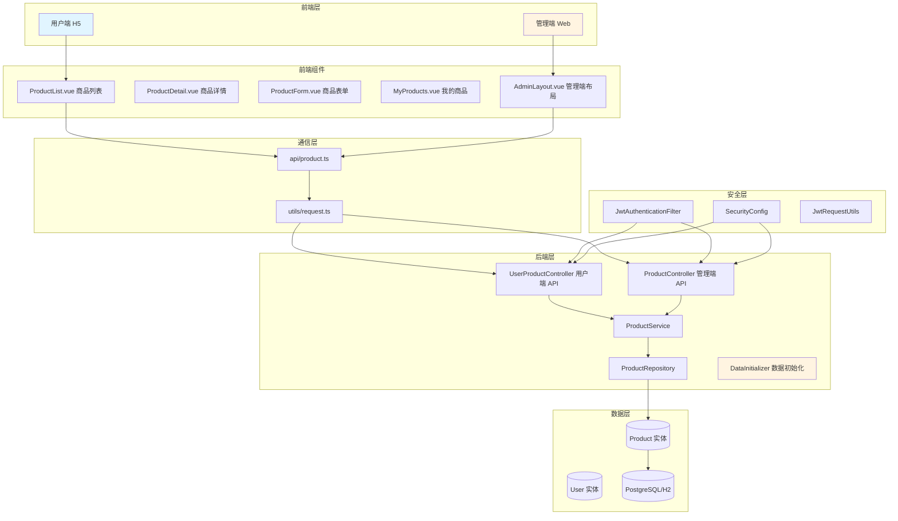
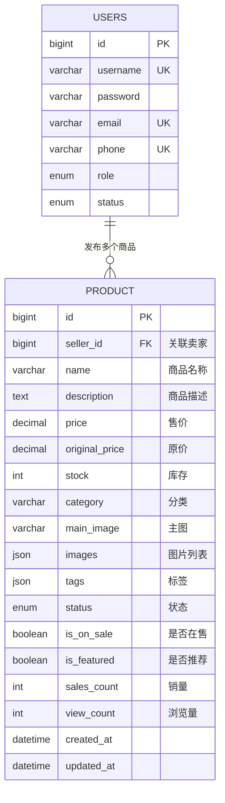
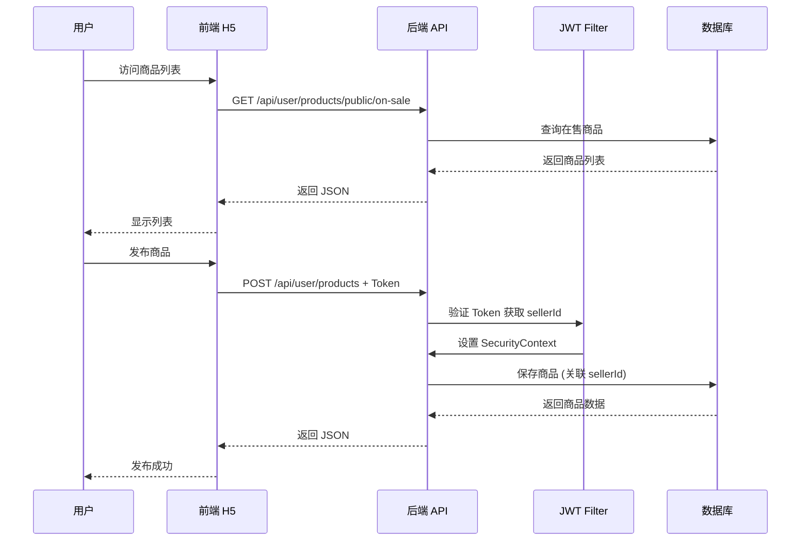

# 商品模块 - 开发文档

> 版本：v1.0.0  
> 最后更新：2026-04-12  
> 作者：AiSale 团队

---

## 一、概述

本文档记录了 AiSale 系统商品管理模块的完整开发过程，包括实体设计、API 开发、前端 H5 页面开发及管理端后台开发，重点记录了开发中遇到的问题及解决方案。

### 1.1 功能范围

| 模块 | 说明 |
|------|------|
| 后端 | 商品实体、Repository、Service、Controller、API 接口 |
| 前端 H5（用户端） | 商品列表、商品详情、发布商品、编辑商品、我的商品 |
| 前端 Web（管理端） | 商品管理列表、商品编辑、用户商品查看、商品上下架管理 |
| 数据初始化 | 启动时自动创建示例商品数据 |

### 1.2 系统架构



---

## 二、技术栈

| 层级 | 技术 | 版本 | 说明 |
|------|------|------|------|
| 后端 | Spring Boot | 3.3.4 | 核心框架 |
| 后端 | Spring Data JPA | 3.3.4 | ORM 框架 |
| 后端 | Spring Security | 6.1.13 | 安全认证 |
| 后端 | JWT | jjwt 0.12.6 | Token 认证 |
| 后端 | Hutool | 5.8.23 | 工具类库 |
| 后端 | Jakarta Validation | - | 参数校验 |
| 前端 | Vue | 3.5.0 | 前端框架 |
| 前端 | Vite | 6.2.0 | 构建工具 |
| 前端 | Element Plus | 2.8.0 | UI 组件库 |
| 前端 | Vue Router | 5.0.0 | 路由管理 |
| 前端 | Pinia | 3.0.0 | 状态管理 |
| 前端 | TypeScript | 5.8.0 | 类型系统 |
| 数据库 | H2 (开发) / PostgreSQL (生产) | - | 关系型数据库 |

---

## 三、数据库设计

### 3.1 ER 图



### 3.2 Product 实体设计

```java
@Entity
@Table(name = "products")
public class Product {

    public enum ProductStatus {
        ON_SALE,      // 在售
        OFF_SALE,     // 下架
        OUT_OF_STOCK  // 售罄
    }

    @Id
    @GeneratedValue(strategy = GenerationType.IDENTITY)
    private Long id;

    @ManyToOne(fetch = FetchType.LAZY)
    @JoinColumn(name = "seller_id", nullable = false)
    private User seller;  // 关联卖家

    @Column(name = "seller_id", insertable = false, updatable = false)
    private Long sellerId;  // 卖家 ID（用于查询）

    @Column(nullable = false)
    @NotBlank(message = "商品名称不能为空")
    @Size(max = 100, message = "商品名称不能超过 100 个字符")
    private String name;  // 商品名称

    @Column(columnDefinition = "TEXT")
    private String description;  // 商品描述

    @Column(nullable = false, precision = 10, scale = 2)
    @NotNull(message = "商品价格不能为空")
    @DecimalMin(value = "0", inclusive = false, message = "商品价格必须大于 0")
    private BigDecimal price;  // 售价

    @Column(precision = 10, scale = 2)
    private BigDecimal originalPrice;  // 原价

    @Column(nullable = false)
    @NotNull(message = "商品库存不能为空")
    @Min(value = 0, message = "商品库存必须大于等于 0")
    private Integer stock;  // 库存

    @Column(nullable = false)
    private String category;  // 分类

    @Column(length = 500)
    private String mainImage;  // 主图

    @ElementCollection(fetch = FetchType.LAZY)
    @CollectionTable(name = "product_images", joinColumns = @JoinColumn(name = "product_id"))
    @Column(name = "image_url")
    private List<String> images = new ArrayList<>();  // 图片列表

    @ElementCollection(fetch = FetchType.LAZY)
    @CollectionTable(name = "product_tags", joinColumns = @JoinColumn(name = "product_id"))
    @Column(name = "tag")
    private List<String> tags = new ArrayList<>();  // 标签

    @Enumerated(EnumType.STRING)
    private ProductStatus status = ProductStatus.ON_SALE;  // 状态

    @Column(name = "is_on_sale")
    private Boolean isOnSale = true;  // 是否在售

    @Column(name = "is_featured")
    private Boolean isFeatured = false;  // 是否推荐

    @Column(name = "sales_count")
    private Integer salesCount = 0;  // 销量

    @Column(name = "view_count")
    private Integer viewCount = 0;  // 浏览量

    private LocalDateTime createdAt;
    private LocalDateTime updatedAt;
}
```

### 3.3 表结构说明

| 字段 | 类型 | 约束 | 说明 |
|------|------|------|------|
| id | BIGINT | PRIMARY KEY, AUTO_INCREMENT | 主键 |
| seller_id | BIGINT | FOREIGN KEY, NOT NULL | 外键关联 users 表 |
| name | VARCHAR | NOT NULL | 商品名称 |
| description | TEXT | - | 商品描述 |
| price | DECIMAL(10,2) | NOT NULL | 售价 |
| original_price | DECIMAL(10,2) | - | 原价 |
| stock | INTEGER | NOT NULL | 库存数量 |
| category | VARCHAR | NOT NULL | 分类 |
| main_image | VARCHAR(500) | - | 主图 URL |
| status | ENUM | DEFAULT 'ON_SALE' | ON_SALE/OFF_SALE/OUT_OF_STOCK |
| is_on_sale | BOOLEAN | DEFAULT TRUE | 是否在售 |
| is_featured | BOOLEAN | DEFAULT FALSE | 是否推荐 |
| sales_count | INTEGER | DEFAULT 0 | 销量统计 |
| view_count | INTEGER | DEFAULT 0 | 浏览量统计 |
| created_at | DATETIME | NOT NULL | 创建时间 |
| updated_at | DATETIME | NOT NULL | 更新时间 |

### 3.4 设计要点

| 设计点 | 说明 |
|--------|------|
| 卖家隔离 | 每个商品归属特定卖家，用户只能管理自己的商品 |
| 状态管理 | 使用 `status` 枚举管理商品状态，自动计算在售/售罄/下架 |
| 图片存储 | 使用 `@ElementCollection` 存储多张图片 |
| 标签系统 | 使用 `@ElementCollection` 存储商品标签 |
| 统计字段 | `salesCount` 和 `viewCount` 用于热门商品排序 |

---

## 四、API 接口设计

### 4.1 接口调用流程



### 4.2 用户端接口（/api/user/products）

#### 公共浏览接口（无需登录）

| 接口 | 方法 | URL | 认证 | 说明 |
|------|------|-----|------|------|
| 获取在售商品 | GET | `/public/on-sale` | ❌ | 获取所有在售商品 |
| 获取商品详情 | GET | `/public/{id}` | ❌ | 获取商品详情 |
| 获取推荐商品 | GET | `/public/featured` | ❌ | 获取推荐商品 |
| 搜索商品 | GET | `/public/search` | ❌ | 多条件搜索商品 |
| 按分类查询 | GET | `/public/category/{category}` | ❌ | 按分类查询 |

#### 已登录用户接口

| 接口 | 方法 | URL | 认证 | 说明 |
|------|------|-----|------|------|
| 获取我的商品 | GET | `/my` | JWT | 获取自己的商品列表 |
| 发布商品 | POST | `/` | JWT | 发布新商品 |
| 更新商品 | PUT | `/{id}` | JWT | 更新自己的商品 |
| 删除商品 | DELETE | `/{id}` | JWT | 删除自己的商品 |
| 更新库存 | PUT | `/{id}/stock` | JWT | 更新商品库存 |
| 更新状态 | PUT | `/{id}/status` | JWT | 更新商品状态 |
| 获取统计 | GET | `/stats` | JWT | 获取自己的商品统计 |

### 4.3 管理端接口（/api/admin/products）

| 接口 | 方法 | URL | 认证 | 说明 |
|------|------|-----|------|------|
| 获取所有商品 | GET | `/` | ADMIN | 获取所有商品 |
| 创建商品 | POST | `/` | ADMIN | 创建商品 |
| 更新商品 | PUT | `/{id}` | ADMIN | 更新任意商品 |
| 删除商品 | DELETE | `/{id}` | ADMIN | 删除任意商品 |
| 查看用户商品 | GET | `/user/{userId}` | ADMIN | 查看指定用户商品 |
| 上下架商品 | PUT | `/{id}/sale-status` | ADMIN | 设置上下架状态 |
| 设置推荐 | PUT | `/{id}/featured` | ADMIN | 设置推荐状态 |
| 高级查询 | GET | `/query` | ADMIN | 多条件组合查询 |
| 售罄商品 | GET | `/out-of-stock` | ADMIN | 查询售罄商品 |
| 下架商品 | GET | `/off-sale` | ADMIN | 查询下架商品 |

### 4.4 请求/响应示例

**发布商品请求**
```json
POST /api/user/products
Authorization: Bearer eyJhbGc...
{
  "name": "iPhone 15 Pro",
  "description": "99 新，无划痕，带原装盒",
  "price": 6999.00,
  "originalPrice": 7999.00,
  "stock": 1,
  "category": "手机数码",
  "mainImage": "https://example.com/image1.jpg",
  "images": ["https://example.com/image2.jpg", "https://example.com/image3.jpg"],
  "tags": ["苹果", "5G", "旗舰"],
  "isOnSale": true,
  "isFeatured": false
}
```

**发布商品响应**
```json
{
  "code": 200,
  "message": "商品发布成功",
  "data": {
    "id": 1,
    "name": "iPhone 15 Pro",
    "price": 6999.00,
    "category": "手机数码",
    "status": "ON_SALE",
    "sellerId": 3,
    "createdAt": "2026-04-12T10:00:00"
  }
}
```

**搜索商品响应**
```json
{
  "code": 200,
  "message": "操作成功",
  "data": {
    "content": [
      {
        "id": 1,
        "name": "iPhone 15 Pro",
        "price": 6999.00,
        "stock": 1,
        "status": "ON_SALE",
        "sellerId": 3
      }
    ],
    "totalElements": 10,
    "totalPages": 1,
    "number": 0,
    "size": 10
  }
}
```

---

## 五、核心功能实现

### 5.1 Repository 层

```java
@Repository
public interface ProductRepository extends JpaRepository<Product, Long> {

    // 按状态分页查询
    Page<Product> findByStatus(ProductStatus status, Pageable pageable);

    // 按分类查询
    Page<Product> findByCategory(String category, Pageable pageable);

    // 查询在售商品
    Page<Product> findByIsOnSaleTrueAndStatus(ProductStatus status, Pageable pageable);

    // 查询推荐商品
    List<Product> findByIsFeaturedTrueAndStatus(ProductStatus status);

    // 按名称模糊查询
    Page<Product> findByNameContainingIgnoreCase(String keyword, Pageable pageable);

    // 按卖家查询
    Page<Product> findBySellerId(Long sellerId, Pageable pageable);
    List<Product> findBySellerId(Long sellerId);

    // 高级搜索（支持多条件组合）
    @Query("SELECT p FROM Product p WHERE " +
           "(:name IS NULL OR p.name LIKE %:name%) AND " +
           "(:category IS NULL OR p.category = :category) AND " +
           "(:minPrice IS NULL OR p.price >= :minPrice) AND " +
           "(:maxPrice IS NULL OR p.price <= :maxPrice) AND " +
           "(:status IS NULL OR p.status = :status) AND " +
           "(:sellerId IS NULL OR p.sellerId = :sellerId)")
    Page<Product> searchProducts(
        @Param("name") String name,
        @Param("category") String category,
        @Param("minPrice") BigDecimal minPrice,
        @Param("maxPrice") BigDecimal maxPrice,
        @Param("status") ProductStatus status,
        @Param("sellerId") Long sellerId,
        Pageable pageable
    );

    // 统计方法
    long countByStatus(ProductStatus status);
    long countBySellerId(Long sellerId);
}
```

### 5.2 Service 层

```java
@Service
@RequiredArgsConstructor
public class ProductService {

    private final ProductRepository productRepository;

    // ==================== 用户端 - 自己的商品管理 ====================

    /**
     * 发布商品
     */
    @Transactional
    public ProductResponse createProduct(ProductRequest request, Long sellerId) {
        Product product = BeanUtil.copyProperties(request, Product.class);
        product.setSellerId(sellerId);
        
        // 自动设置状态
        if (product.getStock() == 0) {
            product.setStatus(Product.ProductStatus.OUT_OF_STOCK);
        }
        
        product = productRepository.save(product);
        return ProductResponse.fromEntity(product);
    }

    /**
     * 更新商品（需验证卖家权限）
     */
    @Transactional
    public ProductResponse updateProduct(Long id, ProductRequest request, Long sellerId) {
        Product product = productRepository.findById(id)
                .orElseThrow(() -> new RuntimeException("商品不存在"));
        
        // 权限验证：只能更新自己的商品
        if (sellerId != null && !product.getSellerId().equals(sellerId)) {
            throw new RuntimeException("无权操作此商品");
        }
        
        BeanUtil.copyProperties(request, product);
        
        // 自动更新状态
        if (product.getStock() == 0) {
            product.setStatus(Product.ProductStatus.OUT_OF_STOCK);
        } else if (product.getIsOnSale()) {
            product.setStatus(Product.ProductStatus.ON_SALE);
        }
        
        product = productRepository.save(product);
        return ProductResponse.fromEntity(product);
    }

    /**
     * 获取我的商品列表
     */
    public Page<ProductResponse> getMyProducts(Long sellerId, Pageable pageable) {
        return productRepository.findBySellerId(sellerId, pageable)
                .map(ProductResponse::fromEntity);
    }

    /**
     * 删除商品（需验证卖家权限）
     */
    @Transactional
    public void deleteProduct(Long id, Long sellerId) {
        Product product = productRepository.findById(id)
                .orElseThrow(() -> new RuntimeException("商品不存在"));
        
        if (sellerId != null && !product.getSellerId().equals(sellerId)) {
            throw new RuntimeException("无权操作此商品");
        }
        
        productRepository.delete(product);
    }

    // ==================== 管理端 - 全体商品管理 ====================

    /**
     * 获取所有商品（管理员）
     */
    public Page<ProductResponse> getAllProducts(Pageable pageable) {
        return productRepository.findAll(pageable)
                .map(ProductResponse::fromEntity);
    }

    /**
     * 更新商品（管理员，无权限验证）
     */
    @Transactional
    public ProductResponse updateProductForAdmin(Long id, ProductRequest request) {
        Product product = productRepository.findById(id)
                .orElseThrow(() -> new RuntimeException("商品不存在"));
        
        BeanUtil.copyProperties(request, product);
        product = productRepository.save(product);
        return ProductResponse.fromEntity(product);
    }

    /**
     * 设置商品上下架状态
     */
    @Transactional
    public ProductResponse setSaleStatus(Long id, Boolean isOnSale) {
        Product product = productRepository.findById(id)
                .orElseThrow(() -> new RuntimeException("商品不存在"));
        
        product.setIsOnSale(isOnSale);
        
        // 自动更新状态
        if (!isOnSale) {
            product.setStatus(Product.ProductStatus.OFF_SALE);
        } else if (product.getStock() > 0) {
            product.setStatus(Product.ProductStatus.ON_SALE);
        }
        
        product = productRepository.save(product);
        return ProductResponse.fromEntity(product);
    }

    /**
     * 设置商品推荐状态
     */
    @Transactional
    public ProductResponse setFeaturedStatus(Long id, Boolean isFeatured) {
        Product product = productRepository.findById(id)
                .orElseThrow(() -> new RuntimeException("商品不存在"));
        
        product.setIsFeatured(isFeatured);
        return ProductResponse.fromEntity(productRepository.save(product));
    }

    // ==================== 公共浏览接口 ====================

    /**
     * 公开搜索商品（仅在售）
     */
    public Page<ProductResponse> searchPublicProducts(
            String name, String category,
            BigDecimal minPrice, BigDecimal maxPrice,
            Long sellerId, Pageable pageable) {
        return productRepository.searchProducts(
                name, category, minPrice, maxPrice,
                Product.ProductStatus.ON_SALE, sellerId, pageable)
                .map(ProductResponse::fromEntity);
    }
}
```

### 5.3 Controller 层

**用户端 Controller**
```java
@Tag(name = "用户端商品", description = "用户管理自己的二手商品")
@RestController
@RequestMapping("/api/user/products")
@RequiredArgsConstructor
public class UserProductController {

    private final ProductService productService;
    private final JwtRequestUtils jwtRequestUtils;

    // 公共浏览接口
    @GetMapping("/public/on-sale")
    public ApiResponse<Page<ProductResponse>> getPublicOnSaleProducts(...) {
        // 无需认证
    }

    @GetMapping("/public/search")
    public ApiResponse<Page<ProductResponse>> searchPublicProducts(
            @RequestParam(required = false) String name,
            @RequestParam(required = false) String category,
            @RequestParam(required = false) BigDecimal minPrice,
            @RequestParam(required = false) BigDecimal maxPrice,
            @RequestParam(required = false) Long sellerId,
            @RequestParam(defaultValue = "0") int page,
            @RequestParam(defaultValue = "10") int size) {
        // 无需认证
    }

    // 已登录用户接口
    @PostMapping
    public ApiResponse<ProductResponse> createProduct(
            @Valid @RequestBody ProductRequest request,
            HttpServletRequest request) {
        Long sellerId = jwtRequestUtils.getCurrentUserId(request);
        ProductResponse product = productService.createProduct(request, sellerId);
        return ApiResponse.success("商品发布成功", product);
    }

    @PutMapping("/{id}")
    public ApiResponse<ProductResponse> updateProduct(
            @PathVariable Long id,
            @Valid @RequestBody ProductRequest request,
            HttpServletRequest request) {
        Long sellerId = jwtRequestUtils.getCurrentUserId(request);
        ProductResponse product = productService.updateProduct(id, request, sellerId);
        return ApiResponse.success("商品更新成功", product);
    }
}
```

**管理端 Controller**
```java
@Tag(name = "商品管理", description = "商品 CRUD 接口（管理端）")
@RestController
@RequestMapping("/api/admin/products")
@RequiredArgsConstructor
public class ProductController {

    private final ProductService productService;

    @PostMapping
    public ApiResponse<ProductResponse> createProduct(@Valid @RequestBody ProductRequest request) {
        ProductResponse product = productService.createProductForAdmin(request);
        return ApiResponse.success("商品创建成功", product);
    }

    @PutMapping("/{id}/sale-status")
    public ApiResponse<ProductResponse> setSaleStatus(
            @PathVariable Long id,
            @RequestParam Boolean isOnSale) {
        ProductResponse product = productService.setSaleStatus(id, isOnSale);
        return ApiResponse.success(isOnSale ? "商品已上架" : "商品已下架", product);
    }

    @GetMapping("/query")
    public ApiResponse<Page<ProductResponse>> queryProducts(
            @RequestParam(required = false) String name,
            @RequestParam(required = false) String category,
            @RequestParam(required = false) BigDecimal minPrice,
            @RequestParam(required = false) BigDecimal maxPrice,
            @RequestParam(required = false) Product.ProductStatus status,
            @RequestParam(required = false) Long sellerId,
            @RequestParam(defaultValue = "0") int page,
            @RequestParam(defaultValue = "10") int size) {
        Pageable pageable = PageRequest.of(page, size);
        Page<ProductResponse> products = productService.searchProductsWithSeller(
                name, category, minPrice, maxPrice, status, sellerId, pageable);
        return ApiResponse.success(products);
    }
}
```

### 5.4 SecurityConfig 配置

```java
@Bean
public SecurityFilterChain securityFilterChain(HttpSecurity http) throws Exception {
    http
        .cors(cors -> cors.configurationSource(corsConfigurationSource()))
        .csrf(AbstractHttpConfigurer::disable)
        .sessionManagement(session -> session.sessionCreationPolicy(SessionCreationPolicy.STATELESS))
        .authorizeHttpRequests(auth -> auth
            // 公开接口
            .requestMatchers(
                "/api/auth/login",
                "/api/auth/register",
                "/api/admin/auth/login",
                "/api/user/products/public/**"  // 商品公共浏览接口
            ).permitAll()
            // 用户端接口 - 需要认证
            .requestMatchers("/api/user/**").authenticated()
            // 管理端接口 - 需要管理员权限
            .requestMatchers("/api/admin/**").hasAnyRole("SUPER_ADMIN", "ADMIN")
            .anyRequest().authenticated()
        )
        .addFilterBefore(jwtAuthenticationFilter, UsernamePasswordAuthenticationFilter.class);

    return http.build();
}

@Bean
public CorsConfigurationSource corsConfigurationSource() {
    CorsConfiguration configuration = new CorsConfiguration();
    configuration.setAllowedOrigins(List.of("http://localhost:3000", "http://127.0.0.1:3000"));
    configuration.setAllowedMethods(Arrays.asList("GET", "POST", "PUT", "DELETE", "OPTIONS", "PATCH"));
    configuration.setAllowedHeaders(Arrays.asList("Authorization", "Content-Type", "X-Requested-With"));
    configuration.setExposedHeaders(List.of("Authorization"));
    configuration.setAllowCredentials(true);
    configuration.setMaxAge(3600L);

    UrlBasedCorsConfigurationSource source = new UrlBasedCorsConfigurationSource();
    source.registerCorsConfiguration("/**", configuration);
    return source;
}
```

---

## 六、前端开发

### 6.1 项目结构

```
frontend/src/
├── api/
│   ├── product.ts           # 商品 API 封装
│   └── types.ts             # TypeScript 类型定义
├── layouts/
│   ├── MobileLayout.vue     # 移动端布局组件（用户端）
│   └── AdminLayout.vue      # 管理端布局组件
├── router/
│   └── index.ts             # 路由配置
├── stores/
│   └── auth.ts              # 认证状态管理
├── views/
│   ├── user/
│   │   ├── ProductList.vue      # 商品列表（用户端）
│   │   ├── ProductDetail.vue    # 商品详情
│   │   ├── ProductForm.vue      # 商品表单
│   │   └── MyProducts.vue       # 我的商品
│   └── admin/
│       ├── ProductList.vue      # 商品管理（管理端）
│       ├── ProductForm.vue      # 商品表单（管理端）
│       └── UserProducts.vue     # 用户商品管理
└── utils/
    └── request.ts           # Axios 封装
```

### 6.2 路由配置

**用户端路由**
```typescript
{
  path: '/user/products',
  name: 'UserProductList',
  component: () => import('@/views/user/ProductList.vue'),
  meta: { requiresAuth: false, title: '商品列表' }
},
{
  path: '/user/products/:id',
  name: 'UserProductDetail',
  component: () => import('@/views/user/ProductDetail.vue'),
  meta: { requiresAuth: false, title: '商品详情' }
},
{
  path: '/user/products/my',
  name: 'UserMyProducts',
  component: () => import('@/views/user/MyProducts.vue'),
  meta: { requiresAuth: true, title: '我的商品' }
},
{
  path: '/user/products/new',
  name: 'UserProductNew',
  component: () => import('@/views/user/ProductForm.vue'),
  meta: { requiresAuth: true, title: '发布商品' }
},
{
  path: '/user/products/:id/edit',
  name: 'UserProductEdit',
  component: () => import('@/views/user/ProductForm.vue'),
  meta: { requiresAuth: true, title: '编辑商品' }
}
```

**管理端路由**
```typescript
{
  path: '/admin/products',
  name: 'AdminProductList',
  component: () => import('@/views/admin/ProductList.vue'),
  meta: { requiresAuth: true, role: 'admin', title: '商品管理' }
},
{
  path: '/admin/products/new',
  name: 'AdminProductNew',
  component: () => import('@/views/admin/ProductForm.vue'),
  meta: { requiresAuth: true, role: 'admin', title: '新增商品' }
},
{
  path: '/admin/products/:id/edit',
  name: 'AdminProductEdit',
  component: () => import('@/views/admin/ProductForm.vue'),
  meta: { requiresAuth: true, role: 'admin', title: '编辑商品' }
},
{
  path: '/admin/products/user/:userId',
  name: 'AdminUserProducts',
  component: () => import('@/views/admin/UserProducts.vue'),
  meta: { requiresAuth: true, role: 'admin', title: '用户商品' }
}
```

### 6.3 API 封装

```typescript
// api/types.ts
export enum ProductStatus {
  ON_SALE = 'ON_SALE',       // 在售
  OFF_SALE = 'OFF_SALE',     // 下架
  OUT_OF_STOCK = 'OUT_OF_STOCK'  // 售罄
}

export interface Product {
  id: number
  name: string
  description?: string
  price: number
  originalPrice?: number
  stock: number
  category: string
  mainImage: string
  images?: string[]
  tags?: string[]
  status: ProductStatus
  isOnSale: boolean
  isFeatured: boolean
  salesCount: number
  viewCount: number
  sellerId: number
  createdAt: string
  updatedAt: string
}

// api/product.ts
import request from '@/utils/request'

// 用户端公共 API（无需登录）
export const searchPublicProducts = (params?: ProductListParams) => {
  return request<ApiResponse<{
    content: Product[]
    totalElements: number
    totalPages: number
    number: number
    size: number
  }>>({
    url: '/user/products/public/search',
    method: 'get',
    params
  })
}

// 用户端已登录 API
export const getMyProducts = (params?: ProductListParams) => {
  return request<ApiResponse<{
    content: Product[]
    totalElements: number
    totalPages: number
    number: number
    size: number
  }>>({
    url: '/user/products/my',
    method: 'get',
    params
  })
}

export const createProduct = (data: ProductCreateRequest) => {
  return request<ApiResponse<Product>>({
    url: '/user/products',
    method: 'post',
    data
  })
}

// 管理端 API
export const getAllProducts = (params?: ProductListParams) => {
  return request<ApiResponse<{
    content: Product[]
    totalElements: number
    totalPages: number
    number: number
    size: number
  }>>({
    url: '/admin/products',
    method: 'get',
    params
  })
}

export const setSaleStatus = (id: number, isOnSale: boolean) => {
  return request<ApiResponse<Product>>({
    url: `/admin/products/${id}/sale-status`,
    method: 'put',
    params: { isOnSale }
  })
}
```

### 6.4 用户端商品列表页

**功能点：**
- 商品卡片网格展示（2 列/移动端，4 列/桌面端）
- 搜索框（按名称搜索）
- 分类筛选
- 价格区间筛选
- 排序（最新、价格升/降序）
- 下拉刷新、上拉加载
- 商品状态标签

**关键代码：**
```vue
<template>
  <MobileLayout title="商品市场" :show-tab-bar="true">
    <div class="product-list-page">
      <!-- 搜索头部 -->
      <div class="search-header">
        <el-input
          v-model="searchForm.name"
          placeholder="搜索商品"
          clearable
          @keyup.enter="handleSearch"
        >
          <template #prefix>
            <el-icon><Search /></el-icon>
          </template>
        </el-input>
      </div>

      <!-- 筛选栏 -->
      <div class="filter-bar">
        <el-select v-model="searchForm.category" @change="handleSearch">
          <el-option label="全部分类" value="" />
          <el-option label="手机数码" value="手机数码" />
          <el-option label="电脑办公" value="电脑办公" />
          <el-option label="家用电器" value="家用电器" />
        </el-select>
        
        <el-input-number v-model="searchForm.minPrice" placeholder="最低价" />
        <el-input-number v-model="searchForm.maxPrice" placeholder="最高价" />
        
        <el-select v-model="sortBy" @change="handleSearch">
          <el-option label="最新发布" value="createdAt,desc" />
          <el-option label="价格从低到高" value="price,asc" />
          <el-option label="价格从高到低" value="price,desc" />
        </el-select>
      </div>

      <!-- 商品网格 -->
      <div class="product-grid">
        <div v-for="product in productList" :key="product.id"
             class="product-card" @click="goToDetail(product.id)">
          <el-image :src="product.mainImage" fit="cover" />
          <div class="product-info">
            <h3 class="product-name">{{ product.name }}</h3>
            <div class="product-price-row">
              <span class="current-price">¥{{ product.price }}</span>
            </div>
            <div class="product-meta">
              <span>库存：{{ product.stock }}</span>
              <span>销量：{{ product.salesCount }}</span>
            </div>
          </div>
        </div>
      </div>

      <!-- 空状态 -->
      <el-empty v-if="productList.length === 0 && !loading" description="暂无商品" />
    </div>
  </MobileLayout>
</template>

<style scoped>
.product-grid {
  display: grid;
  grid-template-columns: repeat(2, 1fr);
  gap: 12px;
  padding: 12px;
}

@media (min-width: 768px) {
  .product-grid {
    grid-template-columns: repeat(3, 1fr);
  }
}

@media (min-width: 1024px) {
  .product-grid {
    grid-template-columns: repeat(4, 1fr);
  }
}

.product-card {
  background: #FFFFFF;
  border-radius: 12px;
  overflow: hidden;
  cursor: pointer;
  transition: transform 0.2s;
}

.product-card:hover {
  transform: translateY(-2px);
  box-shadow: 0 8px 16px rgba(0, 0, 0, 0.1);
}
</style>
```

### 6.5 管理端商品列表页

**功能点：**
- 商品表格展示
- 多条件筛选（名称、分类、状态）
- 统计卡片（商品总数、在售、下架、售罄）
- 快速上下架开关
- 推荐开关
- 编辑/删除操作
- 查看卖家商品

**关键代码：**
```vue
<template>
  <AdminLayout>
    <div class="admin-product-list-page">
      <!-- 页面头部 -->
      <div class="page-header">
        <h1>商品管理</h1>
        <el-button type="primary" @click="goToCreate">
          <el-icon><Plus /></el-icon>
          新增商品
        </el-button>
      </div>

      <!-- 统计卡片 -->
      <el-row :gutter="16" class="stats-row">
        <el-col :span="6">
          <el-card>
            <div class="stat-card">
              <div class="stat-label">商品总数</div>
              <div class="stat-value">{{ stats.total }}</div>
            </div>
          </el-card>
        </el-col>
        <el-col :span="6">
          <div class="stat-value on-sale">{{ stats.onSale }}</div>
          <div class="stat-label">出售中</div>
        </el-col>
      </el-row>

      <!-- 商品表格 -->
      <el-table :data="tableData" v-loading="loading" border stripe>
        <el-table-column prop="id" label="ID" width="80" />
        <el-table-column label="商品图片" width="100">
          <template #default="{ row }">
            <el-image :src="row.mainImage" style="width: 60px; height: 60px;" />
          </template>
        </el-table-column>
        <el-table-column prop="name" label="商品名称" />
        <el-table-column prop="price" label="价格">
          <template #default="{ row }">
            <span class="price">¥{{ row.price }}</span>
          </template>
        </el-table-column>
        <el-table-column prop="status" label="状态">
          <template #default="{ row }">
            <el-tag :type="getStatusColor(row.status)">
              {{ getStatusText(row.status) }}
            </el-tag>
          </template>
        </el-table-column>
        <el-table-column label="上架" width="80">
          <template #default="{ row }">
            <el-switch v-model="row.isOnSale" @change="handleToggleSale(row)" />
          </template>
        </el-table-column>
        <el-table-column label="操作" width="200">
          <template #default="{ row }">
            <el-button size="small" @click="goToEdit(row.id)">编辑</el-button>
            <el-button size="small" type="danger" @click="handleDelete(row.id)">删除</el-button>
            <el-button size="small" @click="viewUserProducts(row.sellerId)">查看卖家</el-button>
          </template>
        </el-table-column>
      </el-table>
    </div>
  </AdminLayout>
</template>
```

---

## 七、数据初始化

### 7.1 DataInitializer 组件

```java
@Component
@ConditionalOnProperty(name = "spring.data.init.enabled", havingValue = "true", matchIfMissing = true)
public class DataInitializer implements CommandLineRunner {

    private final ProductService productService;

    @Override
    public void run(String... args) {
        log.info("开始初始化商品数据...");
        initProducts();
        log.info("商品数据初始化完成!");
    }

    private void initProducts() {
        // 为测试用户创建示例商品
        createProduct("zhangsan", "iPhone 15 Pro", "手机数码", 6999.00, 1);
        createProduct("zhangsan", "MacBook Pro 14", "电脑办公", 12999.00, 1);
        createProduct("lisi", "小米 13 Ultra", "手机数码", 4999.00, 2);
        createProduct("lisi", "Sony PS5", "娱乐玩具", 3299.00, 1);
        // ... 共创建 10 个示例商品
    }

    private void createProduct(String username, String name, String category, 
                               double price, int stock) {
        // 获取用户并创建商品
    }
}
```

### 7.2 示例商品数据

| ID | 商品名称 | 分类 | 价格 | 库存 | 卖家 |
|----|---------|------|------|------|------|
| 1 | iPhone 15 Pro | 手机数码 | 6999.00 | 1 | zhangsan |
| 2 | MacBook Pro 14 | 电脑办公 | 12999.00 | 1 | zhangsan |
| 3 | 小米 13 Ultra | 手机数码 | 4999.00 | 2 | lisi |
| 4 | Sony PS5 | 娱乐玩具 | 3299.00 | 1 | lisi |
| 5 | iPad Air 5 | 电脑办公 | 4399.00 | 1 | zhangsan |
| 6 | 戴森 V12 | 家用电器 | 3999.00 | 1 | lisi |
| 7 | Nintendo Switch | 娱乐玩具 | 1899.00 | 0 | zhangsan |
| 8 | AirPods Pro 2 | 手机数码 | 1799.00 | 3 | lisi |
| 9 | 机械键盘 | 电脑办公 | 599.00 | 5 | zhangsan |
| 10 | 智能音箱 | 家用电器 | 299.00 | 10 | lisi |

---

## 八、问题与解决方案

### 问题 1：JWT Token 验证失败导致 403

**错误信息：**
```
403 Forbidden - 无权操作此商品
```

**原因：** 前端发送请求时未正确携带 Authorization 头，或后端 JwtRequestUtils 解析 Token 失败。

**解决方案：**
```java
// JwtRequestUtils.java
public Long getCurrentUserId(HttpServletRequest request) {
    String authHeader = request.getHeader("Authorization");
    if (authHeader == null || !authHeader.startsWith("Bearer ")) {
        throw new RuntimeException("未提供认证令牌");
    }
    String token = authHeader.substring(7);
    Long userId = jwtUtil.extractUserId(token);
    if (userId == null) {
        throw new RuntimeException("无效的令牌：缺少用户 ID");
    }
    return userId;
}
```

```typescript
// request.ts - 请求拦截器
request.interceptors.request.use((config) => {
    const token = localStorage.getItem('token')
    if (token) {
        config.headers.Authorization = token  // 自动添加 Token
    }
    return config
})
```

---

### 问题 2：CORS 跨域请求被拦截

**错误信息：**
```
Access to XMLHttpRequest at 'http://localhost:8090/api/user/products' 
from origin 'http://localhost:3000' has been blocked by CORS policy.
```

**原因：** 后端未配置 CORS，浏览器拦截跨域请求。

**解决方案：** 在 SecurityConfig 中添加 CORS 配置
```java
@Bean
public CorsConfigurationSource corsConfigurationSource() {
    CorsConfiguration configuration = new CorsConfiguration();
    configuration.setAllowedOrigins(List.of("http://localhost:3000", "http://127.0.0.1:3000"));
    configuration.setAllowedMethods(Arrays.asList("GET", "POST", "PUT", "DELETE", "OPTIONS", "PATCH"));
    configuration.setAllowedHeaders(Arrays.asList("Authorization", "Content-Type", "X-Requested-With"));
    configuration.setExposedHeaders(List.of("Authorization"));
    configuration.setAllowCredentials(true);
    configuration.setMaxAge(3600L);

    UrlBasedCorsConfigurationSource source = new UrlBasedCorsConfigurationSource();
    source.registerCorsConfiguration("/**", configuration);
    return source;
}

// 在 SecurityFilterChain 中启用 CORS
http.cors(cors -> cors.configurationSource(corsConfigurationSource()))
```

---

### 问题 3：管理端表单与用户端表单混用

**问题描述：** 管理端和用户端共用同一个 ProductForm 组件，导致导航和 API 调用混乱。

**解决方案：** 创建管理端专用表单组件
- 用户端：`frontend/src/views/user/ProductForm.vue`（移动端布局）
- 管理端：`frontend/src/views/admin/ProductForm.vue`（桌面端布局，卡片式分组）

管理端表单特点：
- 使用 AdminLayout 包裹，带左侧侧边栏
- 卡片式分组：基本信息、价格与库存、商品图片、高级设置
- 更宽的输入区域和更清晰的表单结构
- 返回按钮指向 `/admin/products`

---

### 问题 4：移动端 Tab 栏路由错误

**问题描述：** 点击 Tab 栏首页按钮跳转到 `/home` 导致 404。

**解决方案：**
```typescript
// MobileLayout.vue
const navigateTo = (path: string) => {
    router.push(path)
}

// 修正 Tab 栏路由
<div class="tab-item" @click="navigateTo('/user/home')">
    <el-icon><HomeFilled /></el-icon>
    <span>首页</span>
</div>

// 修正返回按钮逻辑
const handleBack = () => {
    if (window.history.length > 1) {
        router.back()
    } else {
        router.push('/user/home')  // 返回用户首页
    }
}
```

---

### 问题 5：管理端页面缺失侧边栏

**问题描述：** 管理端页面直接渲染内容，没有左侧导航栏。

**解决方案：** 所有管理端页面使用 AdminLayout 包裹
```vue
<!-- ProductList.vue -->
<template>
  <AdminLayout>
    <div class="admin-product-list-page">
      <!-- 页面内容 -->
    </div>
  </AdminLayout>
</template>

<script setup lang="ts">
import AdminLayout from '@/layouts/AdminLayout.vue'
</script>
```

---

## 九、开发注意事项

### 9.1 权限隔离设计

| 设计点 | 实现方式 |
|--------|------|
| 用户隔离 | 通过 JWT Token 提取 sellerId，用户只能操作自己的商品 |
| 管理员权限 | 管理员可操作所有商品，无需验证 sellerId |
| 公共接口 | 商品浏览、搜索接口无需登录 |
| DTO 校验 | 使用@Valid 和 Jakarta Validation 进行参数校验 |

### 9.2 状态自动管理

```java
// 创建/更新商品时自动设置状态
if (product.getStock() == 0) {
    product.setStatus(ProductStatus.OUT_OF_STOCK);  // 售罄
} else if (product.getIsOnSale()) {
    product.setStatus(ProductStatus.ON_SALE);  // 在售
} else {
    product.setStatus(ProductStatus.OFF_SALE);  // 下架
}
```

### 9.3 移动端适配

```css
/* 商品网格响应式布局 */
.product-grid {
    display: grid;
    grid-template-columns: repeat(2, 1fr);  /* 移动端 2 列 */
    gap: 12px;
}

@media (min-width: 768px) {
    grid-template-columns: repeat(3, 1fr);  /* 平板 3 列 */
}

@media (min-width: 1024px) {
    grid-template-columns: repeat(4, 1fr);  /* 桌面 4 列 */
}

/* 安全区域适配 */
padding-bottom: env(safe-area-inset-bottom);
```

---

## 十、测试检查清单

### 10.1 后端 API 测试

- [ ] GET `/api/user/products/public/on-sale` - 获取在售商品
- [ ] GET `/api/user/products/public/search?name=iPhone` - 搜索商品
- [ ] POST `/api/user/products` - 发布商品（需登录）
- [ ] PUT `/api/user/products/1` - 更新自己的商品
- [ ] DELETE `/api/user/products/1` - 删除自己的商品
- [ ] GET `/api/admin/products` - 获取所有商品（需管理员）
- [ ] PUT `/api/admin/products/1/sale-status?isOnSale=false` - 下架商品
- [ ] 未登录访问用户接口返回 401
- [ ] 普通用户访问管理接口返回 403

### 10.2 前端 H5 测试

- [ ] 商品列表页面加载正常
- [ ] 搜索和筛选功能正常
- [ ] 商品详情展示完整
- [ ] 发布商品表单验证生效
- [ ] 编辑商品数据回显正确
- [ ] 我的商品列表显示自己的商品
- [ ] 删除商品确认弹窗显示
- [ ] 返回按钮正常工作
- [ ] Tab 栏切换正常
- [ ] 移动端响应式布局正常

### 10.3 管理端测试

- [ ] 商品管理表格展示正常
- [ ] 统计卡片数据正确
- [ ] 快速上下架功能正常
- [ ] 推荐功能正常
- [ ] 编辑商品跳转正确
- [ ] 查看卖家商品跳转正确
- [ ] 侧边栏导航正常
- [ ] 退出登录功能正常

---

## 十一、下一步规划

### 11.1 待完善功能

- [ ] 商品图片上传（当前使用 URL 输入）
- [ ] 商品评论/评价系统
- [ ] 商品收藏功能
- [ ] 浏览历史记录
- [ ] 商品举报功能
- [ ] 订单管理模块
- [ ] 即时聊天功能

### 11.2 性能优化

- [ ] 商品图片 CDN 加速
- [ ] 列表数据分页加载
- [ ] 热门商品缓存
- [ ] 搜索 Elasticsearch 集成
- [ ] 库存扣减乐观锁

---

## 十二、相关文档

- [1.初始化配置说明.md](./1.初始化配置说明.md)
- [2.用户管理登录注册开发.md](./2.用户管理登录注册开发.md)
- [3.用户地址开发.md](./3.用户地址开发.md)
- [API 接口文档](http://localhost:8090/swagger-ui.html)

---

*最后更新：2026-04-12*
