# 用户管理 - 登录注册开发文档

## 一、概述

本文档记录了 AiSale 系统用户和管理员登录注册功能的完整开发过程，包括实体设计、API 开发、前端开发及联调测试，重点记录了开发中遇到的问题及解决方案。

### 1.1 系统架构

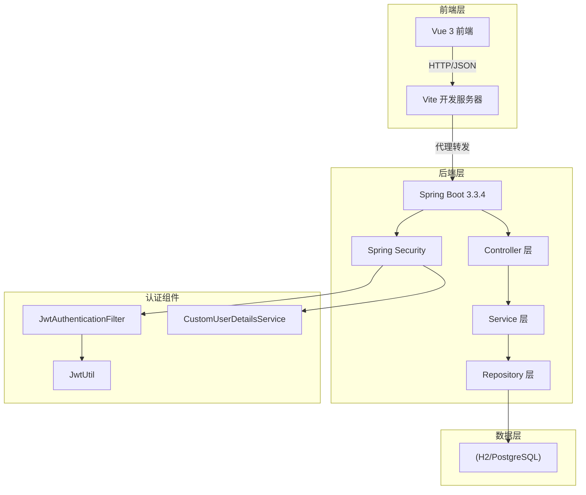

### 1.2 认证流程

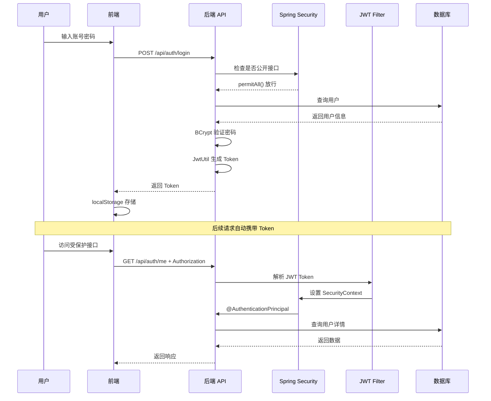

---

## 二、技术栈

| 层级 | 技术 | 版本 |
|------|------|------|
| 后端 | Spring Boot | 3.3.4 |
| 后端 | Spring Security | 6.1.13 |
| 后端 | JPA/Hibernate | 6.5.3 |
| 后端 | JWT | jjwt 0.12.6 |
| 后端 | Lombok | 1.18.30 |
| 前端 | Vue | 3.5.0 |
| 前端 | Vite | 6.2.0 |
| 前端 | Element Plus | 2.8.0 |
| 前端 | Pinia | 3.0.0 |
| 前端 | Vue Router | 5.0.0 |
| 数据库 | H2 (开发) / PostgreSQL (生产) | - |

### 2.1 技术选型说明

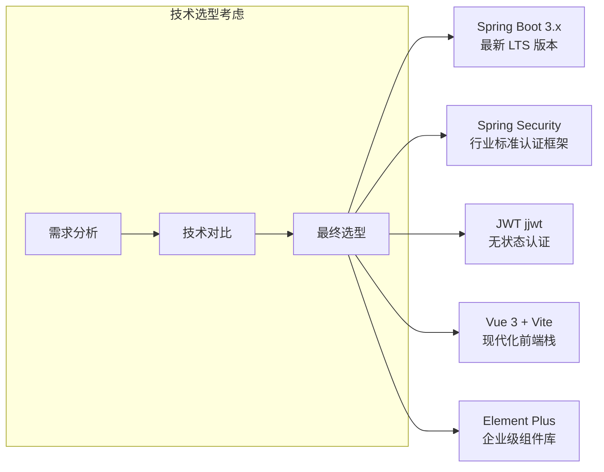

---

## 三、实体设计

### 3.1 实体关系图 (ERD)

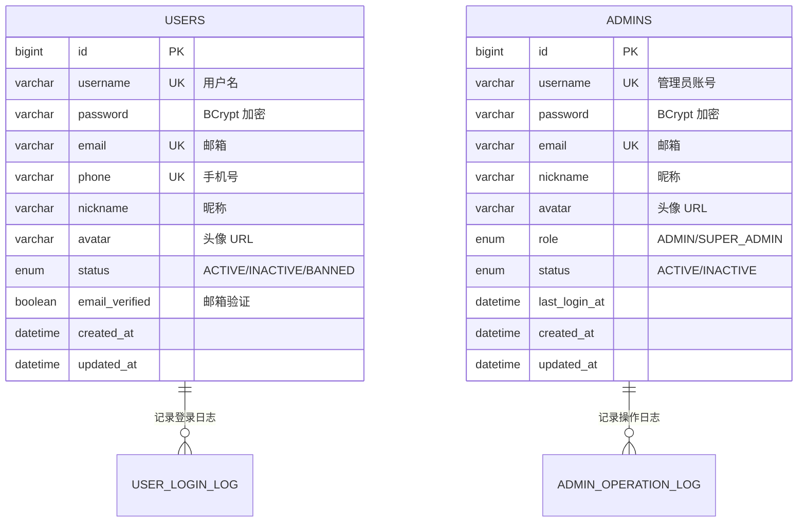

### 3.2 用户实体 (User)

```java
@Entity
@Table(name = "users")
public class User {
    @Id
    @GeneratedValue(strategy = GenerationType.IDENTITY)
    private Long id;

    @Column(unique = true, nullable = false)
    private String username;      // 用户名

    @Column(nullable = false)
    private String password;      // 加密密码

    @Column(unique = true)
    private String email;         // 邮箱

    @Column(unique = true)
    private String phone;         // 手机号

    private String nickname;      // 昵称
    private String avatar;        // 头像 URL

    @Enumerated(EnumType.STRING)
    private UserStatus status = UserStatus.ACTIVE;  // ACTIVE/INACTIVE/BANNED

    private Boolean emailVerified = false;  // 邮箱是否验证

    private LocalDateTime createdAt;
    private LocalDateTime updatedAt;
}
```

### 3.2 管理员实体 (Admin)

```java
@Entity
@Table(name = "admins")
public class Admin {
    @Id
    @GeneratedValue(strategy = GenerationType.IDENTITY)
    private Long id;

    @Column(unique = true, nullable = false)
    private String username;      // 管理员账号

    @Column(nullable = false)
    private String password;      // 加密密码

    @Column(unique = true)
    private String email;         // 邮箱

    private String nickname;      // 昵称
    private String avatar;        // 头像 URL

    @Enumerated(EnumType.STRING)
    private AdminRole role = AdminRole.ADMIN;  // ADMIN/SUPER_ADMIN

    @Enumerated(EnumType.STRING)
    private AdminStatus status = AdminStatus.ACTIVE;  // ACTIVE/INACTIVE

    private LocalDateTime lastLoginAt;  // 最后登录时间
    private LocalDateTime createdAt;
    private LocalDateTime updatedAt;
}
```

### 3.3 设计说明

| 设计点 | 说明 |
|--------|------|
| 分表设计 | 用户和管理员使用不同表，便于权限隔离 |
| 密码加密 | 使用 BCrypt 加密存储 |
| 状态管理 | 支持启用/停用/禁用状态 |
| 审计字段 | `createdAt`/`updatedAt` 自动维护 |

### 3.3 数据库表结构

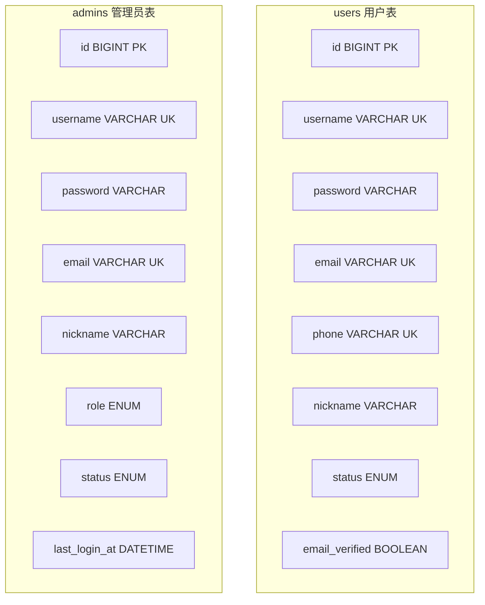

---

## 四、API 接口设计

### 4.1 接口调用流程

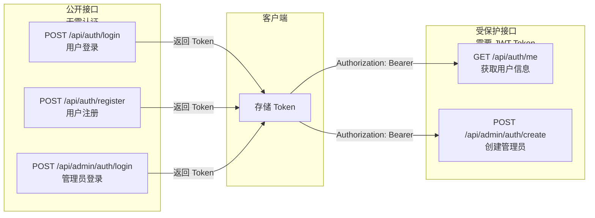

### 4.2 接口列表

| 接口 | 方法 | URL | 认证 | 说明 |
|------|------|-----|------|------|
| 用户登录 | POST | `/api/auth/login` | 无 | 用户登录 |
| 用户注册 | POST | `/api/auth/register` | 无 | 用户注册 |
| 获取当前用户 | GET | `/api/auth/me` | JWT | 获取用户信息 |
| 管理员登录 | POST | `/api/admin/auth/login` | 无 | 管理员登录 |
| 创建管理员 | POST | `/api/admin/auth/create` | JWT | 创建管理员(需权限) |

### 4.2 请求/响应格式

**登录请求**
```json
POST /api/auth/login
{
  "username": "test",
  "password": "123456"
}
```

**登录响应**
```json
{
  "code": 200,
  "message": "登录成功",
  "data": {
    "token": "eyJhbGc...",
    "tokenType": "Bearer",
    "id": 1,
    "username": "test",
    "nickname": "测试用户",
    "avatar": null,
    "role": "USER"
  }
}
```

**注册请求**
```json
POST /api/auth/register
{
  "username": "newuser",
  "password": "123456",
  "email": "test@example.com",
  "nickname": "新用户"
}
```

### 4.3 统一响应结构

```java
@Data
@AllArgsConstructor
public class ApiResponse<T> {
    private int code;       // 200 成功，其他为错误
    private String message; // 响应消息
    private T data;         // 响应数据
}
```

---

## 五、核心功能实现

### 5.1 JWT 工具类

```java
@Component
public class JwtUtil {
    @Value("${jwt.secret:aisale-secret-key}")
    private String secret;
    
    @Value("${jwt.expiration:86400000}")
    private long expiration;  // 24 小时

    // 生成 Token（包含用户名、角色、用户 ID）
    public String generateToken(String username, String role, Long userId) { }
    
    // 解析 Token
    public String extractUsername(String token) { }
    public String extractRole(String token) { }
    
    // 验证 Token
    public boolean validateToken(String token, String username) { }
}
```

### 5.2 认证过滤器

```java
@Component
public class JwtAuthenticationFilter extends OncePerRequestFilter {
    private final JwtUtil jwtUtil;
    private final CustomUserDetailsService userDetailsService;

    @Override
    protected void doFilterInternal(HttpServletRequest request,
                                    HttpServletResponse response,
                                    FilterChain filterChain) {
        // 1. 从 Authorization 头提取 Token
        // 2. 解析用户名
        // 3. 从数据库加载 UserDetails
        // 4. 设置 SecurityContext
    }
}
```

### 5.3 安全配置

```java
@Configuration
@EnableWebSecurity
public class SecurityConfig {
    @Bean
    public SecurityFilterChain securityFilterChain(HttpSecurity http) throws Exception {
        http.csrf(AbstractHttpConfigurer::disable)
            .sessionManagement(s -> s.sessionCreationPolicy(SessionCreationPolicy.STATELESS))
            .authorizeHttpRequests(auth -> auth
                // 公开接口
                .requestMatchers("/api/auth/login", "/api/auth/register",
                                "/api/auth/send-verification",
                                "/api/admin/auth/login").permitAll()
                // 用户接口需要认证
                .requestMatchers("/api/auth/**").authenticated()
                // 管理员接口需要权限
                .requestMatchers("/api/admin/**").hasAnyRole("SUPER_ADMIN", "ADMIN")
                .anyRequest().authenticated()
            )
            .addFilterBefore(jwtAuthenticationFilter, UsernamePasswordAuthenticationFilter.class);
        return http.build();
    }

    @Bean
    public PasswordEncoder passwordEncoder() {
        return new BCryptPasswordEncoder();
    }
}
```

### 5.4 安全过滤器链

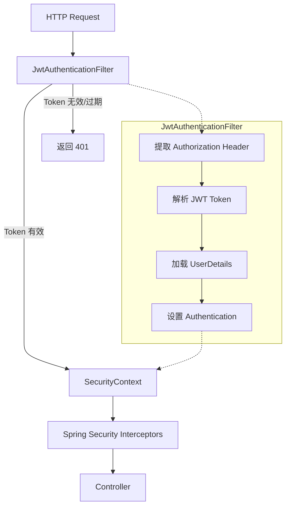

### 5.5 UserDetailsService 实现

```java
@Service
public class CustomUserDetailsService implements UserDetailsService {
    private final UserRepository userRepository;

    @Override
    public UserDetails loadUserByUsername(String username) {
        User user = userRepository.findByUsername(username)
            .orElseThrow(() -> new UsernameNotFoundException("用户不存在"));
        
        return new org.springframework.security.core.userdetails.User(
            user.getUsername(),
            user.getPassword(),
            List.of(new SimpleGrantedAuthority("ROLE_USER"))
        );
    }
}
```

---

## 六、问题与解决方案

### 问题 1: PasswordEncoder Bean 未找到

**错误信息**
```
Parameter 1 of constructor in AdminAuthService required a bean of type 
'org.springframework.security.crypto.password.PasswordEncoder' that could not be found.
```

**原因**: Spring 容器中未定义 PasswordEncoder Bean

**解决方案**: 在 SecurityConfig 中添加 Bean 定义
```java
@Bean
public PasswordEncoder passwordEncoder() {
    return new BCryptPasswordEncoder();
}
```

---

### 问题 2: Lombok 编译失败

**错误信息**
```
变量 adminAuthService 未在默认构造器中初始化
找不到符号：方法 getUsername()
```

**原因**: Maven 未正确配置 Lombok 注解处理器

**解决方案**: 在 pom.xml 中配置 maven-compiler-plugin
```xml
<plugin>
    <groupId>org.apache.maven.plugins</groupId>
    <artifactId>maven-compiler-plugin</artifactId>
    <version>3.11.0</version>
    <configuration>
        <source>17</source>
        <target>17</target>
        <annotationProcessorPaths>
            <path>
                <groupId>org.projectlombok</groupId>
                <artifactId>lombok</artifactId>
                <version>1.18.30</version>
            </path>
        </annotationProcessorPaths>
    </configuration>
</plugin>
```

---

### 问题 3: 重复的 Bean 定义冲突

**错误信息**
```
Annotation-specified bean name 'securityConfig' for bean class 
[com.aisale.backend.security.SecurityConfig] conflicts with existing, 
non-compatible bean definition of same name and class 
[com.aisale.backend.config.SecurityConfig]
```

**原因**: 存在两个同名的 SecurityConfig 类

**解决方案**: 
1. 删除 `config.SecurityConfig`（功能不完整）
2. 保留 `security.SecurityConfig`（包含完整的 JWT 配置）

---

### 问题 4: @AuthenticationPrincipal 返回 null

**错误信息**
```
Cannot invoke "UserDetails.getUsername()" because "userDetails" is null
```

**原因**: 
1. 缺少 UserDetailsService 实现
2. JWT 过滤器只设置了用户名，未设置完整的 UserDetails 对象

**解决方案**: 
1. 创建 CustomUserDetailsService 实现 UserDetailsService 接口
2. 修改 JwtAuthenticationFilter 加载完整的 UserDetails
```java
UserDetails userDetails = userDetailsService.loadUserByUsername(username);
UsernamePasswordAuthenticationToken authToken =
    new UsernamePasswordAuthenticationToken(userDetails, null, userDetails.getAuthorities());
```

---

### 问题 5: 接口无需认证却能访问

**现象**: `/api/auth/me` 无需 Token 即可访问

**原因**: 安全配置中 `/api/auth/**` 被配置为 `permitAll()`

**解决方案**: 明确指定公开接口，其他需要认证
```java
.requestMatchers("/api/auth/login", "/api/auth/register", 
                "/api/auth/send-verification").permitAll()
.requestMatchers("/api/auth/**").authenticated()  // 其他接口需要认证
```

---

## 七、前端开发

### 7.1 前端架构图

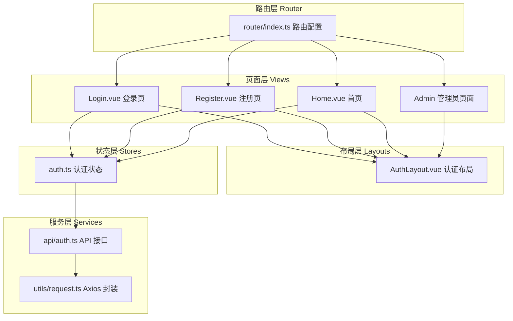

### 7.2 项目结构

```
frontend/src/
├── api/                    # API 接口层
│   └── auth.ts
├── layouts/                # 布局组件
│   └── AuthLayout.vue
├── router/                 # 路由配置
│   └── index.ts
├── stores/                 # 状态管理 (Pinia)
│   └── auth.ts
├── styles/                 # 主题样式
│   └── variables.css
├── utils/                  # 工具函数
│   └── request.ts
└── views/                  # 页面组件
    ├── Home.vue
    ├── user/
    │   ├── Login.vue
    │   └── Register.vue
    └── admin/
        ├── Login.vue
        └── Register.vue
```

### 7.2 主题设计 (浅黄色系)

```css
:root {
  --primary-color: #F59E0B;        /* 琥珀色 */
  --primary-light: #FDE68A;        /* 浅黄 */
  --primary-lighter: #FEF3C7;      /* 更浅 */
  --primary-dark: #D97706;         /* 深橙 */
  --bg-color: #FFFDF5;             /* 背景 */
  --text-primary: #1F2937;         /* 主文字 */
}
```

### 7.3 核心功能

**Axios 请求封装** (`utils/request.ts`)
- 自动注入 Authorization 头
- 统一错误处理
- 401 自动跳转登录

**认证状态管理** (`stores/auth.ts`)
- Token 持久化 (localStorage)
- 用户信息管理
- 登录/注册/退出方法

**路由守卫** (`router/index.ts`)
- `requiresAuth`: 需要认证的路由
- `guest`: 仅访客可访问的路由
- 自动重定向

### 7.4 页面特性

| 页面 | 功能 |
|------|------|
| 用户登录 | 用户名/密码、记住我、跳转注册 |
| 用户注册 | 用户名/密码确认/邮箱/昵称、协议勾选 |
| 管理员登录 | 独立入口、标识区分 |
| 管理员注册 | 角色选择、权限控制 |
| 首页 | 用户信息展示、退出登录 |

### 7.5 前端页面导航流程

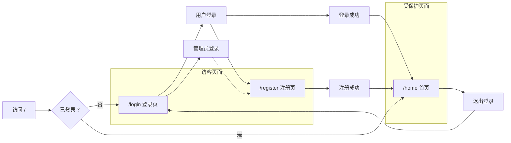

---

## 八、联调测试

### 8.1 完整测试流程

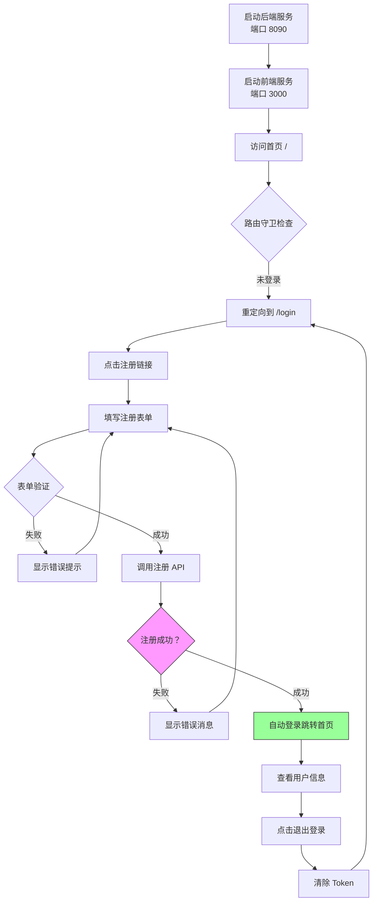

### 8.2 启动服务

**后端** (端口 8090)
```bash
cd backend
mvn spring-boot:run
```

**前端** (端口 3000)
```bash
cd frontend
npm run dev
```

### 8.2 测试流程

1. **用户注册**: 访问 `/register` 填写信息
2. **用户登录**: 访问 `/login` 输入凭据
3. **首页验证**: 登录后跳转 `/home` 查看用户信息
4. **Token 持久化**: 刷新页面保持登录状态
5. **退出登录**: 点击退出清除状态

### 8.3 验证检查点

- [ ] 表单验证规则生效
- [ ] 错误提示显示正确
- [ ] Token 正确存储和发送
- [ ] 路由守卫拦截生效
- [ ] 页面响应式设计正常

---

## 九、问题排查指南

### 9.1 常见问题流程图

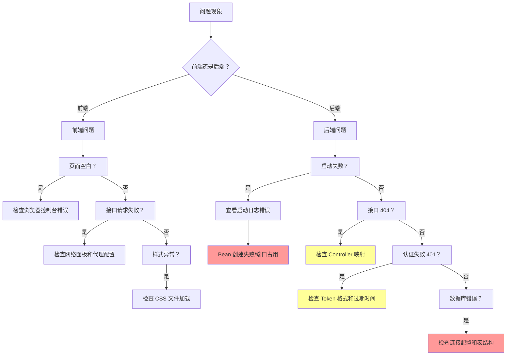

### 9.1 常见问题速查表

| 问题 | 可能原因 | 解决方案 |
|------|----------|----------|
| 前端页面空白 | JS 错误/路由配置错误 | 检查浏览器控制台 F12 |
| 接口 404 | URL 路径错误/后端未启动 | 检查 baseURL 和端口 |
| 接口 401 | Token 过期/格式错误 | 检查 localStorage 和请求头 |
| 后端启动失败 | 端口占用/Bean 冲突 | 查看日志，关闭占用进程 |
| 数据库连接失败 | 配置错误/服务未启动 | 检查 application.yml |
| CORS 错误 | 跨域配置缺失 | 检查后端 CORS 配置 |

### 9.2 快速诊断命令

```bash
# 检查端口占用
netstat -ano | findstr :8090
netstat -ano | findstr :3000

# 查看后端日志
cd backend
tail -f logs/application.log

# 前端重新安装依赖
cd frontend
rm -rf node_modules package-lock.json
npm install
```

---

## 十、Knife4j 接口文档配置

### 9.1 AfterScript 配置

在 Knife4j 中配置自动 Token 提取：

```javascript
// 获取响应对象
var response = JSON.parse(responseBody);

// 判断登录是否成功
if (response.code === 200 && response.data && response.data.token) {
    var tokenType = response.data.tokenType || "Bearer";
    var authHeader = tokenType + " " + response.data.token;
    ke.global.setAllHeader("Authorization", authHeader);
    console.log("✅ Token 已自动设置：" + authHeader);
} else {
    console.log("❌ 登录失败或未获取到 token");
}
```

### 9.2 配置位置

Knife4j UI → 接口调试 → AfterScript 文本框

---

## 十、待完善功能

### 10.1 功能路线图

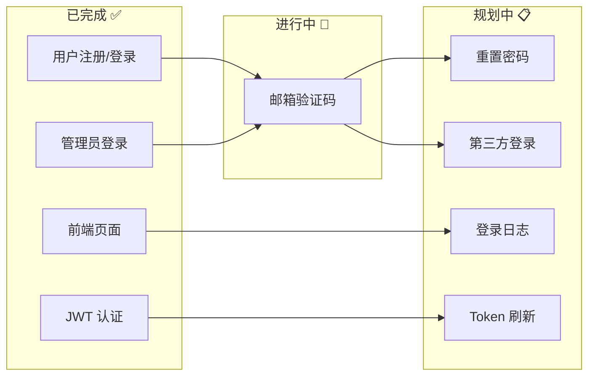

### 10.2 邮箱验证码流程

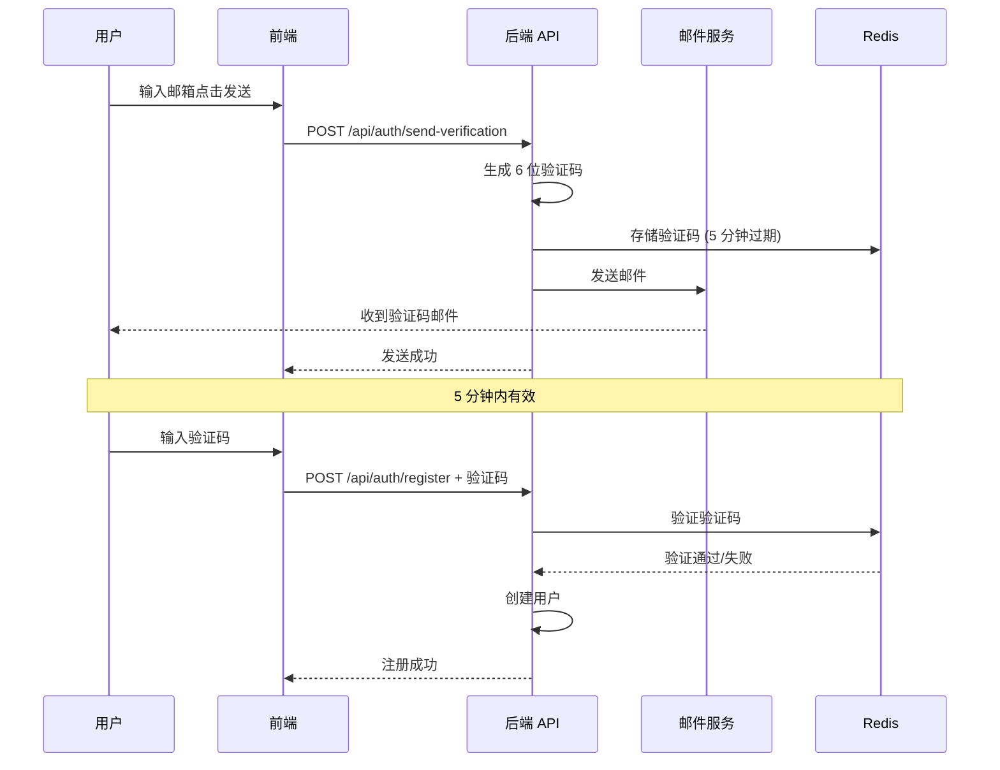

- [ ] 邮箱验证码发送
- [ ] 邮箱验证流程
- [ ] 忘记密码/重置密码
- [ ] 手机号登录
- [ ] 第三方登录 (微信/GitHub)
- [ ] 登录日志记录
- [ ] Token 刷新机制
- [ ] 账号封禁处理

---

## 十一、相关文档

- [1.项目初始化.md](./1.项目初始化.md)
- [API 接口文档](http://localhost:8090/swagger-ui.html)

---

*最后更新: 2026-04-12*
