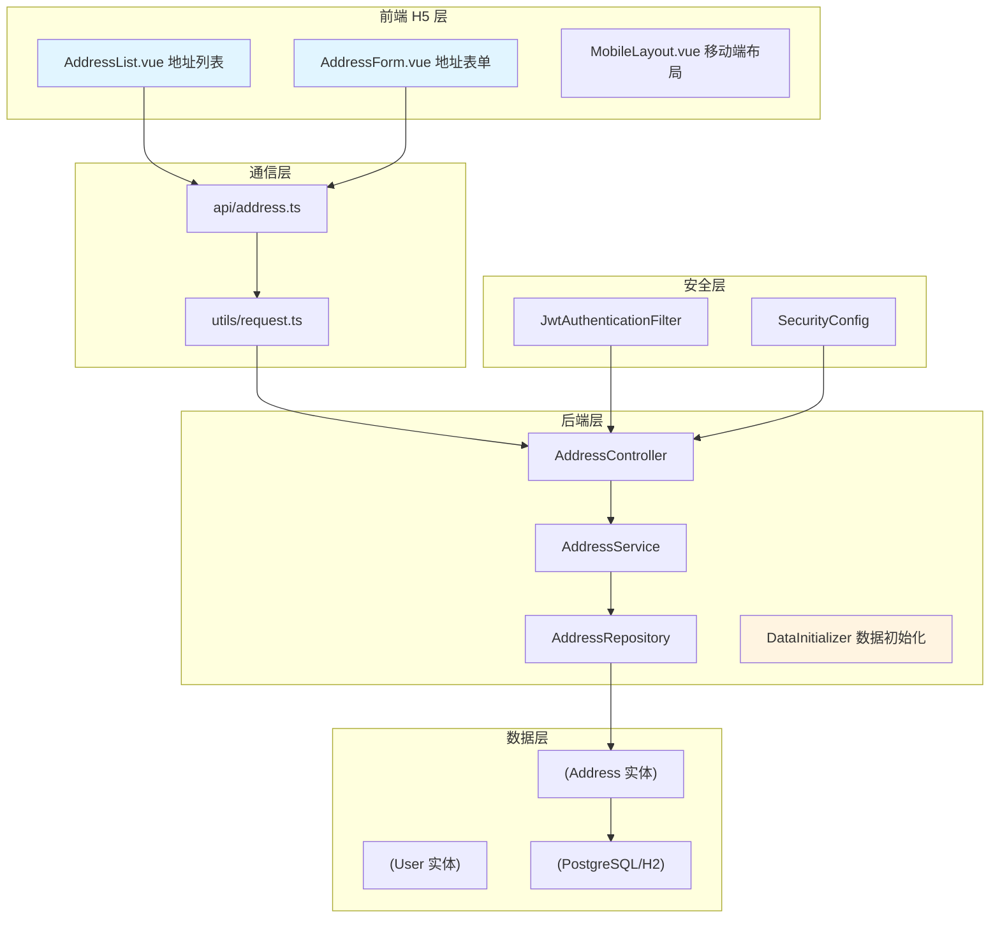
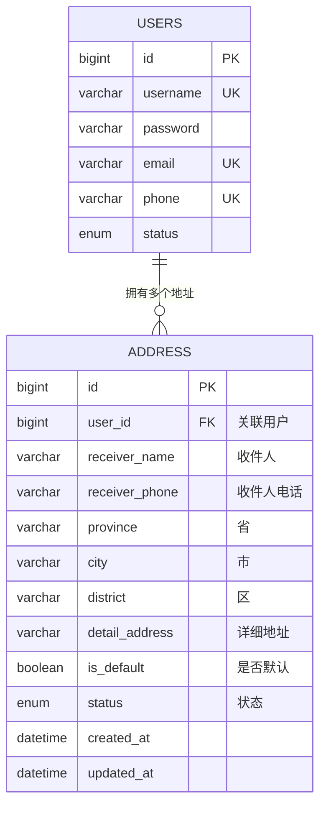
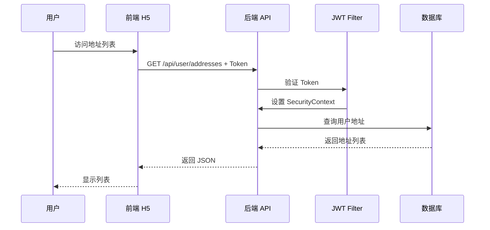

# 用户地址管理 - 开发文档

> 版本：v1.0.0  
> 最后更新：2026-04-12  
> 作者：AiSale 团队

---

## 一、概述

本文档记录了 AiSale 系统用户地址管理功能的完整开发过程，包括实体设计、API 开发、前端 H5 页面开发及联调测试，重点记录了开发中遇到的问题及解决方案。

### 1.1 功能范围

| 模块 | 说明 |
|------|------|
| 后端 | 地址实体、Repository、Service、Controller、API 接口 |
| 前端 H5 | 地址列表、新建地址、编辑地址、删除地址、设置默认地址 |
| 数据初始化 | 启动时自动创建测试用户和地址数据 |

### 1.2 系统架构



---

## 二、技术栈

| 层级 | 技术 | 版本 | 说明 |
|------|------|------|------|
| 后端 | Spring Boot | 3.3.4 | 核心框架 |
| 后端 | Spring Data JPA | 3.3.4 | ORM 框架 |
| 后端 | Spring Security | 6.1.13 | 安全认证 |
| 后端 | JWT | jjwt 0.12.6 | Token 认证 |
| 后端 | Hutool | 5.8.23 | 工具类库 |
| 前端 | Vue | 3.5.0 | 前端框架 |
| 前端 | Vite | 6.2.0 | 构建工具 |
| 前端 | Element Plus | 2.8.0 | UI 组件库 |
| 前端 | Vue Router | 5.0.0 | 路由管理 |
| 前端 | Pinia | 3.0.0 | 状态管理 |
| 数据库 | H2 (开发) / PostgreSQL (生产) | - | 关系型数据库 |

---

## 三、数据库设计

### 3.1 ER 图



### 3.2 Address 实体设计

```java
@Entity
@Table(name = "addresses")
public class Address {

    @Id
    @GeneratedValue(strategy = GenerationType.IDENTITY)
    private Long id;

    @ManyToOne(fetch = FetchType.LAZY)
    @JoinColumn(name = "user_id", nullable = false)
    private User user;  // 关联用户

    @Column(nullable = false)
    private String receiverName;  // 收件人姓名

    @Column(nullable = false)
    private String receiverPhone;  // 收件人电话

    @Column(nullable = false)
    private String province;  // 省

    @Column(nullable = false)
    private String city;  // 市

    @Column(nullable = false)
    private String district;  // 区/县

    @Column(nullable = false, length = 500)
    private String detailAddress;  // 详细地址

    private Boolean isDefault = false;  // 是否默认地址

    @Enumerated(EnumType.STRING)
    private AddressStatus status = AddressStatus.ACTIVE;  // 软删除

    private LocalDateTime createdAt;
    private LocalDateTime updatedAt;
}
```

### 3.3 表结构说明

| 字段 | 类型 | 约束 | 说明 |
|------|------|------|------|
| id | BIGINT | PRIMARY KEY, AUTO_INCREMENT | 主键 |
| user_id | BIGINT | FOREIGN KEY, NOT NULL | 外键关联 users 表 |
| receiver_name | VARCHAR | NOT NULL | 收件人姓名 |
| receiver_phone | VARCHAR | NOT NULL | 收件人电话 |
| province | VARCHAR | NOT NULL | 省份 |
| city | VARCHAR | NOT NULL | 城市 |
| district | VARCHAR | NOT NULL | 区县 |
| detail_address | VARCHAR(500) | NOT NULL | 详细地址 |
| is_default | BOOLEAN | DEFAULT FALSE | 是否默认地址 |
| status | ENUM | DEFAULT 'ACTIVE' | ACTIVE/DELETED |
| created_at | DATETIME | NOT NULL | 创建时间 |
| updated_at | DATETIME | NOT NULL | 更新时间 |

### 3.4 设计要点

| 设计点 | 说明 |
|--------|------|
| 软删除 | 使用 `status` 字段而非物理删除，便于数据恢复 |
| 默认地址 | 每个用户只能有一个默认地址 |
| 级联关系 | `@ManyToOne(fetch = FetchType.LAZY)` 懒加载避免 N+1 查询 |
| 审计字段 | `@PrePersist` 和 `@PreUpdate` 自动维护时间 |

---

## 四、API 接口设计

### 4.1 接口调用流程



### 4.2 接口列表

| 接口 | 方法 | URL | 认证 | 说明 |
|------|------|-----|------|------|
| 获取地址列表 | GET | `/api/user/addresses` | JWT | 获取当前用户所有地址 |
| 获取单个地址 | GET | `/api/user/addresses/{id}` | JWT | 获取指定地址详情 |
| 创建地址 | POST | `/api/user/addresses` | JWT | 添加新地址 |
| 更新地址 | PUT | `/api/user/addresses/{id}` | JWT | 修改地址信息 |
| 删除地址 | DELETE | `/api/user/addresses/{id}` | JWT | 软删除地址 |
| 设置默认地址 | PUT | `/api/user/addresses/{id}/default` | JWT | 设置默认地址 |

### 4.3 请求/响应示例

**创建地址请求**
```json
POST /api/user/addresses
Authorization: Bearer eyJhbGc...
{
  "receiverName": "张三",
  "receiverPhone": "13800138001",
  "province": "北京市",
  "city": "北京市",
  "district": "朝阳区",
  "detailAddress": "中关村大街 1 号",
  "isDefault": true
}
```

**创建地址响应**
```json
{
  "code": 200,
  "message": "地址添加成功",
  "data": {
    "id": 1,
    "receiverName": "张三",
    "receiverPhone": "13800138001",
    "province": "北京市",
    "city": "北京市",
    "district": "朝阳区",
    "detailAddress": "中关村大街 1 号",
    "isDefault": true,
    "fullAddress": "北京市北京市朝阳区中关村大街 1 号"
  }
}
```

**获取地址列表响应**
```json
{
  "code": 200,
  "message": "操作成功",
  "data": [
    {
      "id": 1,
      "receiverName": "张三",
      "receiverPhone": "13800138001",
      "province": "北京市",
      "city": "北京市",
      "district": "朝阳区",
      "detailAddress": "中关村大街 1 号",
      "isDefault": true,
      "fullAddress": "北京市北京市朝阳区中关村大街 1 号"
    },
    {
      "id": 2,
      "receiverName": "李四",
      "receiverPhone": "13800138002",
      "province": "上海市",
      "city": "上海市",
      "district": "浦东新区",
      "detailAddress": "张江高科技园区",
      "isDefault": false,
      "fullAddress": "上海市上海市浦东新区张江高科技园区"
    }
  ]
}
```

---

## 五、核心功能实现

### 5.1 Repository 层

```java
@Repository
public interface AddressRepository extends JpaRepository<Address, Long> {

    // 查询用户地址列表（按默认地址降序、创建时间降序）
    List<Address> findByUserAndStatusOrderByIsDefaultDescCreatedAtDesc(
        User user, AddressStatus status);

    // 查询单个地址
    Optional<Address> findByUserAndIdAndStatus(
        User user, Long id, AddressStatus status);

    // 查询用户默认地址
    Optional<Address> findByUserAndIsDefaultTrueAndStatus(
        User user, AddressStatus status);

    // 更新用户所有地址的 isDefault 状态
    @Modifying
    @Query("UPDATE Address a SET a.isDefault = ?3 WHERE a.user = ?1 AND a.status = ?2")
    void updateIsDefaultByUserAndStatus(
        User user, AddressStatus status, Boolean isDefault);

    // 统计用户地址数量
    long countByUserAndStatus(User user, AddressStatus status);
}
```

**问题 1：Spring Data JPA 无法解析 update 方法**

错误信息：
```
Failed to create query for method 
public abstract void AddressRepository.updateIsDefaultByUserAndStatus(...)
No property 'updateIsDefaultByUser' found for type 'Address'
```

解决方案：使用 `@Modifying` 和 `@Query` 显式定义 JPQL
```java
@Modifying
@Query("UPDATE Address a SET a.isDefault = ?3 WHERE a.user = ?1 AND a.status = ?2")
void updateIsDefaultByUserAndStatus(User user, AddressStatus status, Boolean isDefault);
```

### 5.2 Service 层

```java
@Service
@RequiredArgsConstructor
public class AddressService {

    private final AddressRepository addressRepository;
    private final UserRepository userRepository;

    // 获取用户地址列表
    public List<AddressResponse> getUserAddresses(String username) {
        User user = userRepository.findByUsername(username)
                .orElseThrow(() -> new RuntimeException("用户不存在"));
        
        List<Address> addresses = addressRepository.findByUserAndStatusOrderByIsDefaultDescCreatedAtDesc(
                user, Address.AddressStatus.ACTIVE);
        
        return addresses.stream()
                .map(AddressResponse::fromEntity)
                .toList();
    }

    // 创建地址
    @Transactional
    public AddressResponse createAddress(String username, AddressRequest request) {
        User user = userRepository.findByUsername(username)
                .orElseThrow(() -> new RuntimeException("用户不存在"));

        // 检查地址数量限制（最多 10 个）
        long addressCount = addressRepository.countByUserAndStatus(user, Address.AddressStatus.ACTIVE);
        if (addressCount >= 10) {
            throw new RuntimeException("最多只能添加 10 个地址");
        }

        // 使用 Hutool BeanUtil 简化属性拷贝
        Address address = BeanUtil.copyProperties(request, Address.class);
        address.setUser(user);

        // 处理默认地址逻辑
        if (request.getIsDefault() || addressCount == 0) {
            clearDefaultAddress(user);
            address.setIsDefault(true);
        }

        address = addressRepository.save(address);
        return AddressResponse.fromEntity(address);
    }

    // 设置默认地址
    @Transactional
    public AddressResponse setDefaultAddress(String username, Long addressId) {
        User user = userRepository.findByUsername(username)
                .orElseThrow(() -> new RuntimeException("用户不存在"));

        Address address = addressRepository.findByUserAndIdAndStatus(user, addressId, Address.AddressStatus.ACTIVE)
                .orElseThrow(() -> new RuntimeException("地址不存在"));

        // 清除所有默认地址
        clearDefaultAddress(user);
        address.setIsDefault(true);
        address = addressRepository.save(address);

        return AddressResponse.fromEntity(address);
    }

    // 清除用户所有默认地址
    private void clearDefaultAddress(User user) {
        List<Address> addresses = addressRepository.findByUserAndStatusOrderByIsDefaultDescCreatedAtDesc(
                user, Address.AddressStatus.ACTIVE);
        for (Address addr : addresses) {
            if (addr.getIsDefault()) {
                addr.setIsDefault(false);
                addressRepository.save(addr);
            }
        }
    }
}
```

### 5.3 Controller 层

```java
@RestController
@RequestMapping("/api/user/addresses")
@RequiredArgsConstructor
public class AddressController {

    private final AddressService addressService;

    @GetMapping
    public ApiResponse<List<AddressResponse>> getAllAddresses(
            @AuthenticationPrincipal UserDetails userDetails) {
        List<AddressResponse> addresses = addressService.getUserAddresses(userDetails.getUsername());
        return ApiResponse.success(addresses);
    }

    @PostMapping
    public ApiResponse<AddressResponse> createAddress(
            @AuthenticationPrincipal UserDetails userDetails,
            @Valid @RequestBody AddressRequest request) {
        AddressResponse address = addressService.createAddress(userDetails.getUsername(), request);
        return ApiResponse.success("地址添加成功", address);
    }

    @PutMapping("/{id}/default")
    public ApiResponse<AddressResponse> setDefaultAddress(
            @AuthenticationPrincipal UserDetails userDetails,
            @PathVariable Long id) {
        AddressResponse address = addressService.setDefaultAddress(userDetails.getUsername(), id);
        return ApiResponse.success("默认地址设置成功", address);
    }
}
```

### 5.4 SecurityConfig 配置

```java
@Bean
public SecurityFilterChain securityFilterChain(HttpSecurity http) throws Exception {
    http
        .csrf(AbstractHttpConfigurer::disable)
        .sessionManagement(session -> session.sessionCreationPolicy(SessionCreationPolicy.STATELESS))
        .authorizeHttpRequests(auth -> auth
            // 公开接口
            .requestMatchers("/api/auth/login", "/api/auth/register", ...).permitAll()
            // 管理员接口
            .requestMatchers("/api/admin/**").hasAnyRole("SUPER_ADMIN", "ADMIN")
            // 用户接口 - 允许 USER 或管理员访问
            .requestMatchers("/api/user/**").hasAnyRole("USER", "SUPER_ADMIN", "ADMIN")
            .anyRequest().authenticated()
        )
        .addFilterBefore(jwtAuthenticationFilter, UsernamePasswordAuthenticationFilter.class);

    return http.build();
}
```

---

## 六、前端 H5 开发

### 6.1 项目结构

```
frontend/src/
├── api/
│   └── address.ts           # 地址 API 封装
├── layouts/
│   └── MobileLayout.vue     # 移动端布局组件
├── router/
│   └── index.ts             # 路由配置
├── stores/
│   └── auth.ts              # 认证状态管理
├── views/
│   └── user/
│       ├── Home.vue         # 用户首页
│       ├── AddressList.vue  # 地址列表页
│       └── AddressForm.vue  # 地址表单页
└── utils/
    └── request.ts           # Axios 封装
```

### 6.2 移动端布局组件

```vue
<template>
  <div class="mobile-layout">
    <!-- 顶部导航栏 -->
    <header class="mobile-header">
      <div class="header-content">
        <div class="header-left">
          <slot name="left">
            <el-button text @click="handleBack">
              <el-icon><ArrowLeft /></el-icon>
            </el-button>
          </slot>
        </div>
        <div class="header-title">
          <slot name="title">{{ title }}</slot>
        </div>
        <div class="header-right">
          <slot name="right"></slot>
        </div>
      </div>
    </header>

    <!-- 主内容区 -->
    <main class="main-content">
      <slot></slot>
    </main>

    <!-- 底部标签栏 -->
    <nav class="tab-bar" v-if="showTabBar">
      <div class="tab-item" :class="{ active: activeTab === 'home' }" @click="navigateTo('/user/home')">
        <el-icon :size="24"><HomeFilled /></el-icon>
        <span>首页</span>
      </div>
      <div class="tab-item" :class="{ active: activeTab === 'address' }" @click="navigateTo('/user/addresses')">
        <el-icon :size="24"><Location /></el-icon>
        <span>地址</span>
      </div>
      <div class="tab-item" :class="{ active: activeTab === 'profile' }" @click="navigateTo('/user/profile')">
        <el-icon :size="24"><User /></el-icon>
        <span>我的</span>
      </div>
    </nav>
  </div>
</template>

<style scoped>
.mobile-layout {
  display: flex;
  flex-direction: column;
  height: 100vh;
  background: #F5F5F5;
}

.mobile-header {
  position: sticky;
  top: 0;
  z-index: 100;
  background: linear-gradient(135deg, #FDE68A 0%, #F59E0B 100%);
  box-shadow: 0 2px 8px rgba(245, 158, 11, 0.2);
}

.tab-bar {
  display: flex;
  justify-content: space-around;
  align-items: center;
  height: 60px;
  background: #FFFFFF;
  border-top: 1px solid #E5E5E5;
  padding-bottom: env(safe-area-inset-bottom);
}
</style>
```

### 6.3 地址列表页

**功能点：**
- 地址卡片展示
- 默认地址标识
- 设为默认操作
- 删除地址确认
- 空状态处理
- 底部新增按钮

**关键代码：**
```vue
<template>
  <MobileLayout title="收货地址" :show-tab-bar="true">
    <div class="address-page">
      <!-- 地址列表 -->
      <div class="address-list">
        <div v-for="address in addresses" :key="address.id" 
             class="address-card" :class="{ default: address.isDefault }"
             @click="handleEdit(address)">
          <div class="address-header">
            <div class="receiver-info">
              <span class="receiver-name">{{ address.receiverName }}</span>
              <span class="receiver-phone">{{ address.receiverPhone }}</span>
            </div>
            <el-tag v-if="address.isDefault" size="small" type="warning">默认</el-tag>
          </div>
          <div class="address-detail">
            <el-icon class="location-icon"><Location /></el-icon>
            <span class="address-text">{{ address.fullAddress }}</span>
          </div>
          <div class="address-actions">
            <el-button v-if="!address.isDefault" text type="warning" 
                       @click.stop="handleSetDefault(address)">设为默认</el-button>
            <el-button text type="danger" @click.stop="handleDelete(address)">删除</el-button>
          </div>
        </div>
      </div>

      <!-- 空状态 -->
      <el-empty v-if="!loading && addresses.length === 0" description="暂无收货地址" />

      <!-- 新增按钮 -->
      <div class="add-button-wrapper">
        <el-button type="primary" size="large" block @click="handleAdd">
          <el-icon><Plus /></el-icon>新建收货地址
        </el-button>
      </div>
    </div>
  </MobileLayout>
</template>
```

**问题 2：新增按钮与底部导航栏重叠**

原因：固定定位的按钮与底部 Tab 栏在同一层级

解决方案：
```css
.address-list {
  margin-bottom: 100px;  /* 增加底部间距 */
}

.add-button-wrapper {
  position: fixed;
  bottom: 60px;  /* 位于底部导航栏上方 */
  left: 0;
  right: 0;
  padding: 16px;
  background: transparent;
  pointer-events: none;  /* 包装器不响应点击 */
}

.add-button-wrapper .el-button {
  pointer-events: auto;  /* 按钮本身可点击 */
  max-width: 400px;
  margin: 0 auto;
  box-shadow: 0 4px 12px rgba(245, 158, 11, 0.3);
}
```

### 6.4 地址表单页

**功能点：**
- 收件人信息输入
- 手机号验证
- 省市区选择
- 默认地址开关
- 表单验证
- 新建/编辑模式

**表单验证规则：**
```typescript
const rules: FormRules = {
  receiverName: [
    { required: true, message: '请输入收件人姓名', trigger: 'blur' }
  ],
  receiverPhone: [
    { required: true, message: '请输入收件人电话', trigger: 'blur' },
    { pattern: /^1[3-9]\d{9}$/, message: '手机号格式不正确', trigger: 'blur' }
  ],
  detailAddress: [
    { required: true, message: '请输入详细地址', trigger: 'blur' }
  ]
}
```

### 6.5 API 封装

```typescript
// api/address.ts
import request from '@/utils/request'

export interface Address {
  id?: number
  receiverName: string
  receiverPhone: string
  province: string
  city: string
  district: string
  detailAddress: string
  isDefault: boolean
  fullAddress?: string
}

export async function getUserAddresses() {
  const res = await request.get('/user/addresses')
  return res.data
}

export async function createAddress(data: Address) {
  const res = await request.post('/user/addresses', data)
  return res.data
}

export async function setDefaultAddress(id: number) {
  const res = await request.put(`/user/addresses/${id}/default`)
  return res.data
}
```

**问题 3：API 响应数据处理**

原因：后端返回 `{code, message, data}`结构，前端直接使用`res.data`

解决方案：
```typescript
// 修改前
export function getUserAddresses() {
  return request.get<Address[]>('/user/addresses')
}

// 修改后 - 正确提取 data 字段
export async function getUserAddresses() {
  const res = await request.get('/user/addresses')
  return res.data  // res.data.data 才是真正的地址列表
}
```

---

## 七、数据初始化

### 7.1 DataInitializer 组件

```java
@Component
@ConditionalOnProperty(name = "spring.data.init.enabled", havingValue = "true", matchIfMissing = true)
public class DataInitializer implements CommandLineRunner {

    private final AdminRepository adminRepository;
    private final UserRepository userRepository;
    private final AddressRepository addressRepository;
    private final PasswordEncoder passwordEncoder;

    @Override
    public void run(String... args) {
        log.info("开始初始化测试数据...");
        initAdmins();    // 创建管理员
        initUsers();     // 创建用户
        initAddresses(); // 创建地址
        log.info("测试数据初始化完成!");
    }

    private void initAdmins() {
        // 创建超级管理员 superadmin / 123456
        // 创建管理员 admin / 123456
    }

    private void initUsers() {
        // 创建用户 zhangsan / 123456
        // 创建用户 lisi / 123456
        // 创建用户 wangwu / 123456
    }

    private void initAddresses() {
        // 为张三创建 2 个地址（北京、上海）
        // 为李四创建 1 个地址（广州）
    }
}
```

### 7.2 配置开关

```yaml
# application.yml
spring:
  data:
    init:
      enabled: true  # 设为 false 禁用数据初始化
```

### 7.3 测试账号

| 类型 | 用户名 | 密码 | 说明 |
|------|--------|------|------|
| 超级管理员 | superadmin | 123456 | 拥有全部权限 |
| 管理员 | admin | 123456 | 普通管理员权限 |
| 用户 | zhangsan | 123456 | 2 个地址 |
| 用户 | lisi | 123456 | 1 个地址 |
| 用户 | wangwu | 123456 | 无地址 |

---

## 八、问题与解决方案

### 问题 1：JWT Token 格式错误导致 401

**错误信息：**
```
401 Unauthorized - JWT token is invalid
```

**原因：** 前端存储 Token 时未包含 `Bearer` 前缀

**解决方案：**
```typescript
// auth.ts - 登录成功后存储完整 Token
const authData = result.data
setToken(authData.tokenType + ' ' + authData.token)  // "Bearer eyJhbGc..."

// request.ts - 自动添加 Authorization 头
request.interceptors.request.use((config) => {
  const token = localStorage.getItem('token')
  if (token) {
    config.headers.Authorization = token  // 直接使用完整 Token
  }
  return config
})
```

---

### 问题 2：SecurityConfig 权限配置问题

**现象：** 用户登录后访问 `/api/user/addresses` 返回 403 Forbidden

**原因：** Spring Security 的 `hasRole("USER")` 会自动添加 `ROLE_` 前缀，但 CustomUserDetailsService 返回的是 `ROLE_USER`

**解决方案：** 使用 `hasAnyRole()` 允许多个角色
```java
.requestMatchers("/api/user/**").hasAnyRole("USER", "SUPER_ADMIN", "ADMIN")
```

---

### 问题 3：Hutool BeanUtil 属性拷贝问题

**现象：** `BeanUtil.copyProperties(request, Address.class)` 后 `user` 字段为 null

**原因：** AddressRequest 中没有 user 字段

**解决方案：** 手动设置关联对象
```java
Address address = BeanUtil.copyProperties(request, Address.class);
address.setUser(user);  // 手动设置用户关联
```

---

### 问题 4：前端路由跳转错误

**现象：** 登录后跳转 404

**原因：** 路由配置从 `/home` 改为 `/user/home`，但登录页仍跳转 `/home`

**解决方案：**
```typescript
// Login.vue
router.push(redirect || '/user/home')  // 修改为正确路径

// MobileLayout.vue
if (path === '/user/home' || path === '/') return 'home'  // 修正 Tab 激活判断
```

---

### 问题 5：Lombok 版本不兼容 JDK 17

**错误信息：**
```
java.lang.ExceptionInInitializerError: com.sun.tools.javac.code.TypeTag :: UNKNOWN
```

**原因：** Lombok 1.18.30 与 JDK 17 不兼容

**解决方案：** 升级 Lombok 到 1.18.34
```xml
<properties>
  <lombok.version>1.18.34</lombok.version>
</properties>
```

---

## 九、开发注意事项

### 9.1 实用性设计

| 设计点 | 实现方式 |
|--------|----------|
| 地址数量限制 | 每个用户最多 10 个地址，防止滥用 |
| 默认地址唯一 | 设置新默认地址时自动清除旧默认 |
| 软删除 | 使用 status 字段，便于数据恢复和审计 |
| 懒加载 | 避免 N+1 查询问题 |
| 表单验证 | 前端验证 + 后端 @Valid 双重校验 |

### 9.2 移动端适配

```css
/* 安全区域适配 */
padding-bottom: env(safe-area-inset-bottom);

/* 滚动优化 */
-webkit-overflow-scrolling: touch;

/* 响应式布局 */
@media (max-width: 640px) {
  .welcome-title {
    font-size: 24px;
  }
}
```

### 9.3 代码简化实践

**使用 Hutool BeanUtil 简化 DTO 转换：**

修改前：
```java
public static AddressResponse fromEntity(Address address) {
    AddressResponse response = new AddressResponse();
    response.setId(address.getId());
    response.setReceiverName(address.getReceiverName());
    // ... 重复代码
    return response;
}
```

修改后：
```java
public static AddressResponse fromEntity(Address address) {
    AddressResponse response = BeanUtil.copyProperties(address, AddressResponse.class);
    response.setFullAddress(address.getProvince() + address.getCity() + 
                           address.getDistrict() + address.getDetailAddress());
    return response;
}
```

---

## 十、测试检查清单

### 10.1 后端 API 测试

- [ ] GET `/api/user/addresses` - 获取地址列表
- [ ] GET `/api/user/addresses/1` - 获取单个地址
- [ ] POST `/api/user/addresses` - 创建地址
- [ ] PUT `/api/user/addresses/1` - 更新地址
- [ ] DELETE `/api/user/addresses/1` - 删除地址
- [ ] PUT `/api/user/addresses/1/default` - 设置默认地址
- [ ] 未登录访问返回 401
- [ ] 地址数量超过 10 个返回错误

### 10.2 前端 H5 测试

- [ ] 地址列表页面加载正常
- [ ] 默认地址标识显示正确
- [ ] 设为默认功能正常
- [ ] 删除地址确认弹窗显示
- [ ] 新增地址按钮正常跳转
- [ ] 地址表单验证生效
- [ ] 手机号格式验证正确
- [ ] 返回按钮正常工作
- [ ] 底部 Tab 栏切换正常
- [ ] 移动端响应式布局正常

### 10.3 集成测试

- [ ] 登录 → 跳转首页 → 进入地址管理
- [ ] 新建地址 → 返回列表 → 编辑地址
- [ ] 设置默认地址 → 列表刷新 → 默认标识更新
- [ ] 删除地址 → 列表刷新 → 空状态显示
- [ ] 退出登录 → 访问地址页 → 跳转登录

---

## 十一、下一步规划

### 11.1 待完善功能

- [ ] 省市区三级联动选择器
- [ ] 地址智能解析（粘贴文本自动识别）
- [ ] 地址使用记录（统计使用次数）
- [ ] 地址分享功能
- [ ] 批量操作（批量删除、批量设置默认）

### 11.2 性能优化

- [ ] 地址列表分页加载
- [ ] 地址数据缓存
- [ ] 图片上传（头像、地址证明）
- [ ] 搜索功能（按收件人、电话搜索）

---

## 十二、相关文档

- [1.初始化配置说明.md](./1.初始化配置说明.md)
- [2.用户管理登录注册开发.md](./2.用户管理登录注册开发.md)
- [API 接口文档](http://localhost:8090/swagger-ui.html)

---

*最后更新：2026-04-12*
