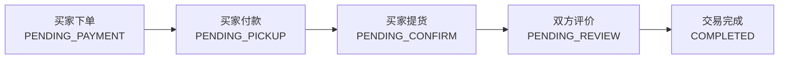

# 订单模块开发文档

## 一、模块概述

### 1.1 业务背景

AiSale 校园二手交易平台的核心交易链路。平台采用**线下自提/面交**模式，无物流配送，交易双方需线下完成商品交付和款项支付。

### 1.2 核心流程



### 1.3 状态机设计

| 状态 | 英文标识 | 说明 | 可执行操作 |
|------|----------|------|------------|
| 待付款 | `PENDING_PAYMENT` | 订单已创建，等待买家付款 | 买家付款、买家/卖家取消 |
| 待提货 | `PENDING_PICKUP` | 已付款，等待买家线下提货 | 买家确认提货、买家取消 |
| 待确认 | `PENDING_CONFIRM` | 已提货，等待卖家确认收款 | 卖家确认收款 |
| 待评价 | `PENDING_REVIEW` | 已确认，等待双方评价 | 买家评价、卖家评价 |
| 已完成 | `COMPLETED` | 双方评价完成，交易结束 | 无 |
| 已取消 | `CANCELLED` | 订单被取消 | 无 |
| 已退款 | `REFUNDED` | 交易失败已退款 | 无 |

---

## 二、数据库设计

### 2.1 订单表 (orders)

```sql
CREATE TABLE orders (
    id              BIGINT PRIMARY KEY AUTO_INCREMENT,
    order_no        VARCHAR(32) NOT NULL UNIQUE,      -- 订单号
    buyer_id        BIGINT NOT NULL,                   -- 买家 ID
    seller_id       BIGINT NOT NULL,                   -- 卖家 ID
    product_id      BIGINT NOT NULL,                   -- 商品 ID
    product_name    VARCHAR(255),                      -- 商品名称快照
    product_image   VARCHAR(500),                      -- 商品图片快照
    price           DECIMAL(10,2),                     -- 成交价格
    quantity        INT,                               -- 购买数量
    total_amount    DECIMAL(10,2),                     -- 订单总额
    meet_location   VARCHAR(500),                      -- 面交地点
    meet_time       DATETIME,                          -- 约定时间
    buyer_remark    VARCHAR(500),                      -- 买家留言
    status          ENUM(...),                         -- 订单状态
    payment_time    DATETIME,                          -- 付款时间
    pickup_time     DATETIME,                          -- 提货时间
    confirm_time    DATETIME,                          -- 确认时间
    complete_time   DATETIME,                          -- 完成时间
    cancel_time     DATETIME,                          -- 取消时间
    cancel_reason   VARCHAR(500),                      -- 取消原因
    cancel_role     ENUM('BUYER','SELLER'),            -- 取消方
    admin_remark    VARCHAR(500),                      -- 管理员备注
    created_at      DATETIME,
    updated_at      DATETIME
);
```

### 2.2 评价表 (order_reviews)

```sql
CREATE TABLE order_reviews (
    id              BIGINT PRIMARY KEY AUTO_INCREMENT,
    order_id        BIGINT NOT NULL,
    reviewer_id     BIGINT NOT NULL,                   -- 评价人 ID
    reviewee_id     BIGINT NOT NULL,                   -- 被评价人 ID
    rating          INT,                               -- 评分 (1-5)
    content         VARCHAR(1000),                     -- 评价内容
    reply_content   VARCHAR(1000),                     -- 回复内容
    review_type     ENUM('BUYER_REVIEW','SELLER_REVIEW'),
    created_at      DATETIME,
    updated_at      DATETIME
);
```

### 2.3 日志表 (order_logs)

```sql
CREATE TABLE order_logs (
    id              BIGINT PRIMARY KEY AUTO_INCREMENT,
    order_id        BIGINT NOT NULL,
    operator_id     BIGINT,                            -- 操作人 ID
    operator_role   ENUM('BUYER','SELLER','ADMIN','SYSTEM'),
    action          VARCHAR(50),                       -- 操作类型
    from_status     ENUM(...),                         -- 原状态
    to_status       ENUM(...),                         -- 新状态
    remark          VARCHAR(500),
    created_at      DATETIME
);
```

---

## 三、后端实现

### 3.1 实体类结构

```
backend/entity/
├── Order.java           # 订单实体
├── OrderReview.java     # 评价实体
└── OrderLog.java        # 日志实体
```

### 3.2 核心业务逻辑

#### 3.2.1 订单创建流程

```java
@Transactional
public OrderResponse createOrder(OrderRequest request, Long buyerId) {
    // 1. 验证商品
    Product product = productRepository.findById(request.getProductId())
        .orElseThrow(() -> new BusinessException("商品不存在"));
    
    // 2. 检查库存
    if (product.getStock() < request.getQuantity()) {
        throw new BusinessException("库存不足");
    }
    
    // 3. 检查重复订单
    List<Order> existing = orderRepository.findByProductIdAndStatus(
        request.getProductId(), OrderStatus.PENDING_PAYMENT);
    if (!existing.isEmpty()) {
        throw new BusinessException("该商品有待付款订单");
    }
    
    // 4. 生成订单号
    String orderNo = generateOrderNo();
    
    // 5. 扣减库存
    product.setStock(product.getStock() - request.getQuantity());
    productRepository.save(product);
    
    // 6. 创建订单
    Order order = new Order();
    // ... 设置订单属性
    order.setStatus(OrderStatus.PENDING_PAYMENT);
    orderRepository.save(order);
    
    // 7. 记录日志
    logOrderAction(order.getId(), null, "CREATE_ORDER", 
                   OrderStatus.PENDING_PAYMENT, "订单创建");
    
    return OrderResponse.fromEntity(order);
}
```

#### 3.2.2 状态流转控制

```java
// 买家付款
@Transactional
public OrderResponse payOrder(Long orderId, Long buyerId) {
    Order order = orderRepository.findById(orderId)
        .orElseThrow(() -> new BusinessException("订单不存在"));
    
    // 验证订单归属
    if (!order.getBuyerId().equals(buyerId)) {
        throw new BusinessException("无权操作此订单");
    }
    
    // 验证状态
    if (order.getStatus() != OrderStatus.PENDING_PAYMENT) {
        throw new BusinessException("订单状态不允许付款");
    }
    
    // 更新状态
    order.setStatus(OrderStatus.PENDING_PICKUP);
    order.setPaymentTime(LocalDateTime.now());
    orderRepository.save(order);
    
    logOrderAction(orderId, buyerId, "PAY_ORDER", 
                   OrderStatus.PENDING_PAYMENT, OrderStatus.PENDING_PICKUP, "买家付款");
    
    return OrderResponse.fromEntity(order);
}
```

### 3.3 控制器接口

#### 用户端接口 (`/api/user/orders`)

| 方法 | 路径 | 说明 |
|------|------|------|
| POST | `/` | 创建订单 |
| GET | `/my/buyer` | 我买的订单列表 |
| GET | `/my/seller` | 我卖的订单列表 |
| GET | `/{id}` | 订单详情 |
| GET | `/{id}/logs` | 订单日志 |
| PUT | `/{id}/pay` | 确认付款 |
| PUT | `/{id}/pickup` | 确认提货 |
| PUT | `/{id}/confirm` | 确认收款 |
| PUT | `/{id}/cancel` | 取消订单 |
| POST | `/{id}/review` | 提交评价 |
| GET | `/{id}/reviews` | 获取评价列表 |

#### 管理端接口 (`/api/admin/orders`)

| 方法 | 路径 | 说明 |
|------|------|------|
| GET | `/` | 所有订单列表 |
| GET | `/{id}` | 订单详情 |
| GET | `/query` | 多条件查询 |
| PUT | `/{id}/status` | 强制修改状态 |
| PUT | `/{id}/remark` | 添加管理员备注 |
| GET | `/{id}/logs` | 订单日志 |

---

## 四、前端实现

### 4.1 页面结构

```
frontend/src/views/
├── user/                          # 用户端
│   ├── OrderList.vue              # 订单列表（买家/卖家）
│   ├── OrderDetail.vue            # 订单详情
│   ├── OrderForm.vue              # 创建订单
│   └── OrderReviewForm.vue        # 提交评价
└── admin/                         # 管理端
    ├── OrderList.vue              # 订单管理列表
    └── OrderDetail.vue            # 订单详情（管理）
```

### 4.2 用户端订单列表

**功能特点：**
- 买家/卖家双视角切换
- 状态筛选
- 分页加载
- 点击跳转详情

**核心代码：**
```vue
<template>
  <MobileLayout title="我的订单" :show-tab-bar="true">
    <el-tabs v-model="activeTab">
      <el-tab-pane name="buyer" label="我买的" />
      <el-tab-pane name="seller" label="我卖的" />
    </el-tabs>
    
    <el-empty v-if="orders.length === 0" description="暂无订单" />
    
    <div v-else class="order-list">
      <div v-for="order in orders" :key="order.id" 
           class="order-item" @click="goToDetail(order.id)">
        <!-- 订单卡片内容 -->
      </div>
    </div>
  </MobileLayout>
</template>
```

### 4.3 用户端订单详情

**功能特点：**
- 订单状态可视化展示
- 交易时间线
- 动态操作按钮（根据状态显示不同操作）
- 订单评价展示

**操作按钮逻辑：**
```typescript
const showPayButton = computed(() => {
  return isBuyer.value && order.value?.status === OrderStatus.PENDING_PAYMENT
})

const showPickupButton = computed(() => {
  return isBuyer.value && order.value?.status === OrderStatus.PENDING_PICKUP
})

const showConfirmButton = computed(() => {
  return !isBuyer.value && order.value?.status === OrderStatus.PENDING_CONFIRM
})

const showReviewButton = computed(() => {
  return isBuyer.value &&
         order.value?.status === OrderStatus.PENDING_REVIEW &&
         !order.value?.hasBuyerReview
})
```

### 4.4 管理端订单列表

**功能特点：**
- 多条件筛选（订单号、买家 ID、卖家 ID、状态、时间范围）
- 统计卡片（总订单数、各状态订单数）
- 快捷修改状态
- 查看日志

---

## 五、遇到的问题与解决方案

### 5.1 API 响应结构不匹配

**问题描述：**
后端返回的 JSON 没有 `code` 字段，前端拦截器判断失败，导致"请求失败"错误。

**原因分析：**
- 前端 `request.ts` 拦截器期望响应结构：`{ code: 200, message: '', data: {} }`
- 后端控制器内部类 `ApiResponse` 只有：`{ message: '', data: {} }`

**解决方案：**
1. 删除 `UserOrderController`和`AdminOrderController` 中的内部类 `ApiResponse`
2. 使用全局的 `com.aisale.backend.dto.ApiResponse<T>`
3. 确保所有控制器统一使用相同的响应结构

**修改代码：**
```java
// 修改前（内部类）
@lombok.Data
@lombok.AllArgsConstructor
public static class ApiResponse<T> {
    private String message;
    private T data;
}

// 修改后（使用全局 DTO）
import com.aisale.backend.dto.ApiResponse;
// 直接使用 ApiResponse.success(data)
```

### 5.2 图标导入错误

**问题描述：**
```
SyntaxError: does not provide an export named 'CloseCircle'
```

**原因分析：**
Element Plus Icons 中图标名称为 `CircleClose`，而非 `CloseCircle`。

**解决方案：**
```typescript
// 修改前
import { CloseCircle } from '@element-plus/icons-vue'

// 修改后
import { CircleClose } from '@element-plus/icons-vue'
```

### 5.3 订单日志 API 权限问题

**问题描述：**
用户端订单详情页调用日志接口返回 403 未授权错误。

**原因分析：**
- 前端调用的是管理端接口 `/admin/orders/{id}/logs`
- 管理端接口需要管理员权限
- 普通用户访问被拒绝

**解决方案：**
1. 在 `UserOrderController` 中添加用户端日志接口
2. 修改前端 API 路径为 `/user/orders/{id}/logs`

**新增接口：**
```java
@Operation(summary = "获取订单日志")
@GetMapping("/{id}/logs")
public ApiResponse<List<OrderLog>> getOrderLogs(
        @PathVariable Long id,
        HttpServletRequest httpRequest) {
    Long userId = jwtRequestUtils.getCurrentUserId(httpRequest);
    // 验证订单权限
    orderService.getOrderById(id, userId);
    return ApiResponse.success(orderService.getOrderLogs(id));
}
```

### 5.4 Vite 缓存问题

**问题描述：**
代码已修改但浏览器仍报错，控制台显示旧的模块导入错误。

**解决方案：**
清除 Vite 开发服务器缓存：
```bash
rm -rf frontend/node_modules/.vite
npm run dev  # 重启开发服务器
```

---

## 六、测试验证

### 6.1 完整交易流程测试

1. **准备阶段**
   - 创建两个测试用户（买家、卖家）
   - 卖家发布商品

2. **下单阶段**
   - 买家浏览商品 → 点击购买
   - 填写订单信息（面交地点、时间、留言）
   - 提交订单

3. **付款阶段**
   - 买家在订单详情点击"确认付款"
   - 状态变更：待付款 → 待提货

4. **提货阶段**
   - 线下交易（模拟）
   - 买家点击"确认提货"
   - 状态变更：待提货 → 待确认

5. **确认阶段**
   - 卖家点击"确认收款"
   - 状态变更：待确认 → 待评价

6. **评价阶段**
   - 买家提交评价
   - 卖家提交评价
   - 状态变更：待评价 → 已完成

### 6.2 管理端功能测试

- 查看所有订单列表
- 多条件筛选订单
- 查看订单详情和日志
- 强制修改订单状态
- 添加管理员备注

---

## 七、注意事项

### 7.1 数据安全
- 订单操作必须验证归属权（买家只能操作自己的订单）
- 管理员操作需要记录日志

### 7.2 并发控制
- 下单时检查库存需加锁
- 避免重复订单

### 7.3 数据一致性
- 订单创建和库存扣减在同一事务中
- 取消订单时需恢复库存

### 7.4 状态校验
- 每次状态变更前验证前置状态
- 不允许跨状态跳转

---

## 八、后续优化建议

1. **支付集成**：对接真实支付接口（微信支付/支付宝）
2. **消息通知**：订单状态变更时发送站内信或短信通知
3. **订单超时**：自动取消超时未付款订单（定时任务）
4. **数据统计**：完善订单统计功能（销售额、订单量趋势）
5. **导出功能**：支持订单数据导出 Excel
