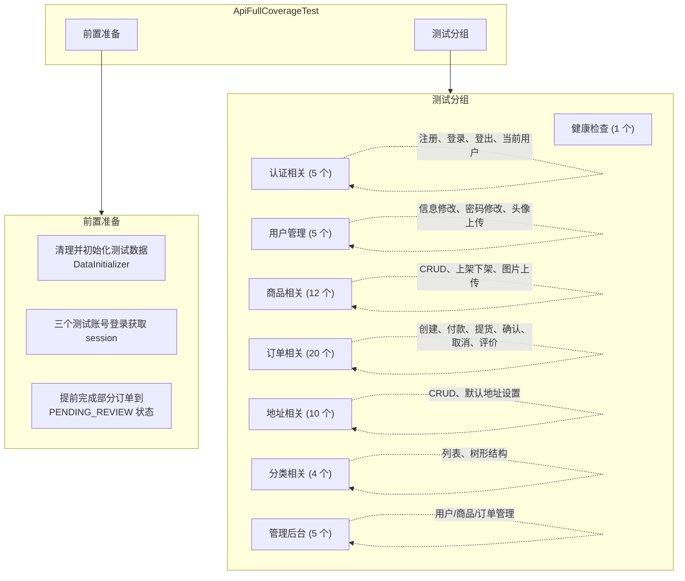

# API 测试与单元测试文档

## 一、测试概述

### 1.1 测试范围

| 测试类型 | 文件 | 覆盖内容 |
|----------|------|----------|
| API 接口测试 | `tests/api_full_coverage_test.py` | 62 个 HTTP 接口 |
| Java 单元测试 | `OrderServiceTest.java` | 订单服务 14 个测试用例 |
| Java 单元测试 | `OrderReviewServiceTest.java` | 评价服务 12 个测试用例 |

### 1.2 测试执行命令

```bash
# 运行 API 接口测试
cd backend/tests
python api_full_coverage_test.py

# 运行 Java 单元测试
mvn test -Dtest=OrderServiceTest,OrderReviewServiceTest

# 运行全部测试
mvn test
```

---

## 二、API 接口测试（62 个接口）

### 2.1 测试架构



### 2.2 测试数据依赖

API 测试成功的关键在于**正确的测试数据准备**。`DataInitializer` 创建了 10 个订单，每个处于不同状态：

| 订单 ID | 状态 | 买家 | 卖家 | 用途 |
|---------|------|------|------|------|
| 1 | PENDING_PICKUP | lisi | zhangsan | 测试买家确认提货 |
| 2 | PENDING_REVIEW | lisi | zhangsan | 测试买家评价 |
| 3 | PENDING_CONFIRM | zhangsan | lisi | 测试卖家确认收款 |
| 4 | COMPLETED | zhangsan | lisi | 测试已完成订单查看 |
| 5 | PENDING_PAYMENT | wangwu | zhangsan | 测试买家付款 |
| 6 | PENDING_PICKUP | wangwu | lisi | 边界测试 |
| 7 | PENDING_CONFIRM | lisi | wangwu | 边界测试 |
| 8 | PENDING_REVIEW | zhangsan | lisi | 测试卖家评价 |
| 9 | PENDING_PICKUP | wangwu | zhangsan | 测试买家取消订单 |
| 10 | PENDING_PAYMENT | zhangsan | wangwu | 测试卖家取消订单 |

---

## 三、遇到的问题与解决方案

### 问题 1：评价接口返回 403 Forbidden

**现象**：
```python
POST /api/user/orders/2/review?type=BUYER
响应：403 Forbidden
```

**原因分析**：
1. ReviewType 枚举值为 `BUYER_REVIEW` 和 `SELLER_REVIEW`，而非 `BUYER` 和 `SELLER`
2. 评价需要订单处于 `PENDING_REVIEW` 状态
3. 只有订单的买家才能进行买家评价

**解决方案**：
```python
# 错误写法
params={"type": "BUYER"}

# 正确写法
params={"type": "BUYER_REVIEW"}

# 使用正确的账号（订单 2 的买家是 lisi）
lisi_session.login(BUYER_ACCOUNT["username"], BUYER_ACCOUNT["password"])
```

---

### 问题 2：回复评价接口返回 403 Forbidden

**现象**：
```python
PUT /api/user/orders/review/1/reply
响应：403 Forbidden
```

**原因分析**：
1. 只有**被评价人**才能回复评价
2. 订单 8 的卖家是 `lisi`，而非 `zhangsan`
3. `OrderReviewRequest` DTO 需要 `rating` 和 `content` 两个字段

**解决方案**：
```python
# 错误写法 - 用了 zhangsan
seller_session.login(SELLER_ACCOUNT["username"], SELLER_ACCOUNT["password"])

# 正确写法 - 用 lisi（订单 8 的卖家）
lisi_session.login(BUYER_ACCOUNT["username"], BUYER_ACCOUNT["password"])

# 请求体补充完整字段
json={"content": "回复测试", "rating": 5}
```

---

### 问题 3：订单操作接口返回 403 Forbidden

**现象**：
```python
PUT /api/user/orders/1/pay  # 403
PUT /api/user/orders/2/confirm-pickup  # 403
```

**原因分析**：
订单操作有严格的**身份校验**：
- 付款：只能由买家操作
- 提货确认：只能由买家操作
- 收款确认：只能由卖家操作
- 取消：买家或卖家均可（状态允许时）

测试时使用错账号会导致 403。

**解决方案**：
```python
# 订单 5 是 PENDING_PAYMENT，买家是 wangwu
wangwu_session.login(WANGWU_ACCOUNT["username"], WANGWU_ACCOUNT["password"])
resp = self._request(wangwu_session, "PUT", "/api/user/orders/5/pay")

# 订单 3 是 PENDING_CONFIRM，卖家是 lisi
lisi_session.login(BUYER_ACCOUNT["username"], BUYER_ACCOUNT["password"])
resp = self._request(lisi_session, "PUT", "/api/user/orders/3/confirm")

# 订单 9 是 PENDING_PICKUP，买家是 wangwu（用于取消测试）
wangwu_session.login(WANGWU_ACCOUNT["username"], WANGWU_ACCOUNT["password"])
resp = self._request(wangwu_session, "DELETE", "/api/user/orders/9/cancel")
```

---

### 问题 4：DTO 字段缺失导致数据不完整

**现象**：
```java
OrderReviewResponse response = ...
// response.getRevieweeId() 返回 null
```

**原因分析**：
`OrderReviewResponse.fromEntity()` 方法没有设置 `revieweeId` 字段。

**解决方案**：
```java
// 在 fromEntity() 方法中添加
response.setRevieweeId(review.getRevieweeId());
```

---

### 问题 5：JUnit 测试编译错误 - 找不到 getter 方法

**现象**：
```
[ERROR] 无法找到方法 getHasBuyerReview()
[ERROR] 无法找到方法 getHasSellerReview()
```

**原因分析**：
Lombok 的 `@Data` 注解为 `boolean` 字段生成的 getter 方法是 `isXxx()` 而非 `getXxx()`。

**解决方案**：
```java
// 错误写法
assertFalse(response.getHasBuyerReview());

// 正确写法
assertFalse(response.isHasBuyerReview());
```

---

### 问题 6：Mockito 验证失败 - Wanted but not invoked

**现象**：
```
Wanted but not invoked:
orderRepository.save(<custom argument matcher>);

However, there was exactly 1 interaction:
orderRepository.findById(1L);
```

**原因分析**：
测试 `createReview_BothReviews_CompleteOrder` 时，需要模拟双方都已评价的场景。但 `existsByOrderIdAndReviewType` 只配置了一次返回值，而代码中会调用两次（检查重复评价 + 检查是否双方都评价）。

**解决方案**：
```java
// 配置连续返回值
when(orderReviewRepository.existsByOrderIdAndReviewType(ORDER_ID, OrderReview.ReviewType.SELLER_REVIEW))
    .thenReturn(false)  // 第一次调用（检查是否重复评价）
    .thenReturn(true);  // 第二次调用（检查是否双方都评价）
```

---

## 四、Java 单元测试实践

### 4.1 OrderServiceTest（14 个测试用例）

| 测试方法 | 覆盖场景 | 关键点 |
|----------|----------|--------|
| `createOrder_Success` | 正常下单 | 库存扣减、订单日志 |
| `createOrder_ProductNotFound` | 商品不存在 | 异常抛出 |
| `createOrder_InsufficientStock` | 库存不足 | 边界检查 |
| `createOrder_BuyOwnProduct` | 买自己商品 | 自我交易禁止 |
| `payOrder_Success` | 买家付款 | 状态流转 PENDING_PAYMENT→PENDING_PICKUP |
| `payOrder_OrderNotFound` | 订单不存在 | 异常处理 |
| `payOrder_Unauthorized` | 无权操作 | 身份校验 |
| `payOrder_WrongStatus` | 状态不允许 | 状态机校验 |
| `confirmPickup_Success` | 买家提货 | 状态流转 |
| `confirmPayment_Success` | 卖家收款 | 状态流转 |
| `cancelOrder_ByBuyer_Success` | 买家取消 | 库存恢复 |
| `cancelOrder_InvalidStatus` | 状态不可取消 | 已完成订单不能取消 |
| `getOrderById_Success` | 查看订单 | 评价状态标记 |
| `getOrderById_Unauthorized` | 无权查看 | 非订单相关方 |

### 4.2 OrderReviewServiceTest（12 个测试用例）

| 测试方法 | 覆盖场景 | 关键点 |
|----------|----------|--------|
| `createReview_ByBuyer_Success` | 买家评价 | reviewer=买家，reviewee=卖家 |
| `createReview_BySeller_Success` | 卖家评价 | reviewer=卖家，reviewee=买家 |
| `createReview_WrongOrderStatus` | 状态不允许 | 非 PENDING_REVIEW 状态 |
| `createReview_Unauthorized` | 无权评价 | 陌生人尝试评价 |
| `createReview_DuplicateReview` | 重复评价 | 防重复提交 |
| `createReview_BothReviews_CompleteOrder` | 双方评价完成 | 订单自动完成 |
| `replyReview_Success` | 回复评价 | 被评价人回复 |
| `replyReview_NotFound` | 评价不存在 | 异常处理 |
| `replyReview_Unauthorized` | 无权回复 | 评价方不能回复 |
| `getReviewsByOrderId_Success` | 订单评价列表 | 双向评价 |
| `getReviewsByReviewerId_Success` | 用户发出的评价 | 评价人维度 |
| `getReviewsByRevieweeId_Success` | 用户收到的评价 | 被评价人维度 |

---

## 五、测试最佳实践建议

### 5.1 测试命名规范

```java
// 推荐：方法名_场景_预期结果
@Test
@DisplayName("创建评价 - 买家评价成功")
void createReview_ByBuyer_Success() { ... }

@Test
@DisplayName("买家确认付款 - 订单不存在")
void payOrder_OrderNotFound() { ... }
```

### 5.2 Mock 配置技巧

```java
// 使用 ArgumentCaptor 验证保存的对象
ArgumentCaptor<OrderReview> reviewCaptor = ArgumentCaptor.forClass(OrderReview.class);
verify(orderReviewRepository).save(reviewCaptor.capture());
OrderReview savedReview = reviewCaptor.getValue();
assertEquals(BUYER_ID, savedReview.getReviewerId());

// 使用 argThat 验证复杂条件
verify(orderRepository).save(argThat(order -> 
    order.getStatus() == Order.OrderStatus.COMPLETED
));
```

### 5.3 测试数据隔离

```java
@BeforeEach
void setUp() {
    // 每个测试方法都重新初始化数据
    testOrder = new Order();
    testOrder.setId(ORDER_ID);
    // ...
}
```

### 5.4 API 测试的账号管理

```python
# 集中管理测试账号
BUYER_ACCOUNT = {"username": "lisi", "password": "password123"}
SELLER_ACCOUNT = {"username": "zhangsan", "password": "password123"}
WANGWU_ACCOUNT = {"username": "wangwu", "password": "password123"}

# 根据测试场景选择合适的账号登录
def _get_session_for_user(user_type: str) -> requests.Session:
    if user_type == "buyer":
        return buyer_session
    elif user_type == "seller":
        return seller_session
    # ...
```

---

## 六、测试结果

### 6.1 API 接口测试

```
测试结果：62/62 通过
通过率：100%
覆盖模块：认证、用户、商品、订单、地址、分类、管理后台
```

### 6.2 Java 单元测试

```
[INFO] Tests run: 27, Failures: 0, Errors: 0, Skipped: 0
├── AiSaleBackendApplicationTests: 1
├── OrderServiceTest: 14
└── OrderReviewServiceTest: 12
```

---

## 七、后续建议

### 7.1 扩展测试覆盖

- [ ] 添加 `ProductService` 单元测试
- [ ] 添加 `UserService` 单元测试
- [ ] 添加 `AddressService` 单元测试
- [ ] 集成测试（@SpringBootTest）测试完整流程

### 7.2 测试数据优化

- [ ] 使用 `@Sql` 注解加载 SQL 脚本初始化数据
- [ ] 使用 `@DataJpaTest` 测试 Repository 层
- [ ] 使用 `Testcontainers` 进行真实数据库测试

### 7.3 CI/CD 集成

```yaml
# GitHub Actions 示例
- name: Run Tests
  run: mvn test

- name: Upload Test Results
  uses: actions/upload-artifact@v3
  with:
    name: test-results
    path: target/surefire-reports/
```

### 7.4 测试覆盖率报告

```bash
# 使用 JaCoCo 生成覆盖率报告
mvn jacoco:prepare-agent test jacoco:report

# 查看 HTML 报告
open target/site/jacoco/index.html
```

---

## 附录：完整测试代码

- API 测试：`backend/tests/api_full_coverage_test.py`
- OrderService 测试：`backend/src/test/java/com/aisale/backend/service/OrderServiceTest.java`
- OrderReviewService 测试：`backend/src/test/java/com/aisale/backend/service/OrderReviewServiceTest.java`
