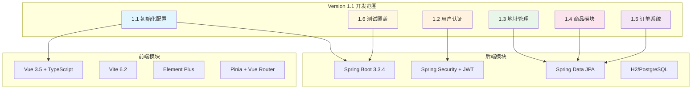
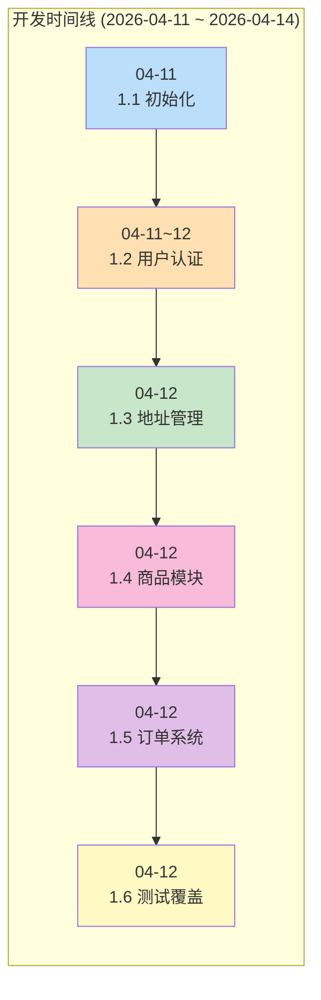
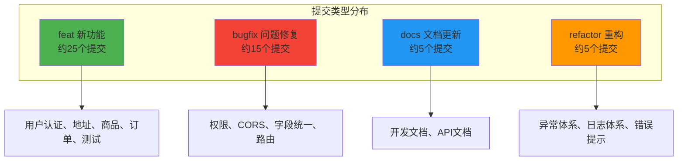
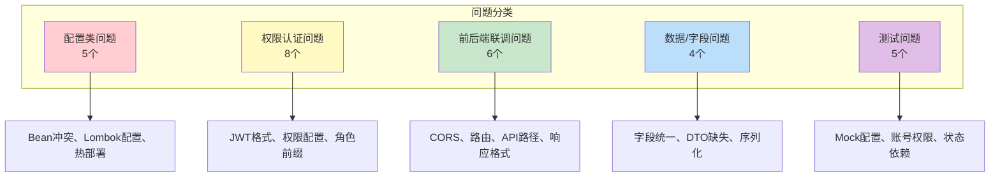
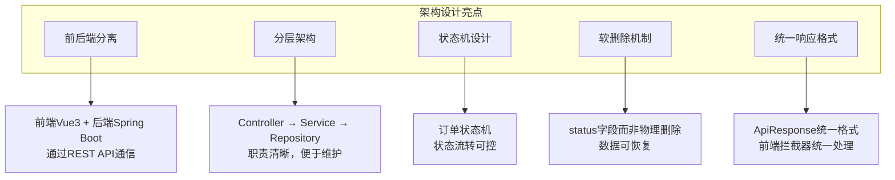
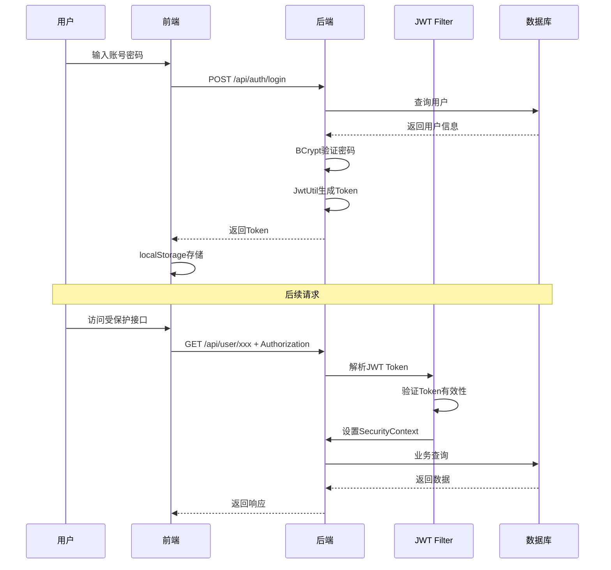
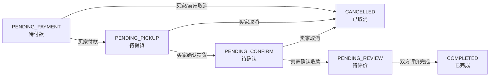

# AiSale 项目 Version 1.1 复盘文档

> 版本：v1.1  
> 复盘日期：2026-04-14  
> 开发周期：2026-04-11 ~ 2026-04-14  
> 文档目的：系统性总结项目开发历程，提炼经验教训，为后续开发提供参考

---

## 一、版本概述

### 1.1 开发背景

AiSale 是一个校园二手交易平台，采用**线下自提/面交**模式，无物流配送。项目旨在为校园用户提供便捷的二手物品交易渠道，同时探索最新AI技术（RAG、AGENT、MCP）在电商场景的应用。

### 1.2 主要目标

| 目标 | 说明 | 完成状态 |
|------|------|----------|
| 基础架构搭建 | 前后端框架初始化、安全配置、热部署 | ✅ 完成 |
| 用户认证体系 | JWT认证、用户/管理员登录注册 | ✅ 完成 |
| 地址管理 | 用户收货地址CRUD、默认地址设置 | ✅ 完成 |
| 商品模块 | 商品发布、浏览、搜索、上下架管理 | ✅ 完成 |
| 订单系统 | 完整交易流程、状态机、评价体系 | ✅ 完成 |
| 测试覆盖 | API测试、单元测试 | ✅ 完成 |

### 1.3 开发范围



---

## 二、开发历程回顾

### 2.1 版本迭代时间线



### 2.2 各版本关键节点

| 版本 | 开发日期 | 关键提交 | 主要成果 |
|------|----------|----------|----------|
| 1.1 初始化 | 04-11 | `85e1803` | 前后端框架搭建、基础配置 |
| 1.2 用户认证 | 04-11~12 | `ca58709`, `1c32d65`, `b391296` | JWT认证、登录注册API、前端页面 |
| 1.3 地址管理 | 04-12 | `b77a406`, `2fc003f`, `ad64af2` | 地址CRUD、移动端布局、数据初始化 |
| 1.4 商品模块 | 04-12 | `26eca1a`, `beadb2b`, `a830d1d`, `7e5a31d` | 商品实体、API、前端页面、管理端 |
| 1.5 订单系统 | 04-12 | `18b6903`, `cf2f29d`, `c79af81`, `bdb225e` | 订单实体、状态机、评价、前端 |
| 1.6 测试覆盖 | 04-12 | `bc6d89a`, `cd0d3bb`, `5b22371`, `960a22c` | 单元测试、API测试、文档完善 |

---

## 三、代码变动分析

### 3.1 Git提交统计

基于Git仓库提交记录分析（共约50个提交）：



### 3.2 各版本代码变更详情

#### 3.2.1 1.1 初始化配置

| 变更类型 | 文件/模块 | 说明 |
|----------|-----------|------|
| 新增 | `backend/pom.xml` | Maven依赖配置（Spring Boot、JWT、Hutool） |
| 新增 | `backend/src/main/java/.../config/` | SecurityConfig、AiConfig配置类 |
| 新增 | `backend/src/main/resources/application.yml` | 应用配置（H2数据库、端口8090） |
| 新增 | `frontend/package.json` | Vue 3、Vite、Element Plus依赖 |
| 新增 | `frontend/vite.config.ts` | Vite配置、API代理 |
| 新增 | `frontend/src/router/index.ts` | 路由配置框架 |

#### 3.2.2 1.2 用户认证

| 变更类型 | 文件/模块 | 说明 |
|----------|-----------|------|
| 新增 | `entity/User.java`, `entity/Admin.java` | 用户/管理员实体 |
| 新增 | `security/JwtUtil.java` | JWT工具类（生成、解析、验证） |
| 新增 | `security/JwtAuthenticationFilter.java` | JWT认证过滤器 |
| 新增 | `security/CustomUserDetailsService.java` | UserDetailsService实现 |
| 新增 | `controller/UserAuthController.java` | 用户认证API |
| 新增 | `controller/AdminAuthController.java` | 管理员认证API |
| 新增 | `frontend/src/views/user/Login.vue` | 用户登录页 |
| 新增 | `frontend/src/stores/auth.ts` | 认证状态管理（Pinia） |
| 修复 | `SecurityConfig.java` | 权限配置问题修复 |

#### 3.2.3 1.3 地址管理

| 变更类型 | 文件/模块 | 说明 |
|----------|-----------|------|
| 新增 | `entity/Address.java` | 地址实体（软删除、默认地址） |
| 新增 | `repository/AddressRepository.java` | 地址Repository |
| 新增 | `service/AddressService.java` | 地址业务逻辑 |
| 新增 | `controller/AddressController.java` | 地址API |
| 新增 | `frontend/src/layouts/MobileLayout.vue` | 移动端布局组件 |
| 新增 | `frontend/src/views/user/AddressList.vue` | 地址列表页 |
| 新增 | `frontend/src/views/user/AddressForm.vue` | 地址表单页 |
| 新增 | `DataInitializer.java` | 测试数据初始化 |

#### 3.2.4 1.4 商品模块

| 变更类型 | 文件/模块 | 说明 |
|----------|-----------|------|
| 新增 | `entity/Product.java` | 商品实体（状态、图片、标签） |
| 新增 | `repository/ProductRepository.java` | 商品Repository（高级搜索） |
| 新增 | `service/ProductService.java` | 商品业务逻辑 |
| 新增 | `controller/UserProductController.java` | 用户端商品API |
| 新增 | `controller/ProductController.java` | 管理端商品API |
| 新增 | `frontend/src/views/user/ProductList.vue` | 商品列表页 |
| 新增 | `frontend/src/views/user/ProductDetail.vue` | 商品详情页 |
| 新增 | `frontend/src/views/user/ProductForm.vue` | 商品发布页 |
| 新增 | `frontend/src/views/admin/ProductList.vue` | 管理端商品列表 |
| 新增 | `frontend/src/layouts/AdminLayout.vue` | 管理端布局组件 |
| 修复 | CORS配置 | 跨域请求拦截问题 |

#### 3.2.5 1.5 订单系统

| 变更类型 | 文件/模块 | 说明 |
|----------|-----------|------|
| 新增 | `entity/Order.java` | 订单实体（状态机） |
| 新增 | `entity/OrderReview.java` | 评价实体 |
| 新增 | `entity/OrderLog.java` | 订单日志实体 |
| 新增 | `service/OrderService.java` | 订单业务逻辑 |
| 新增 | `service/OrderReviewService.java` | 评价业务逻辑 |
| 新增 | `controller/UserOrderController.java` | 用户端订单API |
| 新增 | `controller/AdminOrderController.java` | 管理端订单API |
| 新增 | `frontend/src/views/user/OrderList.vue` | 订单列表页 |
| 新增 | `frontend/src/views/user/OrderDetail.vue` | 订单详情页 |
| 新增 | `frontend/src/views/user/OrderForm.vue` | 下单页 |
| 新增 | `frontend/src/views/user/OrderReviewForm.vue` | 评价页 |
| 修复 | ApiResponse结构 | 统一响应格式 |

#### 3.2.6 1.6 测试覆盖

| 变更类型 | 文件/模块 | 说明 |
|----------|-----------|------|
| 新增 | `test/OrderServiceTest.java` | 订单服务单元测试（14个用例） |
| 新增 | `test/OrderReviewServiceTest.java` | 评价服务单元测试（12个用例） |
| 新增 | `tests/api_full_coverage_test.py` | API接口测试（62个接口） |
| 新增 | `docs/1.6.API测试与单元测试.md` | 测试文档 |

---

## 四、问题与难点

### 4.1 问题分类统计



### 4.2 具体问题详述

#### 问题1：PasswordEncoder Bean未找到

| 属性 | 内容 |
|------|------|
| **背景** | AdminAuthService构造函数注入PasswordEncoder |
| **现象** | 启动失败：`Parameter 1 of constructor required a bean of type 'PasswordEncoder' that could not be found` |
| **影响范围** | 所有需要密码加密的服务无法启动 |
| **根本原因** | SecurityConfig中未定义PasswordEncoder Bean |

#### 问题2：Lombok编译失败

| 属性 | 内容 |
|------|------|
| **背景** | 使用Lombok注解简化实体类 |
| **现象** | 编译错误：`变量未在默认构造器中初始化`、`找不到符号：方法 getUsername()` |
| **影响范围** | 所有使用Lombok的类 |
| **根本原因** | Maven未正确配置Lombok注解处理器 |

#### 问题3：重复Bean定义冲突

| 属性 | 内容 |
|------|------|
| **背景** | 存在两个SecurityConfig类 |
| **现象** | 启动失败：`bean name 'securityConfig' conflicts with existing, non-compatible bean definition` |
| **影响范围** | 应用无法启动 |
| **根本原因** | config包和security包中存在同名配置类 |

#### 问题4：@AuthenticationPrincipal返回null

| 属性 | 内容 |
|------|------|
| **背景** | Controller中使用@AuthenticationPrincipal获取用户信息 |
| **现象** | 运行时错误：`Cannot invoke "UserDetails.getUsername()" because "userDetails" is null` |
| **影响范围** | 所有需要用户身份的接口 |
| **根本原因** | 缺少UserDetailsService实现，JWT过滤器未设置完整Authentication |

#### 问题5：JWT Token格式错误

| 属性 | 内容 |
|------|------|
| **背景** | 前端存储Token并发送请求 |
| **现象** | 401 Unauthorized：`JWT token is invalid` |
| **影响范围** | 所有需要认证的接口 |
| **根本原因** | 前端存储Token时未包含`Bearer`前缀 |

#### 问题6：CORS跨域请求被拦截

| 属性 | 内容 |
|------|------|
| **背景** | 前端(3000端口)请求后端(8090端口) |
| **现象** | 浏览器错误：`Access to XMLHttpRequest blocked by CORS policy` |
| **影响范围** | 所有跨域API请求 |
| **根本原因** | SecurityConfig未配置CORS |

#### 问题7：API响应结构不匹配

| 属性 | 内容 |
|------|------|
| **背景** | 订单模块Controller返回响应 |
| **现象** | 前端拦截器判断失败，显示"请求失败" |
| **影响范围** | 订单模块所有接口 |
| **根本原因** | Controller使用内部类ApiResponse缺少code字段 |

#### 问题8：前端路由跳转404

| 属性 | 内容 |
|------|------|
| **背景** | 登录成功后跳转首页 |
| **现象** | 页面显示404 |
| **影响范围** | 登录流程、Tab栏导航 |
| **根本原因** | 路由路径从`/home`改为`/user/home`，但跳转代码未同步更新 |

#### 问题9：评价接口返回403

| 属性 | 内容 |
|------|------|
| **背景** | API测试调用评价接口 |
| **现象** | POST `/api/user/orders/2/review?type=BUYER` 返回403 |
| **影响范围** | 评价功能测试 |
| **根本原因** | ReviewType枚举值为`BUYER_REVIEW`而非`BUYER`，且使用了错误的测试账号 |

#### 问题10：Mockito验证失败

| 属性 | 内容 |
|------|------|
| **背景** | 单元测试验证Repository调用 |
| **现象** | `Wanted but not invoked: orderRepository.save()` |
| **影响范围** | 订单评价单元测试 |
| **根本原因** | Mock配置只返回一次，但代码中调用两次 |

---

## 五、解决方案

### 5.1 配置类问题解决方案

#### 解决问题1：PasswordEncoder Bean

**实施步骤**：
1. 在SecurityConfig中添加Bean定义
2. 使用BCryptPasswordEncoder作为实现

**代码修改**：
```java
@Bean
public PasswordEncoder passwordEncoder() {
    return new BCryptPasswordEncoder();
}
```

**最终效果**：所有密码加密服务正常注入，用户注册登录功能正常

#### 解决问题2：Lombok配置

**实施步骤**：
1. 在pom.xml中配置maven-compiler-plugin
2. 添加Lombok注解处理器路径

**代码修改**：
```xml
<plugin>
    <groupId>org.apache.maven.plugins</groupId>
    <artifactId>maven-compiler-plugin</artifactId>
    <version>3.11.0</version>
    <configuration>
        <source>17</source>
        <target>17</target>
        <annotationProcessorPaths>
            <path>
                <groupId>org.projectlombok</groupId>
                <artifactId>lombok</artifactId>
                <version>1.18.30</version>
            </path>
        </annotationProcessorPaths>
    </configuration>
</plugin>
```

**最终效果**：Lombok注解正常工作，实体类编译成功

#### 解决问题3：Bean冲突

**实施步骤**：
1. 删除`config.SecurityConfig`（功能不完整）
2. 保留`security.SecurityConfig`（包含完整JWT配置）

**最终效果**：应用正常启动，无Bean冲突

### 5.2 权限认证问题解决方案

#### 解决问题4：@AuthenticationPrincipal

**实施步骤**：
1. 创建CustomUserDetailsService实现UserDetailsService接口
2. 修改JwtAuthenticationFilter加载完整UserDetails

**代码修改**：
```java
// CustomUserDetailsService.java
@Service
public class CustomUserDetailsService implements UserDetailsService {
    @Override
    public UserDetails loadUserByUsername(String username) {
        User user = userRepository.findByUsername(username)
            .orElseThrow(() -> new UsernameNotFoundException("用户不存在"));
        return new org.springframework.security.core.userdetails.User(
            user.getUsername(),
            user.getPassword(),
            List.of(new SimpleGrantedAuthority("ROLE_USER"))
        );
    }
}

// JwtAuthenticationFilter.java
UserDetails userDetails = userDetailsService.loadUserByUsername(username);
UsernamePasswordAuthenticationToken authToken =
    new UsernamePasswordAuthenticationToken(userDetails, null, userDetails.getAuthorities());
SecurityContextHolder.getContext().setAuthentication(authToken);
```

**最终效果**：@AuthenticationPrincipal正常获取用户信息

#### 解决问题5：JWT Token格式

**实施步骤**：
1. 前端登录成功后存储完整Token（含Bearer前缀）
2. 请求拦截器直接使用存储的Token

**代码修改**：
```typescript
// auth.ts
const authData = result.data
setToken(authData.tokenType + ' ' + authData.token)  // "Bearer eyJhbGc..."

// request.ts
request.interceptors.request.use((config) => {
    const token = localStorage.getItem('token')
    if (token) {
        config.headers.Authorization = token  // 直接使用完整Token
    }
    return config
})
```

**最终效果**：所有认证请求正常通过

#### 解决问题6：CORS配置

**实施步骤**：
1. 在SecurityConfig中添加CorsConfigurationSource Bean
2. 在SecurityFilterChain中启用CORS

**代码修改**：
```java
@Bean
public CorsConfigurationSource corsConfigurationSource() {
    CorsConfiguration configuration = new CorsConfiguration();
    configuration.setAllowedOrigins(List.of("http://localhost:3000", "http://127.0.0.1:3000"));
    configuration.setAllowedMethods(Arrays.asList("GET", "POST", "PUT", "DELETE", "OPTIONS", "PATCH"));
    configuration.setAllowedHeaders(Arrays.asList("Authorization", "Content-Type", "X-Requested-With"));
    configuration.setExposedHeaders(List.of("Authorization"));
    configuration.setAllowCredentials(true);
    configuration.setMaxAge(3600L);

    UrlBasedCorsConfigurationSource source = new UrlBasedCorsConfigurationSource();
    source.registerCorsConfiguration("/**", configuration);
    return source;
}

// SecurityFilterChain中启用
http.cors(cors -> cors.configurationSource(corsConfigurationSource()))
```

**最终效果**：跨域请求正常通过

### 5.3 前后端联调问题解决方案

#### 解决问题7：API响应结构

**实施步骤**：
1. 删除Controller内部类ApiResponse
2. 使用全局DTO `com.aisale.backend.dto.ApiResponse<T>`

**代码修改**：
```java
// 修改前（内部类）
@lombok.Data
@lombok.AllArgsConstructor
public static class ApiResponse<T> {
    private String message;
    private T data;
}

// 修改后（使用全局DTO）
import com.aisale.backend.dto.ApiResponse;
return ApiResponse.success(data);  // 包含code、message、data
```

**最终效果**：前端拦截器正常解析响应

#### 解决问题8：路由跳转

**实施步骤**：
1. 修改Login.vue跳转路径
2. 修正MobileLayout.vue Tab栏路由

**代码修改**：
```typescript
// Login.vue
router.push(redirect || '/user/home')  // 修改为正确路径

// MobileLayout.vue
const navigateTo = (path: string) => {
    router.push(path)
}
<div class="tab-item" @click="navigateTo('/user/home')">
```

**最终效果**：登录后正常跳转，Tab栏导航正常

### 5.4 测试问题解决方案

#### 解决问题9：评价接口权限

**实施步骤**：
1. 使用正确的ReviewType枚举值
2. 使用正确的测试账号（订单买家）

**代码修改**：
```python
# 错误写法
params={"type": "BUYER"}

# 正确写法
params={"type": "BUYER_REVIEW"}

# 使用正确的账号
lisi_session.login(BUYER_ACCOUNT["username"], BUYER_ACCOUNT["password"])
```

**最终效果**：评价接口测试通过

#### 解决问题10：Mock配置

**实施步骤**：
1. 配置连续返回值

**代码修改**：
```java
when(orderReviewRepository.existsByOrderIdAndReviewType(ORDER_ID, OrderReview.ReviewType.SELLER_REVIEW))
    .thenReturn(false)  // 第一次调用（检查是否重复评价）
    .thenReturn(true);  // 第二次调用（检查是否双方都评价）
```

**最终效果**：单元测试验证通过

---

## 六、经验总结

### 6.1 成功经验

#### 6.1.1 技术选型正确

| 选型 | 优势 | 体现 |
|------|------|------|
| Spring Boot 3.x | 最新LTS版本，生态完善 | 快速搭建后端服务 |
| Vue 3 + Vite | 现代化前端栈，开发效率高 | HMR热更新、TypeScript支持 |
| JWT认证 | 无状态，适合前后端分离 | 跨服务认证、Token刷新 |
| Hutool | 工具类库，简化代码 | BeanUtil.copyProperties减少重复代码 |
| Element Plus | 企业级组件库 | 快速构建UI，移动端适配 |

#### 6.1.2 架构设计合理



#### 6.1.3 开发流程规范

| 规范 | 说明 |
|------|------|
| 文档先行 | 每个模块开发前编写设计文档 |
| Git提交规范 | feat/bugfix/docs/refactor前缀 |
| 测试覆盖 | API测试 + 单元测试双重保障 |
| 热部署配置 | 开发效率提升，修改即时生效 |

#### 6.1.4 问题解决高效

| 问题类型 | 解决方式 |
|----------|----------|
| 配置问题 | 查阅官方文档、Stack Overflow |
| 权限问题 | 理解Spring Security原理 |
| 联调问题 | 浏览器DevTools、后端日志 |
| 测试问题 | Mock配置、数据准备 |

### 6.2 需改进的方面

#### 6.2.1 代码规范

| 问题 | 改进建议 |
|------|----------|
| 内部类ApiResponse | 统一使用全局DTO，避免重复定义 |
| 字段命名不一致 | 前后端字段名统一（如isDefault vs is_default） |
| 异常处理分散 | 建立全局异常处理器 |

#### 6.2.2 测试覆盖

| 问题 | 改进建议 |
|------|----------|
| 单元测试覆盖不全 | 添加ProductService、UserService测试 |
| 集成测试缺失 | 使用@SpringBootTest测试完整流程 |
| 测试数据依赖 | 使用@Sql注解加载SQL脚本 |

#### 6.2.3 文档维护

| 问题 | 改进建议 |
|------|----------|
| 文档更新不及时 | 代码变更同步更新文档 |
| 文档格式不统一 | 统一使用mermaid图表格式 |
| API文档分散 | 集中维护Swagger/Knife4j文档 |

#### 6.2.4 性能优化

| 问题 | 改进建议 |
|------|----------|
| N+1查询问题 | 使用JOIN FETCH优化 |
| 分页未实现 | 商品列表、订单列表添加分页 |
| 缓存缺失 | 热门商品、用户信息缓存 |

---

## 七、参考价值

### 7.1 可复用的设计模式

#### 7.1.1 JWT认证流程



**参考要点**：
- Token存储格式：`Bearer <token>`
- 过滤器顺序：JwtAuthenticationFilter在UsernamePasswordAuthenticationFilter之前
- UserDetailsService必须实现

#### 7.1.2 订单状态机



**参考要点**：
- 每次状态变更验证前置状态
- 不允许跨状态跳转
- 取消订单恢复库存
- 日志记录每次状态变更

#### 7.1.3 统一响应格式

```java
@Data
@AllArgsConstructor
@NoArgsConstructor
public class ApiResponse<T> {
    private int code;       // 200成功，其他错误
    private String message; // 响应消息
    private T data;         // 响应数据
    
    public static <T> ApiResponse<T> success(T data) {
        return new ApiResponse<>(200, "操作成功", data);
    }
    
    public static <T> ApiResponse<T> success(String message, T data) {
        return new ApiResponse<>(200, message, data);
    }
    
    public static <T> ApiResponse<T> error(int code, String message) {
        return new ApiResponse<>(code, message, null);
    }
}
```

**参考要点**：
- 所有Controller统一使用
- 前端拦截器统一处理
- 错误码标准化

### 7.2 最佳实践清单

| 类别 | 最佳实践 | 说明 |
|------|----------|------|
| **配置** | Profile区分环境 | dev免认证，prod需认证 |
| **配置** | 热部署配置 | DevTools + IDE自动编译 |
| **安全** | 公开接口明确指定 | permitAll()精确匹配 |
| **安全** | CORS配置 | 允许特定Origin和方法 |
| **数据** | 软删除机制 | status字段而非物理删除 |
| **数据** | 审计字段 | createdAt/updatedAt自动维护 |
| **前端** | 路由守卫 | requiresAuth + role meta |
| **前端** | 状态管理 | Pinia + localStorage持久化 |
| **测试** | 数据准备 | DataInitializer创建测试数据 |
| **测试** | Mock技巧 | 连续返回值配置 |

### 7.3 避坑指南

| 问题类型 | 避坑要点 |
|----------|----------|
| Bean冲突 | 同名类放在不同包会导致冲突 |
| Lombok | Maven必须配置annotationProcessorPaths |
| JWT | Token必须包含Bearer前缀 |
| CORS | SecurityConfig必须配置CorsConfigurationSource |
| 权限 | hasRole()自动添加ROLE_前缀 |
| 响应 | Controller不要使用内部类ApiResponse |
| 路由 | 路径变更需同步更新所有跳转代码 |
| 测试 | Mock返回值需匹配实际调用次数 |

---

## 八、后续规划

### 8.1 Version 1.2 计划

| 功能 | 优先级 | 说明 |
|------|----------|------|
| OSS文件上传 | 高 | 阿里云OSS集成，图片上传 |
| IM即时通讯 | 高 | WebSocket聊天功能 |
| 用户信息完善 | 中 | 用户资料编辑、头像上传 |
| 管理端完善 | 中 | 用户管理、订单统计 |
| 性能优化 | 中 | 分页、缓存、索引 |

### 8.2 技术债务清理

| 债务 | 说明 |
|------|------|
| 单元测试覆盖 | 补充ProductService、UserService测试 |
| 异常处理 | 建立全局异常处理器 |
| 日志规范 | 统一日志格式和级别 |
| 代码规范 | 统一命名、格式化 |

---

## 九、附录

### 9.1 关键文件清单

| 模块 | 后端文件 | 前端文件 |
|------|----------|----------|
| 认证 | `JwtUtil.java`, `JwtAuthenticationFilter.java`, `CustomUserDetailsService.java` | `auth.ts`, `Login.vue` |
| 地址 | `Address.java`, `AddressService.java` | `AddressList.vue`, `AddressForm.vue` |
| 商品 | `Product.java`, `ProductService.java`, `UserProductController.java` | `ProductList.vue`, `ProductForm.vue` |
| 订单 | `Order.java`, `OrderService.java`, `OrderReviewService.java` | `OrderList.vue`, `OrderDetail.vue` |
| 测试 | `OrderServiceTest.java`, `api_full_coverage_test.py` | - |

### 9.2 测试账号

| 类型 | 用户名 | 密码 | 说明 |
|------|--------|------|------|
| 超级管理员 | superadmin | 123456 | 全部权限 |
| 管理员 | admin | 123456 | 管理权限 |
| 用户 | zhangsan | 123456 | 2地址，卖家 |
| 用户 | lisi | 123456 | 1地址，卖家 |
| 用户 | wangwu | 123456 | 无地址，买家 |

### 9.3 相关文档链接

- [1.1.初始化配置说明.md](./1.1.初始化配置说明.md)
- [1.2.用户管理登录注册开发.md](./1.2.用户管理登录注册开发.md)
- [1.3.用户地址开发.md](./1.3.用户地址开发.md)
- [1.4.商品模块开发.md](./1.4.商品模块开发.md)
- [1.5.订单模块开发.md](./1.5.订单模块开发.md)
- [1.6.API测试与单元测试.md](./1.6.API测试与单元测试.md)
- [API接口文档](http://localhost:8090/swagger-ui.html)

---

*文档编写日期：2026-04-14*  
*复盘版本：v1.1*