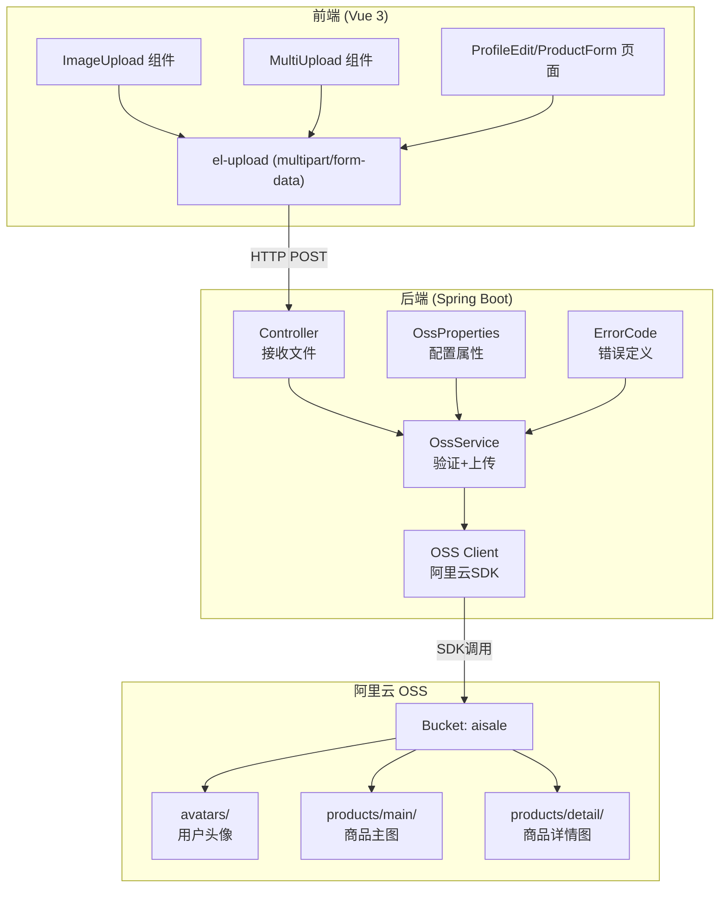
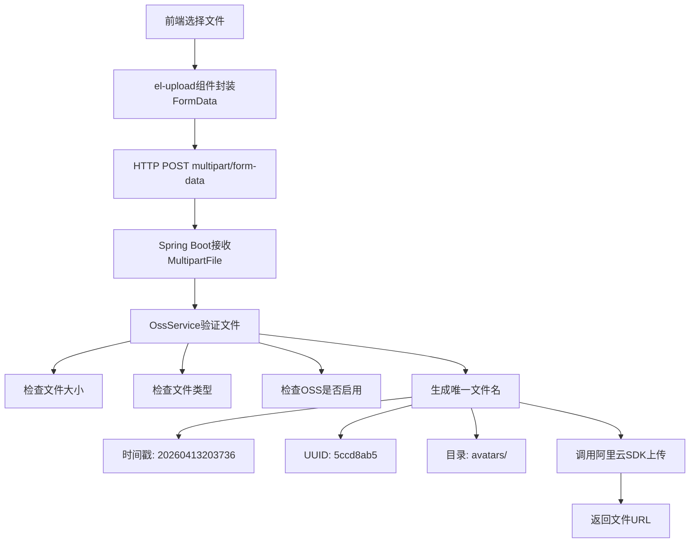
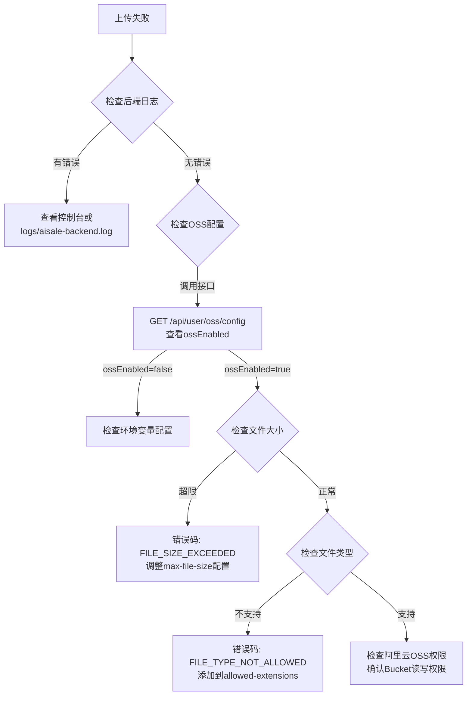

# OSS文件上传开发总结

## 一、技术架构

### 1.1 整体架构图



### 1.2 核心文件清单

| 层级         | 文件                         | 作用              |
| ------------ | ---------------------------- | ----------------- |
| **配置层**   | `OssProperties.java`         | 配置属性绑定      |
|              | `OssConfig.java`             | OSS客户端Bean创建 |
|              | `application.yml`            | 配置文件          |
| **服务层**   | `OssService.java`            | 文件上传核心逻辑  |
|              | `ErrorCode.java`             | 文件错误码定义    |
| **控制层**   | `UserController.java`        | 头像上传接口      |
|              | `UserProductController.java` | 商品图片上传接口  |
| **前端组件** | `ImageUpload.vue`            | 单图上传组件      |
|              | `MultiImageUpload.vue`       | 多图上传组件      |
|              | `oss.ts`                     | API调用模块       |

---

## 二、核心实现原理

### 2.1 配置属性绑定原理

```java
@ConfigurationProperties(prefix = "aliyun.oss")
public class OssProperties {
    private String endpoint;
    private String accessKeyId;
    // ...
}
```

**原理**：Spring Boot启动时扫描所有`@ConfigurationProperties`注解的类，将`application.yml`中以`aliyun.oss`开头的配置自动注入到对应字段。

**关键点**：

- 字段名与配置key自动映射（驼峰转kebab-case）
- 支持默认值设置
- 支持环境变量覆盖 `${OSS_ACCESS_KEY_ID:}`

### 2.2 条件化Bean加载

```java
@Bean
@ConditionalOnProperty(prefix = "aliyun.oss", name = {"access-key-id", "access-key-secret", "bucket-name"})
public OSS ossClient() {
    return new OSSClientBuilder().build(...);
}
```

**原理**：只有当配置文件中存在指定的属性时才创建Bean。

**解决的问题**：开发环境可能没有OSS配置，避免启动失败。

### 2.3 文件上传流程



### 2.4 文件名生成策略

```java
private String generateFileName(String directory, String extension) {
    String timestamp = LocalDateTime.now().format(DateTimeFormatter.ofPattern("yyyyMMddHHmmss"));
    String uuid = UUID.randomUUID().toString().replace("-", "").substring(0, 8);
    return directory + "/" + timestamp + "_" + uuid + "." + extension;
}
```

**生成结果示例**：`avatars/20260413203736_5ccd8ab5.jpg`

**设计原因**：

- 时间戳：便于按时间查找和排序
- UUID：防止文件名冲突
- 目录分类：便于管理和清理

---

## 三、遇到的问题与解决方案

### 3.1 问题：文件上传大小超过限制

**错误信息**：

```
MaxUploadSizeExceededException: Maximum upload size exceeded
```

**原因**：Spring Boot默认文件上传限制为1MB。

**解决方案**：

```yaml
spring:
  servlet:
    multipart:
      enabled: true
      max-file-size: 10MB # 单文件最大10MB
      max-request-size: 50MB # 总请求最大50MB（多文件上传时）
```

### 3.2 问题：OSS未配置导致启动失败

**错误信息**：

```
InvalidCredentialsException: Access key id should not be null or empty
```

**原因**：OSS客户端Bean强制创建，但配置为空。

**解决方案**：

```java
// 方案1：条件化Bean创建
@ConditionalOnProperty(prefix = "aliyun.oss", name = "access-key-id")

// 方案2：可选注入
@Autowired(required = false)
private OSS ossClient;

// 方案3：运行时检查
public boolean isOssEnabled() {
    return ossClient != null;
}
```

### 3.3 问题：环境变量名称不匹配

**错误现象**：配置了`.env`文件但OSS未启用。

**原因**：

- `.env`中：`OSS_ACCESS_KEY_ID`
- `application.yml`中：`${ALIYUN_OSS_ACCESS_KEY_ID:}`

**解决方案**：统一环境变量名称，修改`application.yml`：

```yaml
aliyun:
  oss:
    access-key-id: ${OSS_ACCESS_KEY_ID:}
```

### 3.4 问题：前端上传组件Token传递

**问题**：el-upload组件默认不携带Authorization头。

**解决方案**：

```vue
const headers = computed(() => { const token = localStorage.getItem('token')
return { Authorization: token || '' } })
```

---

## 四、关键技术点

### 4.1 Spring Boot文件上传配置

| 配置项                          | 说明                   | 默认值 |
| ------------------------------- | ---------------------- | ------ |
| `multipart.enabled`             | 是否启用文件上传       | true   |
| `multipart.max-file-size`       | 单文件最大大小         | 1MB    |
| `multipart.max-request-size`    | 总请求最大大小         | 10MB   |
| `multipart.file-size-threshold` | 超过此大小写入临时文件 | 0      |

### 4.2 阿里云OSS SDK核心类

```java
// 创建客户端
OSS ossClient = new OSSClientBuilder().build(endpoint, accessKeyId, accessKeySecret);

// 上传文件
PutObjectResult result = ossClient.putObject(bucketName, objectKey, inputStream, metadata);

// 检查文件是否存在
boolean exists = ossClient.doesObjectExist(bucketName, objectKey);

// 删除文件
ossClient.deleteObject(bucketName, objectKey);

// 关闭客户端
ossClient.shutdown();
```

### 4.3 Element Plus Upload组件

**核心属性**：

```vue
<el-upload
  :action="uploadUrl"           <!-- 上传地址 -->
  :headers="headers"            <!-- 请求头 -->
  :before-upload="beforeUpload" <!-- 上传前验证 -->
  :on-success="handleSuccess"   <!-- 成功回调 -->
  :on-error="handleError"       <!-- 失败回调 -->
  :accept="acceptTypes"         <!-- 接收的文件类型 -->
  :show-file-list="false"       <!-- 不显示文件列表 -->
  multiple                      <!-- 多选 -->
/>
```

**accept MIME类型对照表**：
| 扩展名 | MIME类型 |
|--------|----------|
| jpg/jpeg | image/jpeg |
| png | image/png |
| gif | image/gif |
| webp | image/webp |
| bmp | image/bmp |
| ico | image/x-icon |
| svg | image/svg+xml |
| tiff | image/tiff |

---

## 五、最佳实践

### 5.1 文件验证策略

```java
private void validateFile(MultipartFile file) {
    // 1. 空文件检查
    if (file == null || file.isEmpty()) {
        throw new BusinessException(ErrorCode.FILE_EMPTY);
    }

    // 2. 大小检查
    if (file.getSize() > maxFileSize) {
        throw new BusinessException(ErrorCode.FILE_SIZE_EXCEEDED);
    }

    // 3. 类型检查（白名单）
    String extension = getFileExtension(file.getOriginalFilename());
    if (!allowedExtensions.contains(extension.toLowerCase())) {
        throw new BusinessException(ErrorCode.FILE_TYPE_NOT_ALLOWED);
    }
}
```

### 5.2 错误码设计

```java
// 文件上传错误 (1004xxxx)
FILE_UPLOAD_ERROR("10040001", "文件上传失败", 500),
FILE_DOWNLOAD_ERROR("10040002", "文件下载失败", 500),
FILE_DELETE_ERROR("10040003", "文件删除失败", 500),
FILE_EMPTY("10040004", "上传文件不能为空", 400),
FILE_SIZE_EXCEEDED("10040005", "文件大小超过限制", 400),
FILE_TYPE_NOT_ALLOWED("10040006", "不支持的文件类型", 400),
```

### 5.3 目录分类策略

| 目录               | 用途       | 清理策略                 |
| ------------------ | ---------- | ------------------------ |
| `avatars/`         | 用户头像   | 用户更换头像时删除旧头像 |
| `products/main/`   | 商品主图   | 商品删除时清理           |
| `products/detail/` | 商品详情图 | 商品删除时清理           |
| `temp/`            | 临时文件   | 定时清理（如24小时后）   |

### 5.4 URL生成策略

```java
private String getFileUrl(String fileName) {
    // 优先使用自定义域名（CDN加速）
    if (baseUrl != null && !baseUrl.isEmpty()) {
        return baseUrl + "/" + fileName;
    }
    // 默认使用OSS域名
    return "https://" + bucketName + "." + endpoint + "/" + fileName;
}
```

---

## 六、快速排查指南

### 6.1 上传失败排查步骤



### 6.2 常用调试命令

```bash
# 查看OSS配置
curl -H "Authorization: Bearer <token>" http://localhost:8090/api/user/oss/config

# 测试上传
curl -X POST -H "Authorization: Bearer <token>" \
  -F "file=@test.jpg" \
  http://localhost:8090/api/user/avatar

# 检查端口占用
netstat -ano | findstr :8090
```

---

## 七、扩展方向

### 7.1 图片处理

阿里云OSS支持图片处理：

```
原图URL: https://bucket.oss-cn-beijing.aliyuncs.com/avatars/test.jpg
缩略图: https://bucket.oss-cn-beijing.aliyuncs.com/avatars/test.jpg?x-oss-process=image/resize,w_100
水印: https://bucket.oss-cn-beijing.aliyuncs.com/avatars/test.jpg?x-oss-process=image/watermark,text_Hello
```

### 7.2 上传进度显示

```vue
<el-upload
  :on-progress="handleProgress"
>
<script>
const handleProgress = (event, file) => {
  const percent = Math.floor(event.percent)
  console.log(`上传进度: ${percent}%`)
}
</script>
```

### 7.3 大文件分片上传

对于超大文件（如视频），可使用OSS分片上传：

```java
InitiateMultipartUploadRequest initRequest = new InitiateMultipartUploadRequest(bucketName, objectKey);
InitiateMultipartUploadResult initResult = ossClient.initiateMultipartUpload(initRequest);
String uploadId = initResult.getUploadId();

// 分片上传...
UploadPartResult uploadPartResult = ossClient.uploadPart(uploadPartRequest);

// 完成上传
CompleteMultipartUploadRequest completeRequest = new CompleteMultipartUploadRequest(...);
ossClient.completeMultipartUpload(completeRequest);
```
