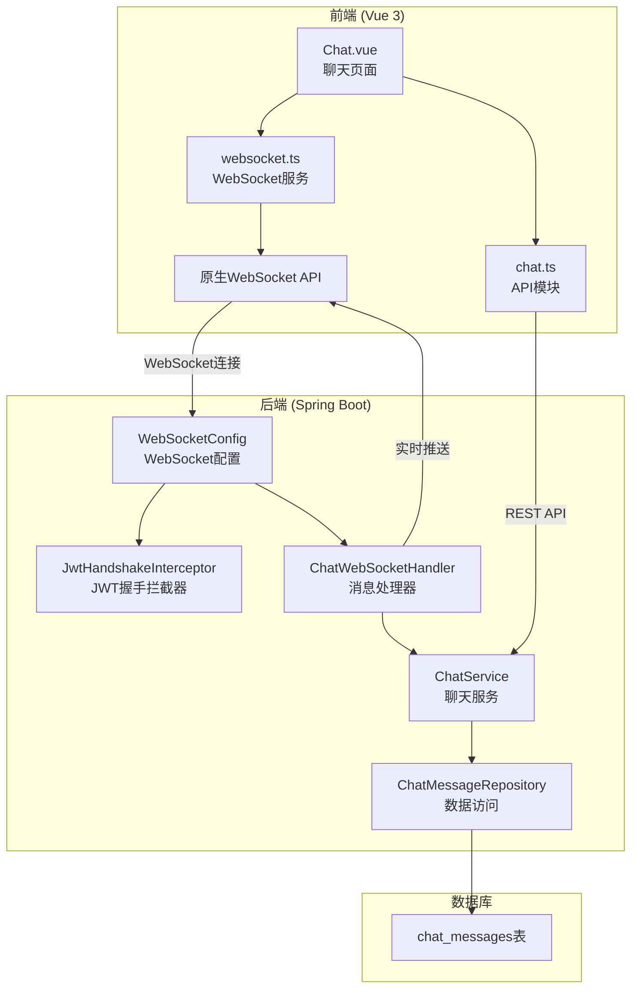
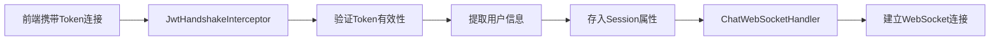
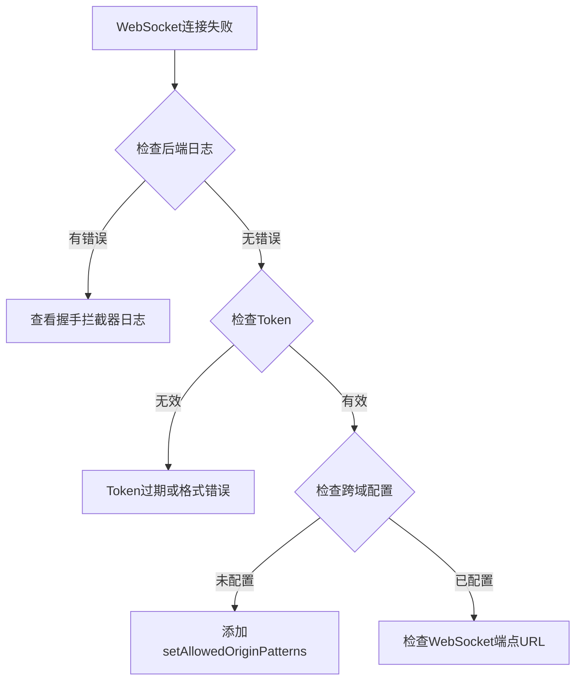

# IM即时通讯模块开发总结

## 一、技术架构

### 1.1 整体架构图



### 1.2 核心文件清单

| 层级 | 文件 | 作用 |
|------|------|------|
| **配置层** | `WebSocketConfig.java` | WebSocket端点配置 |
| | `JwtHandshakeInterceptor.java` | JWT身份验证拦截器 |
| **处理层** | `ChatWebSocketHandler.java` | WebSocket消息处理器 |
| **服务层** | `ChatService.java` | 聊天业务逻辑 |
| **数据层** | `ChatMessage.java` | 消息实体 |
| | `ChatMessageRepository.java` | 消息数据访问 |
| **控制层** | `UserChatController.java` | REST API控制器 |
| **DTO** | `ChatMessageRequest.java` | 发送消息请求 |
| | `ChatMessageResponse.java` | 消息响应 |
| **前端** | `websocket.ts` | WebSocket服务模块 |
| | `Chat.vue` | 聊天页面组件 |
| | `chat.ts` | API调用模块 |

---

## 二、核心实现原理

### 2.1 WebSocket身份验证流程



**实现代码**：

```java
@Component
public class JwtHandshakeInterceptor implements HandshakeInterceptor {
    
    @Override
    public boolean beforeHandshake(ServerHttpRequest request, 
                                    ServerHttpResponse response,
                                    WebSocketHandler wsHandler, 
                                    Map<String, Object> attributes) {
        String token = extractToken(request);
        
        if (token == null) {
            log.warn("WebSocket handshake failed: no token provided");
            return false;
        }
        
        try {
            String username = jwtUtil.extractUsername(token);
            Long userId = jwtUtil.extractUserId(token);
            
            attributes.put("userId", userId);
            attributes.put("username", username);
            
            return true;
        } catch (Exception e) {
            log.error("WebSocket handshake error: {}", e.getMessage());
            return false;
        }
    }
}
```

### 2.2 WebSocket消息处理

```java
@Component
public class ChatWebSocketHandler extends TextWebSocketHandler {
    
    private final Map<String, Long> sessionUserMap = new ConcurrentHashMap<>();
    private final Map<Long, WebSocketSession> userSessionMap = new ConcurrentHashMap<>();
    
    @Override
    public void afterConnectionEstablished(WebSocketSession session) {
        Long userId = (Long) session.getAttributes().get("userId");
        sessionUserMap.put(session.getId(), userId);
        userSessionMap.put(userId, session);
    }
    
    @Override
    protected void handleTextMessage(WebSocketSession session, TextMessage message) {
        Long senderId = sessionUserMap.get(session.getId());
        ChatMessageRequest request = objectMapper.readValue(message.getPayload(), ChatMessageRequest.class);
        
        ChatMessageResponse response = chatService.sendMessage(senderId, request.getReceiverId(), request.getContent());
        
        // 发送给接收者
        WebSocketSession receiverSession = userSessionMap.get(request.getReceiverId());
        if (receiverSession != null && receiverSession.isOpen()) {
            receiverSession.sendMessage(new TextMessage(objectMapper.writeValueAsString(response)));
        }
    }
}
```

### 2.3 前端WebSocket服务

```typescript
class WebSocketService {
    private ws: WebSocket | null = null
    private status: ConnectionStatus = 'disconnected'
    
    connect(token: string): Promise<boolean> {
        const wsUrl = `ws://localhost:8090/ws/chat?token=${token}`
        this.ws = new WebSocket(wsUrl)
        
        this.ws.onopen = () => {
            this.setStatus('connected')
        }
        
        this.ws.onmessage = (event) => {
            const msg = JSON.parse(event.data)
            this.messageCallbacks.forEach(cb => cb(msg))
        }
        
        this.ws.onclose = () => {
            this.setStatus('disconnected')
            // 自动重连
            if (this.reconnectAttempts < this.maxReconnectAttempts) {
                setTimeout(() => this.connect(token), this.reconnectDelay)
            }
        }
    }
    
    sendMessage(receiverId: number, content: string): boolean {
        if (!this.ws || this.ws.readyState !== WebSocket.OPEN) {
            return false
        }
        this.ws.send(JSON.stringify({ receiverId, content, messageType: 'TEXT' }))
        return true
    }
}
```

---

## 三、遇到的问题与解决方案

### 3.1 问题：sockjs-client/stompjs兼容性问题

**错误信息**：
```
ReferenceError: global is not defined
```

**原因**：`sockjs-client`使用Node.js的`global`对象，但浏览器环境没有这个对象。

**解决方案**：移除sockjs-client和stompjs，使用原生WebSocket API。

```json
// package.json - 移除依赖
{
  "dependencies": {
    // 移除以下两行
    // "sockjs-client": "^1.6.1",
    // "stompjs": "^2.3.3",
  }
}
```

### 3.2 问题：循环依赖

**错误信息**：
```
The dependencies of some of the beans form a cycle:
   webSocketConfig -> chatWebSocketHandler -> chatService
```

**原因**：`ChatWebSocketHandler`依赖`ChatService`，而`ChatService`又依赖`ChatWebSocketHandler`。

**解决方案**：使用`ApplicationContext`延迟获取Bean。

```java
@Service
public class ChatService {
    private final ApplicationContext applicationContext;
    private ChatWebSocketHandler webSocketHandler;
    
    private ChatWebSocketHandler getWebSocketHandler() {
        if (webSocketHandler == null) {
            webSocketHandler = applicationContext.getBean(ChatWebSocketHandler.class);
        }
        return webSocketHandler;
    }
}
```

### 3.3 问题：WebSocket跨域连接失败

**错误信息**：
```
WebSocket connection failed
```

**原因**：后端WebSocket跨域配置不正确。

**解决方案**：设置允许所有来源。

```java
@Override
public void registerWebSocketHandlers(WebSocketHandlerRegistry registry) {
    registry.addHandler(chatWebSocketHandler, "/ws/chat")
        .addInterceptors(jwtHandshakeInterceptor)
        .setAllowedOriginPatterns("*");  // 允许所有来源
}
```

---

## 四、关键技术点

### 4.1 WebSocket连接状态管理

| 状态 | 说明 | UI显示 |
|------|------|--------|
| `connected` | 已连接 | 绿色标签 |
| `connecting` | 连接中 | 黄色标签 |
| `disconnected` | 未连接 | 灰色标签 |
| `error` | 连接失败 | 红色标签 |

### 4.2 消息数据结构

```java
@Entity
@Table(name = "chat_messages")
public class ChatMessage {
    @Id
    private Long id;
    
    private Long senderId;      // 发送者ID
    private Long receiverId;    // 接收者ID
    private String content;     // 消息内容
    private MessageType messageType;  // 消息类型
    private Boolean isRead;     // 是否已读
    private LocalDateTime createdAt; // 创建时间
    
    public enum MessageType {
        TEXT, IMAGE, SYSTEM
    }
}
```

### 4.3 REST API接口

| 接口 | 方法 | 说明 |
|------|------|------|
| `/api/user/chat/send` | POST | 发送消息 |
| `/api/user/chat/conversation/{userId}` | GET | 获取聊天记录 |
| `/api/user/chat/partners` | GET | 获取聊天对象列表 |
| `/api/user/chat/unread` | GET | 获取未读消息 |
| `/api/user/chat/read/{messageId}` | PUT | 标记已读 |

### 4.4 WebSocket端点

| 端点 | 说明 |
|------|------|
| `/ws/chat?token={jwt}` | WebSocket连接端点 |

---

## 五、最佳实践

### 5.1 会话管理

```java
// 使用ConcurrentHashMap保证线程安全
private final Map<String, Long> sessionUserMap = new ConcurrentHashMap<>();
private final Map<Long, WebSocketSession> userSessionMap = new ConcurrentHashMap<>();

// 连接建立时注册
@Override
public void afterConnectionEstablished(WebSocketSession session) {
    Long userId = (Long) session.getAttributes().get("userId");
    sessionUserMap.put(session.getId(), userId);
    userSessionMap.put(userId, session);
}

// 连接关闭时清理
@Override
public void afterConnectionClosed(WebSocketSession session, CloseStatus status) {
    Long userId = sessionUserMap.remove(session.getId());
    if (userId != null) {
        userSessionMap.remove(userId);
    }
}
```

### 5.2 自动重连机制

```typescript
private reconnectAttempts = 0
private maxReconnectAttempts = 5
private reconnectDelay = 3000

this.ws.onclose = () => {
    this.setStatus('disconnected')
    
    if (this.reconnectAttempts < this.maxReconnectAttempts) {
        this.reconnectAttempts++
        setTimeout(() => this.connect(token), this.reconnectDelay)
    }
}
```

### 5.3 消息持久化

```java
@Transactional
public ChatMessageResponse sendMessage(Long senderId, Long receiverId, String content) {
    // 1. 保存消息到数据库
    ChatMessage message = ChatMessage.builder()
        .senderId(senderId)
        .receiverId(receiverId)
        .content(content)
        .messageType(ChatMessage.MessageType.TEXT)
        .isRead(false)
        .build();
    
    ChatMessage savedMessage = chatMessageRepository.save(message);
    
    // 2. 推送给在线用户
    ChatMessageResponse response = ChatMessageResponse.fromEntity(savedMessage, ...);
    webSocketHandler.sendMessageToUser(receiverId, response);
    
    return response;
}
```

---

## 六、快速排查指南

### 6.1 WebSocket连接失败排查



### 6.2 常用调试命令

```bash
# 检查WebSocket端点
curl -i -N -H "Connection: Upgrade" -H "Upgrade: websocket" -H "Sec-WebSocket-Key: test" -H "Sec-WebSocket-Version: 13" http://localhost:8090/ws/chat

# 检查后端服务状态
curl http://localhost:8090/api/user/chat/config

# 发送测试消息
curl -X POST -H "Authorization: Bearer <token>" \
  -H "Content-Type: application/json" \
  -d '{"receiverId":2,"content":"测试消息"}' \
  http://localhost:8090/api/user/chat/send
```

---

## 七、扩展方向

### 7.1 离线消息推送

当用户不在线时，消息保存到数据库，用户上线后推送未读消息：

```java
@Override
public void afterConnectionEstablished(WebSocketSession session) {
    Long userId = sessionUserMap.get(session.getId());
    
    // 推送未读消息
    List<ChatMessageResponse> unreadMessages = chatService.getUnreadMessages(userId);
    for (ChatMessageResponse msg : unreadMessages) {
        session.sendMessage(new TextMessage(objectMapper.writeValueAsString(msg)));
    }
}
```

### 7.2 群聊功能

扩展消息类型，支持群组聊天：

```java
public enum MessageType {
    TEXT,
    IMAGE,
    SYSTEM,
    GROUP  // 群聊消息
}

// 群聊消息处理
public void sendGroupMessage(Long groupId, String content) {
    List<Long> groupMembers = groupService.getGroupMembers(groupId);
    for (Long memberId : groupMembers) {
        sendMessageToUser(memberId, message);
    }
}
```

### 7.3 消息已读回执

```java
// 发送已读回执
public void markAsRead(Long messageId) {
    ChatMessage message = chatMessageRepository.findById(messageId).orElseThrow();
    message.setIsRead(true);
    chatMessageRepository.save(message);
    
    // 通知发送者消息已读
    ChatMessageResponse response = ChatMessageResponse.fromEntity(message, ...);
    webSocketHandler.sendMessageToUser(message.getSenderId(), response);
}
```