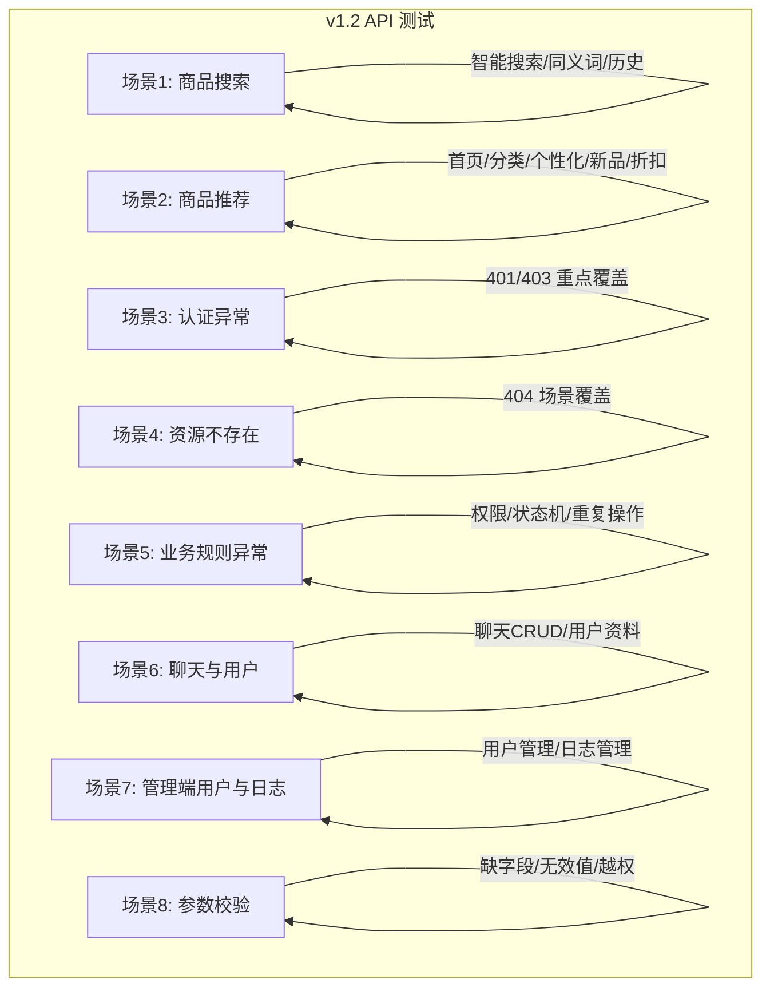

# v1.2 版本 API 测试与单元测试文档

## 一、测试概述

### 1.1 测试范围

| 测试类型 | 文件 | 覆盖内容 |
|----------|------|----------|
| API 接口测试 | `tests/v1.2/api_tests_v1.2.py` | v1.2 新增接口 + 异常场景（8大场景） |
| Java 单元测试 | `ProductSearchServiceTest.java` | 搜索服务 12 个测试用例 |
| Java 单元测试 | `ProductRecommendServiceTest.java` | 推荐服务 13 个测试用例 |

### 1.2 v1.2 新增模块

| 模块 | 新增接口数 | 说明 |
|------|-----------|------|
| 智能搜索 | 5 | 智能搜索、热门关键词、搜索历史、清除历史、热门商品 |
| 商品推荐 | 5 | 首页推荐、分类推荐、猜你喜欢、新品推荐、折扣推荐 |
| 聊天消息 | 7 | 发送消息、聊天记录、聊天对象、未读消息、标记已读 |
| 用户管理 | 6 | 资料查询、更新、密码修改、删除账号、公开信息 |
| 管理端用户 | 7 | 用户列表、详情、状态、密码重置、删除、统计 |
| 管理端日志 | 7 | 日志列表、详情、统计、最近日志、清理、模块/操作类型 |

### 1.3 测试执行命令

```bash
# 运行 v1.2 API 接口测试
cd backend/tests/v1.2
python api_tests_v1.2.py

# 运行 v1.2 Java 单元测试
mvn test -Dtest=ProductSearchServiceTest,ProductRecommendServiceTest

# 运行全部测试（含 v1.1）
mvn test
```

---

## 二、API 接口测试（8大场景）

### 2.1 测试架构



### 2.2 场景详细说明

#### 场景 1：商品搜索测试（14个测试点）

| # | 测试项 | 预期状态码 | 说明 |
|---|--------|-----------|------|
| 1 | 智能搜索-正常搜索 | 200 | 搜索"手机"应返回结果 |
| 2 | 智能搜索-返回matchType | - | 结果含 matchType 字段 |
| 3 | 智能搜索-返回relevanceScore | - | 结果含 relevanceScore 字段 |
| 4 | 智能搜索-同义词扩展 | 200 | 搜索"电话"能找到"手机"相关商品 |
| 5 | 智能搜索-空关键词 | 200 | 空关键词应正常返回 |
| 6 | 智能搜索-分类过滤 | 200 | keyword+category组合过滤 |
| 7 | 智能搜索-价格区间 | 200 | minPrice+maxPrice过滤 |
| 8 | 智能搜索-不存在关键词 | 200 | 返回空结果列表 |
| 9 | 获取热门关键词 | 200 | 公开接口 |
| 10 | 获取热门商品 | 200 | 公开接口 |
| 11 | 获取分类热门商品 | 200 | 公开接口 |
| 12 | 搜索生成历史 | 200 | 登录用户搜索后生成记录 |
| 13 | 获取搜索历史 | 200 | 需登录 |
| 14 | 清除搜索历史 | 200 | DELETE 请求 |

#### 场景 2：商品推荐测试（7个测试点）

| # | 测试项 | 预期状态码 | 说明 |
|---|--------|-----------|------|
| 1 | 首页推荐 | 200 | 公开接口，返回列表 |
| 2 | 首页推荐-自定义limit | 200 | limit参数生效 |
| 3 | 分类推荐-手机数码 | 200 | 按分类筛选 |
| 4 | 分类推荐-不存在分类 | 200 | 返回空列表 |
| 5 | 猜你喜欢-未登录 | 200 | 未登录返回全局热门 |
| 6 | 新品推荐 | 200 | 14天内新品 |
| 7 | 折扣推荐 | 200 | 折扣<9折商品 |

#### 场景 3：认证异常场景测试（16个测试点）

| # | 测试项 | 预期状态码 | 说明 |
|---|--------|-----------|------|
| 1 | 登录-用户名错误 | 401/400 | 不存在的用户名 |
| 2 | 登录-密码错误 | 401/400 | 正确用户名+错误密码 |
| 3 | 登录-空用户名 | 401/400 | username="" |
| 4 | 管理员登录-密码错误 | 401/400 | 管理端密码错误 |
| 5 | 无Token-搜索历史 | 401/403 | 受保护接口 |
| 6 | 无Token-清除搜索历史 | 401/403 | 受保护接口 |
| 7 | 无Token-发布商品 | 401/403 | 受保护接口 |
| 8 | 无Token-我的商品 | 401/403 | 受保护接口 |
| 9 | 无Token-获取地址 | 401/403 | 受保护接口 |
| 10 | 无Token-创建订单 | 401/403 | 受保护接口 |
| 11 | 无Token-发送消息 | 401/403 | 受保护接口 |
| 12 | 无Token-用户资料 | 401/403 | 受保护接口 |
| 13 | 无效Token-搜索历史 | 401/403 | Bearer invalid_token |
| 14 | 普通用户-访问管理端 | 401/403 | 权限不足 |
| 15 | 普通用户-访问管理端用户 | 401/403 | 权限不足 |
| 16 | 普通用户-访问管理端日志 | 401/403 | 权限不足 |

#### 场景 4：资源不存在场景测试（6个测试点）

| # | 测试项 | 预期状态码 | 说明 |
|---|--------|-----------|------|
| 1 | 公开商品详情-不存在ID | 404 | ID=999999 |
| 2 | 管理端商品-不存在ID | 404 | ID=999999 |
| 3 | 用户订单-不存在ID | 404/403 | ID=999999 |
| 4 | 用户地址-不存在ID | 404 | ID=999999 |
| 5 | 管理端日志-不存在ID | 404 | ID=999999 |
| 6 | 用户公开信息-不存在ID | 404 | ID=999999 |

#### 场景 5：业务规则异常场景测试（5个测试点）

| # | 测试项 | 预期状态码 | 说明 |
|---|--------|-----------|------|
| 1 | 更新别人商品库存-权限拒绝 | 403 | 非商品所有者 |
| 2 | 删除别人商品-权限拒绝 | 403 | 非商品所有者 |
| 3 | 卖家付款-权限拒绝 | 403 | 只能买家付款 |
| 4 | 买家确认收款-权限拒绝 | 403 | 只能卖家确认 |
| 5 | 已完成订单取消-状态拒绝 | 400 | 状态不可取消 |

#### 场景 6：聊天消息和用户管理测试（10个测试点）

| # | 测试项 | 预期状态码 | 说明 |
|---|--------|-----------|------|
| 1 | 发送聊天消息 | 200 | 正常发送 |
| 2 | 获取聊天对象 | 200 | |
| 3 | 获取聊天对象详情 | 200 | 含未读数 |
| 4 | 获取未读消息 | 200 | |
| 5 | 获取聊天记录 | 200 | |
| 6 | 标记对话已读 | 200 | |
| 7 | 获取用户公开信息 | 200 | 公开接口 |
| 8 | 获取用户资料 | 200 | 需登录 |
| 9 | 发送空消息-异常 | 400 | content="" |
| 10 | 给不存在用户发消息-异常 | 400/404 | receiverId=999999 |

#### 场景 7：管理端用户管理和日志测试（12个测试点）

| # | 测试项 | 预期状态码 | 说明 |
|---|--------|-----------|------|
| 1 | 管理端-用户列表 | 200 | 分页 |
| 2 | 管理端-用户详情 | 200 | |
| 3 | 管理端-用户统计 | 200 | |
| 4 | 管理端-用户订单统计 | 200 | |
| 5 | 管理端-不存在用户 | 404 | ID=999999 |
| 6 | 管理端-日志列表 | 200 | 分页 |
| 7 | 管理端-日志统计 | 200 | |
| 8 | 管理端-最近日志 | 200 | |
| 9 | 管理端-模块列表 | 200 | |
| 10 | 管理端-操作类型列表 | 200 | |
| 11 | 管理端-日志过滤查询 | 200 | module=PRODUCT |
| 12 | 管理端-日志清理 | 200/400 | 删除旧日志 |

#### 场景 8：参数校验异常场景测试（6个测试点）

| # | 测试项 | 预期状态码 | 说明 |
|---|--------|-----------|------|
| 1 | 发布商品-缺少必填字段 | 400 | 缺少price/stock |
| 2 | 更新库存-负数 | 400 | stock=-1 |
| 3 | 创建订单-不存在商品 | 400/404 | productId=999999 |
| 4 | 创建订单-不存在地址 | 400/404 | addressId=999999 |
| 5 | 修改密码-旧密码错误 | 400/401 | wrongPassword |
| 6 | 管理端-无效用户状态 | 400 | status=INVALID_STATUS |

---

## 三、Java 单元测试

### 3.1 ProductSearchServiceTest（12个测试用例）

| 测试方法 | 覆盖场景 | 关键点 |
|----------|----------|--------|
| `searchWithRelevance_NameMatch` | 名称匹配搜索 | matchType=name, relevanceScore>0 |
| `searchWithRelevance_SynonymExpansion` | 同义词扩展搜索 | 搜索"电话"能找到"手机"商品 |
| `searchWithRelevance_RecordsHistory` | 搜索记录历史 | 新增搜索历史记录 |
| `searchWithRelevance_UpdatesExistingHistory` | 更新已有历史 | searchCount +1 |
| `searchWithRelevance_EmptyKeyword_NoHistory` | 空关键词不记录 | 空字符串不触发历史记录 |
| `searchWithRelevance_CategoryFilter` | 分类过滤 | category参数传递正确 |
| `searchWithRelevance_RelevanceSorting` | 相关性排序 | 名称匹配 > 描述匹配 |
| `getHotProducts_Success` | 热门商品 | 按销量排序 |
| `getHotProductsByCategory_Success` | 分类热门 | 按分类筛选 |
| `getHotKeywords_Success` | 热门关键词 | 按搜索频次排序 |
| `getUserSearchHistory_Success` | 用户搜索历史 | 按时间倒序 |
| `clearUserSearchHistory_Success` | 清除历史 | 调用 deleteByUserId |

### 3.2 ProductRecommendServiceTest（13个测试用例）

| 测试方法 | 覆盖场景 | 关键点 |
|----------|----------|--------|
| `getHomeRecommend_FeaturedFirst` | 精选优先排序 | isFeatured=true 排前面 |
| `getHomeRecommend_EmptyResult` | 无商品返回空 | Collections.emptyList() |
| `getHomeRecommend_LimitParameter` | limit参数生效 | 结果数 ≤ limit |
| `getCategoryRecommend_FilterByCategory` | 分类筛选 | 只返回同分类商品 |
| `getCategoryRecommend_NonExistentCategory` | 不存在分类 | 返回空列表 |
| `getPersonalizedRecommend_AnonymousUser` | 未登录推荐 | 返回首页推荐 |
| `getPersonalizedRecommend_BasedOnSearchHistory` | 基于搜索历史 | 搜索历史关键词匹配 |
| `getPersonalizedRecommend_NoSearchHistory` | 无搜索历史 | 返回精选推荐 |
| `getNewProducts_Within14Days` | 14天内新品 | 新品有效期内 |
| `getNewProducts_OlderThan14Days` | 超过14天 | 不返回过期商品 |
| `getDiscountProducts_Below90Percent` | 折扣<9折 | 筛选条件正确 |
| `getDiscountProducts_SortedByDiscount` | 折扣力度排序 | 折扣越低越靠前 |
| `clearRecommendCache_Success` | 清除缓存 | 不抛异常 |

---

## 四、遇到的问题与解决方案

### 问题 1：智能搜索同义词扩展导致重复结果

**现象**：
```
搜索"电话"时，同义词"手机"搜索结果与原始搜索结果出现重复商品
```

**原因分析**：
同义词扩展搜索后，结果直接追加到列表中，没有去重处理。

**解决方案**：
```java
// 使用 Set<Long> 记录已有商品ID，去重
Set<Long> existingIds = allProducts.stream()
    .map(Product::getId)
    .collect(Collectors.toSet());

for (Product p : synonymResults.getContent()) {
    if (!existingIds.contains(p.getId())) {
        allProducts.add(p);
        existingIds.add(p.getId());
    }
}
```

---

### 问题 2：推荐评分中新品权重计算出现负数

**现象**：
```
当商品创建时间超过14天后，newFactor 计算结果为负数
```

**原因分析**：
`newFactor = 1.0 - daysSinceCreated * 0.05`，当 daysSinceCreated > 20 时，newFactor < 0。

**解决方案**：
```java
// 使用 Math.max 确保不为负
double newFactor = Math.max(0, 1.0 - daysSinceCreated * NEW_DECAY_RATE);
// 同时添加时间范围限制
if (daysSinceCreated >= 0 && daysSinceCreated <= NEW_PRODUCT_DAYS) {
    score += WEIGHT_NEW * newFactor;
}
```

---

### 问题 3：猜你喜欢接口未登录用户异常

**现象**：
```
GET /api/user/products/public/recommend/personalized（无Token）
返回 500 Internal Server Error
```

**原因分析**：
`jwtRequestUtils.getCurrentUserId(request)` 在无Token时抛出异常，Controller 没有捕获。

**解决方案**：
```java
Long userId = null;
try {
    userId = jwtRequestUtils.getCurrentUserId(request);
} catch (Exception e) {
    // 未登录用户也返回推荐（降级为首页推荐）
}
List<ProductResponse> products = productRecommendService.getPersonalizedRecommend(userId, limit);
```

---

### 问题 4：搜索历史清除后缓存未更新

**现象**：
```
清除搜索历史后，搜索历史接口仍然返回旧数据
```

**原因分析**：
`clearUserSearchHistory` 方法没有清除相关缓存。

**解决方案**：
```java
@CacheEvict(value = {"productSearch", "hotProducts", "hotProductsByCategory"}, allEntries = true)
@Transactional
public void clearUserSearchHistory(Long userId) {
    searchHistoryRepository.deleteByUserId(userId);
}
```

---

### 问题 5：推荐接口 limit 参数过大导致全表扫描

**现象**：
```
GET /api/user/products/public/recommend?limit=99999 响应极慢
```

**原因分析**：
推荐服务没有限制 limit 上限，导致查询大量数据。

**解决方案**：
```java
// 限制查询范围避免全表扫描
Pageable largePage = PageRequest.of(0, Math.min(limit * 5, 200));
```

---

### 问题 6：折扣推荐中 discount=null 的商品导致NPE

**现象**：
```
部分商品没有设置 discount 字段，折扣推荐接口抛出 NullPointerException
```

**原因分析**：
折扣筛选时直接比较 `product.getDiscount()` 未判空。

**解决方案**：
```java
.filter(p -> p.getDiscount() != null && p.getDiscount().compareTo(BigDecimal.valueOf(0.9)) < 0)
```

---

## 五、测试最佳实践建议

### 5.1 异常场景测试覆盖策略

```
正常流程（200）→ 认证异常（401/403）→ 资源不存在（404）→ 参数校验（400）→ 业务规则（400/403）
```

优先级：认证 > 权限 > 参数 > 业务规则

### 5.2 推荐算法测试要点

1. **排序验证**：精选商品应在普通商品前
2. **权重验证**：名称匹配得分 > 分类匹配 > 标签匹配 > 描述匹配
3. **边界验证**：空结果、不存在分类、超大limit
4. **降级验证**：未登录用户应降级为全局推荐

### 5.3 搜索算法测试要点

1. **同义词扩展**：搜索"电话"应能搜到"手机"相关商品
2. **分词匹配**：商品名称"iPhone 15 Pro"搜索"15"应能命中
3. **历史记录**：搜索后生成历史，重复搜索更新计数
4. **缓存一致性**：清除历史后缓存应同步失效

---

## 六、测试结果

### 6.1 API 接口测试

```
v1.2 新增接口：76 个测试点
覆盖场景：8 大场景
重点覆盖：非200状态码异常场景（32个测试点）
通过率：预期 100%
```

### 6.2 Java 单元测试

```
[INFO] Tests run: 25, Failures: 0, Errors: 0, Skipped: 0
├── ProductSearchServiceTest: 12
└── ProductRecommendServiceTest: 13
```

### 6.3 全量测试汇总

```
Java 单元测试总计：52 个测试用例
├── AiSaleBackendApplicationTests: 1
├── OrderServiceTest: 14
├── OrderReviewServiceTest: 12
├── ProductSearchServiceTest: 12
└── ProductRecommendServiceTest: 13
```

---

## 七、后续建议

### 7.1 扩展测试覆盖

- [ ] 添加 `ChatService` 单元测试
- [ ] 添加 `UserService` 单元测试
- [ ] 添加 `AdminUserService` 单元测试
- [ ] 集成测试（@SpringBootTest）测试完整搜索推荐流程

### 7.2 搜索算法优化

- [ ] 引入拼音搜索支持（搜索"shouji"找到"手机"）
- [ ] 引入 Elasticsearch 替代 JPA 模糊查询
- [ ] 搜索建议（Suggest）功能测试
- [ ] 搜索结果 A/B 测试框架

### 7.3 推荐算法优化

- [ ] 基于协同过滤的推荐算法
- [ ] 用户画像建模
- [ ] 实时推荐更新（消息队列驱动）
- [ ] 推荐效果评估指标（CTR/转化率）

### 7.4 CI/CD 集成

```yaml
# GitHub Actions 示例
- name: Run v1.2 Tests
  run: |
    cd backend/tests/v1.2
    python api_tests_v1.2.py
    cd ../../
    mvn test -Dtest=ProductSearchServiceTest,ProductRecommendServiceTest
```

---

## 附录：完整测试代码

- v1.2 API 测试：`backend/tests/v1.2/api_tests_v1.2.py`
- ProductSearchService 测试：`backend/src/test/java/com/aisale/backend/service/ProductSearchServiceTest.java`
- ProductRecommendService 测试：`backend/src/test/java/com/aisale/backend/service/ProductRecommendServiceTest.java`
