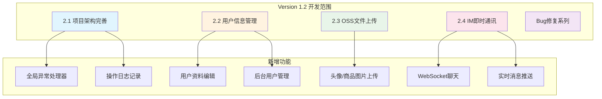
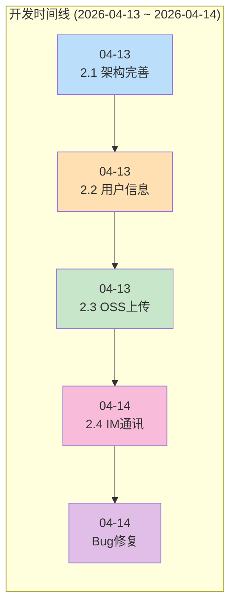
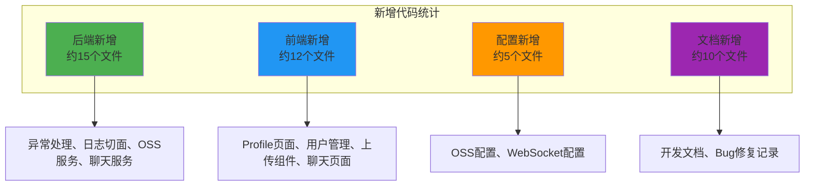
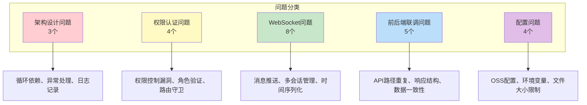
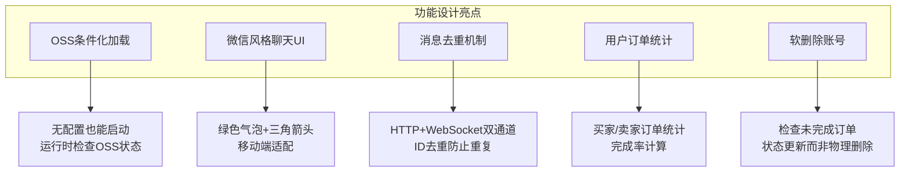
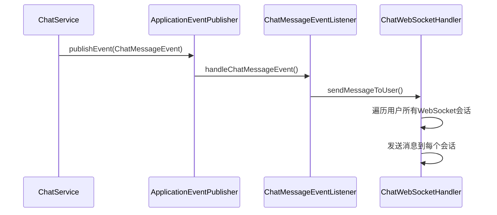

# AiSale 项目 Version 1.2 复盘文档

> 版本：v1.2  
> 复盘日期：2026-04-14  
> 开发周期：2026-04-13 ~ 2026-04-14  
> 文档目的：系统性总结项目Version 1.2开发历程，提炼经验教训，为后续开发提供参考

---

## 一、版本概述

### 1.1 开发背景

Version 1.2 是 AiSale 校园二手交易平台的功能增强版本，在 Version 1.1 基础架构稳定的基础上，重点完善了项目架构、用户信息管理、OSS文件上传、IM即时通讯等核心功能模块。

### 1.2 主要目标

| 目标 | 说明 | 完成状态 |
|------|------|----------|
| 项目架构完善 | 全局异常处理、日志体系、操作日志记录 | ✅ 完成 |
| 用户信息管理 | 用户端个人信息管理、后台用户管理 | ✅ 完成 |
| OSS文件上传 | 阿里云OSS集成、图片上传组件 | ✅ 完成 |
| IM即时通讯 | WebSocket聊天、实时消息推送 | ✅ 完成 |
| Bug修复 | 权限控制、路由重定向、登录验证等 | ✅ 完成 |

### 1.3 开发范围



---

## 二、开发历程回顾

### 2.1 版本迭代时间线



### 2.2 各版本关键节点

| 版本 | 开发日期 | 主要成果 |
|------|----------|----------|
| 2.1 项目架构完善 | 04-13 | 全局异常处理器、ErrorCode枚举、日志切面、操作日志实体 |
| 2.2 用户信息管理 | 04-13 | 用户端Profile页面、后台用户管理、订单统计、密码修改 |
| 2.3 OSS文件上传 | 04-13 | 阿里云OSS集成、ImageUpload组件、MultiImageUpload组件 |
| 2.4 IM即时通讯 | 04-14 | WebSocket配置、ChatService、Chat.vue微信风格UI、消息推送 |
| Bug修复系列 | 04-13~14 | 权限控制漏洞、路由重定向、管理员登录验证、操作日志记录 |

---

## 三、代码变动分析

### 3.1 新增功能模块统计



### 3.2 各模块代码变更详情

#### 3.2.1 2.1 项目架构完善

| 变更类型 | 文件/模块 | 说明 |
|----------|-----------|------|
| 新增 | `exception/GlobalExceptionHandler.java` | 全局异常处理器 |
| 新增 | `exception/ErrorCode.java` | 错误码枚举定义 |
| 新增 | `exception/BusinessException.java` | 业务异常类 |
| 新增 | `exception/NotFoundException.java` | 资源不存在异常 |
| 新增 | `exception/UnauthorizedException.java` | 未授权异常 |
| 新增 | `exception/ConflictException.java` | 冲突异常 |
| 新增 | `aspect/LogAspect.java` | 日志切面 |
| 新增 | `entity/OperationLog.java` | 操作日志实体 |
| 新增 | `service/OperationLogService.java` | 操作日志服务 |
| 新增 | `controller/AdminLogController.java` | 管理端日志控制器 |

#### 3.2.2 2.2 用户信息管理

| 变更类型 | 文件/模块 | 说明 |
|----------|-----------|------|
| 新增 | `dto/UpdateProfileRequest.java` | 更新资料请求DTO |
| 新增 | `dto/ChangePasswordRequest.java` | 修改密码请求DTO |
| 新增 | `dto/UserProfileResponse.java` | 用户信息响应DTO |
| 新增 | `dto/UserQueryRequest.java` | 用户查询请求DTO |
| 新增 | `dto/UserAdminResponse.java` | 用户管理响应DTO |
| 新增 | `controller/UserController.java` | 用户端控制器 |
| 新增 | `controller/AdminUserController.java` | 后台用户控制器 |
| 新增 | `service/UserService.java` | 用户服务 |
| 新增 | `service/AdminUserService.java` | 后台用户服务 |
| 新增 | `frontend/views/user/Profile.vue` | 个人信息页 |
| 新增 | `frontend/views/user/ProfileEdit.vue` | 编辑资料页 |
| 新增 | `frontend/views/user/ChangePassword.vue` | 修改密码页 |
| 新增 | `frontend/views/admin/UserList.vue` | 用户列表页 |
| 新增 | `frontend/views/admin/UserDetail.vue` | 用户详情页 |

#### 3.2.3 2.3 OSS文件上传

| 变更类型 | 文件/模块 | 说明 |
|----------|-----------|------|
| 新增 | `config/OssProperties.java` | OSS配置属性绑定 |
| 新增 | `config/OssConfig.java` | OSS客户端Bean创建 |
| 新增 | `service/OssService.java` | 文件上传核心逻辑 |
| 新增 | `frontend/components/ImageUpload.vue` | 单图上传组件 |
| 新增 | `frontend/components/MultiImageUpload.vue` | 多图上传组件 |
| 新增 | `frontend/api/oss.ts` | OSS API调用模块 |
| 修改 | `application.yml` | 添加OSS配置项 |

#### 3.2.4 2.4 IM即时通讯

| 变更类型 | 文件/模块 | 说明 |
|----------|-----------|------|
| 新增 | `config/WebSocketConfig.java` | WebSocket端点配置 |
| 新增 | `security/JwtHandshakeInterceptor.java` | JWT握手拦截器 |
| 新增 | `websocket/ChatWebSocketHandler.java` | WebSocket消息处理器 |
| 新增 | `event/ChatMessageEvent.java` | 消息事件定义 |
| 新增 | `event/ChatMessageEventListener.java` | 消息事件监听器 |
| 新增 | `entity/ChatMessage.java` | 消息实体 |
| 新增 | `repository/ChatMessageRepository.java` | 消息数据访问 |
| 新增 | `service/ChatService.java` | 聊天业务逻辑 |
| 新增 | `controller/UserChatController.java` | REST API控制器 |
| 新增 | `dto/ChatMessageRequest.java` | 发送消息请求DTO |
| 新增 | `dto/ChatMessageResponse.java` | 消息响应DTO |
| 新增 | `dto/ChatPartnerResponse.java` | 联系人详情响应DTO |
| 新增 | `frontend/views/user/Chat.vue` | 聊天页面(微信风格) |
| 新增 | `frontend/services/websocket.ts` | WebSocket服务(全局单例) |
| 新增 | `frontend/api/chat.ts` | 聊天API调用模块 |

---

## 四、问题与难点

### 4.1 问题分类统计



### 4.2 具体问题详述

#### 问题1：循环依赖问题

| 属性 | 内容 |
|------|------|
| **背景** | ChatService需要调用ChatWebSocketHandler推送消息，ChatWebSocketHandler需要调用ChatService处理消息 |
| **现象** | 启动失败：`The dependencies of some of the beans form a cycle: ChatWebSocketHandler -> ChatService -> ChatWebSocketHandler` |
| **影响范围** | IM模块无法启动 |
| **根本原因** | 双向依赖导致Spring无法初始化Bean |

#### 问题2：权限控制漏洞

| 属性 | 内容 |
|------|------|
| **背景** | 管理员登录页面验证逻辑不完善 |
| **现象** | 普通用户账号能够通过管理平台登录页面成功登录，获得管理员权限 |
| **影响范围** | 系统权限控制失效，安全漏洞 |
| **根本原因** | 前端登录成功后没有验证返回的角色是否为管理员 |

#### 问题3：管理员登录TypeError

| 属性 | 内容 |
|------|------|
| **背景** | 管理员登录验证角色 |
| **现象** | `TypeError: Cannot read properties of undefined (reading 'role')` |
| **影响范围** | 管理员无法登录 |
| **根本原因** | 访问路径错误：`response.data.data.role`应为`response.data.role` |

#### 问题4：路由重定向错误

| 属性 | 内容 |
|------|------|
| **背景** | 已登录用户访问管理员登录页 |
| **现象** | 已登录管理员访问`/admin/login`被重定向到`/user/home` |
| **影响范围** | 管理员无法切换账号 |
| **根本原因** | 路由守卫guest逻辑没有区分用户登录页和管理员登录页 |

#### 问题5：操作日志未保存

| 属性 | 内容 |
|------|------|
| **背景** | 管理端日志查询功能 |
| **现象** | 日志管理模块查询不到任何操作日志，数据库operation_logs表为空 |
| **影响范围** | 日志管理功能完全失效 |
| **根本原因** | LogAspect切面只记录日志到控制台，没有调用OperationLogService保存到数据库 |

#### 问题6：LocalDateTime序列化格式不匹配

| 属性 | 内容 |
|------|------|
| **背景** | WebSocket消息时间显示 |
| **现象** | 消息时间显示为"Invalid Date" |
| **影响范围** | IM模块时间显示 |
| **根本原因** | Jackson默认序列化LocalDateTime为数组格式`[2026,4,14,10,30,0]`，前端期望ISO字符串 |

#### 问题7：消息重复添加

| 属性 | 内容 |
|------|------|
| **背景** | HTTP发送消息+WebSocket回执 |
| **现象** | 发送消息时，消息列表中出现两条相同消息 |
| **影响范围** | IM模块消息显示 |
| **根本原因** | HTTP响应添加消息后，WebSocket回执又触发添加 |

#### 问题8：多标签页消息推送丢失

| 属性 | 内容 |
|------|------|
| **背景** | 用户多标签页打开聊天 |
| **现象** | 只有一个标签页能收到WebSocket推送消息 |
| **影响范围** | IM模块多会话支持 |
| **根本原因** | userSessionMap使用`Map<Long, WebSocketSession>`，同一用户多个session互相覆盖 |

#### 问题9：OSS未配置导致启动失败

| 属性 | 内容 |
|------|------|
| **背景** | OSS客户端Bean创建 |
| **现象** | `InvalidCredentialsException: Access key id should not be null or empty` |
| **影响范围** | 应用无法启动 |
| **根本原因** | OSS客户端Bean强制创建，但配置为空 |

#### 问题10：文件上传大小超限

| 属性 | 内容 |
|------|------|
| **背景** | 上传商品图片 |
| **现象** | `MaxUploadSizeExceededException: Maximum upload size exceeded` |
| **影响范围** | 图片上传功能 |
| **根本原因** | Spring Boot默认文件上传限制为1MB |

---

## 五、解决方案

### 5.1 架构设计问题解决方案

#### 解决问题1：循环依赖

**实施步骤**：
1. 创建`ChatMessageEvent`事件类
2. 创建`ChatMessageEventListener`事件监听器
3. ChatService通过事件发布推送消息

**代码修改**：
```java
// ChatMessageEvent.java
public class ChatMessageEvent extends ApplicationEvent {
    private final Long targetUserId;
    private final ChatMessageResponse message;
}

// ChatService.java
private final ApplicationEventPublisher eventPublisher;

public ChatMessageResponse sendMessage(...) {
    eventPublisher.publishEvent(new ChatMessageEvent(this, receiverId, response));
    eventPublisher.publishEvent(new ChatMessageEvent(this, senderId, response));
}
```

**最终效果**：解耦成功，IM模块正常启动

### 5.2 权限认证问题解决方案

#### 解决问题2：权限控制漏洞

**实施步骤**：
1. 前端登录成功后验证返回的角色
2. 使用authStore.userInfo获取role

**代码修改**：
```typescript
// Login.vue
const role = authStore.userInfo?.role
if (!role || (role !== 'ADMIN' && role !== 'SUPER_ADMIN')) {
    ElMessage.error('权限不足，请使用管理员账号登录')
    authStore.logout()
    return
}
```

**最终效果**：普通用户无法登录管理员页面

#### 解决问题3：管理员登录TypeError

**实施步骤**：
1. 修正访问路径
2. 使用authStore.userInfo获取role

**代码修改**：
```typescript
// 错误写法
const role = response.data.data.role  // undefined

// 正确写法
const role = authStore.userInfo?.role
```

**最终效果**：管理员正常登录

#### 解决问题4：路由重定向错误

**实施步骤**：
1. 路由守卫区分AdminLogin和UserLogin
2. 检查用户角色做不同处理

**代码修改**：
```typescript
// router/index.ts
if (to.name === 'AdminLogin') {
    if (authStore.isLoggedIn) {
        if (authStore.isAdmin) {
            next({ name: 'AdminProductList' })  // 管理员重定向到管理首页
        } else {
            next()  // 普通用户允许访问（可切换账号）
        }
    } else {
        next()
    }
}
```

**最终效果**：路由重定向逻辑正确

### 5.3 WebSocket问题解决方案

#### 解决问题6：LocalDateTime序列化

**实施步骤**：
1. 后端添加`@JsonFormat`注解
2. 前端兼容多种时间格式

**代码修改**：
```java
// ChatMessageResponse.java
@JsonFormat(pattern = "yyyy-MM-dd'T'HH:mm:ss")
private LocalDateTime createdAt;
```

```typescript
// websocket.ts
if (Array.isArray(createdAt)) {
    const [y, mo, d, h = 0, mi = 0, s = 0] = createdAt
    createdAt = new Date(y, mo - 1, d, h, mi, s).toISOString()
}
```

**最终效果**：时间正常显示

#### 解决问题7：消息重复添加

**实施步骤**：
1. 使用消息ID进行去重检查

**代码修改**：
```typescript
const onWebSocketMessage = (msg: ChatMessage) => {
    const exists = messages.value.some(m => m.id === msg.id)
    if (!exists) {
        messages.value.push(msg)
        scrollToBottom()
    }
}
```

**最终效果**：消息不重复显示

#### 解决问题8：多标签页推送

**实施步骤**：
1. 改用`List<WebSocketSession>`支持多会话

**代码修改**：
```java
// 修复前
private final Map<Long, WebSocketSession> userSessionMap = new ConcurrentHashMap<>();

// 修复后
private final Map<Long, List<WebSocketSession>> userSessionsMap = new ConcurrentHashMap<>();

public void sendMessageToUser(Long userId, ChatMessageResponse message) {
    List<WebSocketSession> sessions = userSessionsMap.get(userId);
    for (WebSocketSession session : sessions) {
        if (session.isOpen()) {
            session.sendMessage(new TextMessage(json));
        }
    }
}
```

**最终效果**：多标签页都能收到消息

### 5.4 配置问题解决方案

#### 解决问题9：OSS未配置启动失败

**实施步骤**：
1. 使用`@ConditionalOnProperty`条件化Bean创建
2. 可选注入OSS客户端

**代码修改**：
```java
@Bean
@ConditionalOnProperty(prefix = "aliyun.oss", name = "access-key-id")
public OSS ossClient() {
    return new OSSClientBuilder().build(...);
}

// OssService.java
public boolean isOssEnabled() {
    return ossClient != null;
}
```

**最终效果**：无OSS配置也能正常启动

#### 解决问题10：文件上传大小超限

**实施步骤**：
1. 配置Spring Boot文件上传限制

**代码修改**：
```yaml
spring:
  servlet:
    multipart:
      max-file-size: 10MB
      max-request-size: 50MB
```

**最终效果**：大文件正常上传

---

## 六、经验总结

### 6.1 成功经验

#### 6.1.1 技术架构升级

| 升级点 | 优势 | 体现 |
|------|------|------|
| 全局异常处理 | 统一错误响应格式 | ErrorCode枚举、GlobalExceptionHandler |
| 日志体系完善 | 操作可追溯 | LogAspect切面、OperationLog实体 |
| Spring Event机制 | 解耦循环依赖 | ChatMessageEvent事件发布 |
| WebSocket多会话 | 支持多标签页 | CopyOnWriteArrayList会话管理 |

#### 6.1.2 功能模块设计



#### 6.1.3 安全机制增强

| 安全点 | 说明 |
|------|------|
| 权限控制漏洞修复 | 前端验证返回角色，防止普通用户登录管理端 |
| 路由守卫完善 | 区分AdminLogin和UserLogin，角色判断重定向 |
| 密码验证机制 | 修改密码、删除账号都需要验证原密码 |
| JWT握手验证 | WebSocket连接通过JWT Token验证身份 |

### 6.2 需改进的方面

#### 6.2.1 WebSocket扩展

| 问题 | 改进建议 |
|------|----------|
| 离线消息推送 | 用户上线时推送未读消息 |
| 消息已读回执 | 通知发送者消息已读状态 |
| 图片消息支持 | 扩展messageType支持IMAGE |

#### 6.2.2 OSS功能扩展

| 问题 | 改进建议 |
|------|----------|
| 图片处理 | 支持缩略图、水印等OSS图片处理 |
| 上传进度 | 显示上传进度百分比 |
| 大文件分片 | 超大文件使用OSS分片上传 |

#### 6.2.3 日志功能完善

| 问题 | 改进建议 |
|------|----------|
| 日志查询优化 | 添加时间范围筛选 |
| 日志导出 | 支持导出CSV/Excel |
| 日志清理 | 定时清理过期日志 |

---

## 七、参考价值

### 7.1 可复用的设计模式

#### 7.1.1 Spring Event解耦模式



**参考要点**：
- 使用事件机制解耦双向依赖
- 事件类继承ApplicationEvent
- 监听器使用@EventListener注解

#### 7.1.2 WebSocket多会话管理

```java
// userId -> 该用户的所有活跃WebSocket会话
private final Map<Long, List<WebSocketSession>> userSessionsMap = new ConcurrentHashMap<>();

@Override
public void afterConnectionEstablished(WebSocketSession session) {
    Long userId = (Long) session.getAttributes().get("userId");
    userSessionsMap.computeIfAbsent(userId, k -> new CopyOnWriteArrayList<>()).add(session);
}

public void sendMessageToUser(Long userId, ChatMessageResponse message) {
    List<WebSocketSession> sessions = userSessionsMap.get(userId);
    for (WebSocketSession session : sessions) {
        if (session.isOpen()) {
            session.sendMessage(new TextMessage(json));
        }
    }
}
```

**参考要点**：
- 使用CopyOnWriteArrayList支持并发
- 连接建立时添加会话到列表
- 发送消息时遍历所有会话

#### 7.1.3 OSS条件化加载

```java
@Bean
@ConditionalOnProperty(prefix = "aliyun.oss", name = {"access-key-id", "access-key-secret", "bucket-name"})
public OSS ossClient() {
    return new OSSClientBuilder().build(endpoint, accessKeyId, accessKeySecret);
}

@Autowired(required = false)
private OSS ossClient;

public boolean isOssEnabled() {
    return ossClient != null;
}
```

**参考要点**：
- 使用@ConditionalOnProperty条件化Bean
- 使用@Autowired(required = false)可选注入
- 运行时检查服务是否可用

### 7.2 最佳实践清单

| 类别 | 最佳实践 | 说明 |
|------|----------|------|
| **架构** | 全局异常处理 | GlobalExceptionHandler统一处理 |
| **架构** | 错误码枚举 | ErrorCode定义所有错误码 |
| **架构** | 日志切面 | LogAspect自动记录操作日志 |
| **安全** | 权限验证 | 登录后验证返回角色 |
| **安全** | 路由守卫 | 区分不同登录页的角色判断 |
| **WebSocket** | 事件解耦 | Spring Event避免循环依赖 |
| **WebSocket** | 多会话管理 | CopyOnWriteArrayList支持多标签页 |
| **WebSocket** | 消息去重 | 使用消息ID检查重复 |
| **OSS** | 条件化加载 | 无配置也能正常启动 |
| **OSS** | 文件验证 | 大小、类型白名单检查 |

### 7.3 避坑指南

| 问题类型 | 避坑要点 |
|----------|----------|
| 循环依赖 | 使用Spring Event事件机制解耦 |
| 权限漏洞 | 登录成功后必须验证返回角色 |
| 路由守卫 | 区分AdminLogin和UserLogin的处理逻辑 |
| LocalDateTime | 使用@JsonFormat注解指定序列化格式 |
| WebSocket会话 | 使用List而非单个Session支持多标签页 |
| 消息去重 | HTTP响应和WebSocket回执需要去重 |
| OSS配置 | 使用@ConditionalOnProperty条件化Bean |
| 文件上传 | 配置max-file-size和max-request-size |
| 操作日志 | 切面需要调用Service保存到数据库 |
| API路径 | 注意baseURL已包含/api前缀 |

---

## 八、后续规划

### 8.1 Version 1.3 计划

| 功能 | 优先级 | 说明 |
|------|----------|------|
| 离线消息推送 | 高 | 用户上线时推送未读消息 |
| 消息已读回执 | 高 | 通知发送者消息已读状态 |
| 图片消息支持 | 中 | 扩展messageType支持IMAGE |
| 图片处理 | 中 | OSS缩略图、水印功能 |
| 日志导出 | 低 | 支持导出CSV/Excel |

### 8.2 技术债务清理

| 债务 | 说明 |
|------|------|
| WebSocket测试 | 添加WebSocket单元测试 |
| OSS测试 | 添加OSS上传测试 |
| 性能优化 | WebSocket连接池优化 |
| 文档完善 | 补充API接口文档 |

---

## 九、附录

### 9.1 关键文件清单

| 模块 | 后端文件 | 前端文件 |
|------|----------|----------|
| 异常处理 | `GlobalExceptionHandler.java`, `ErrorCode.java`, `BusinessException.java` | - |
| 日志 | `LogAspect.java`, `OperationLog.java`, `OperationLogService.java` | `LogList.vue` |
| 用户管理 | `UserController.java`, `AdminUserController.java`, `UserService.java` | `Profile.vue`, `UserList.vue` |
| OSS | `OssProperties.java`, `OssConfig.java`, `OssService.java` | `ImageUpload.vue` |
| IM | `ChatWebSocketHandler.java`, `ChatService.java`, `ChatMessageEvent.java` | `Chat.vue`, `websocket.ts` |

### 9.2 测试账号

| 类型 | 用户名 | 密码 | 说明 |
|------|--------|------|------|
| 超级管理员 | superadmin | 123456 | 全部权限 |
| 管理员 | admin | 123456 | 管理权限 |
| 用户 | zhangsan | 123456 | 2地址，卖家 |
| 用户 | lisi | 123456 | 1地址，卖家 |
| 用户 | wangwu | 123456 | 无地址，买家 |

### 9.3 相关文档链接

- [2.1.项目架构完善.md](./2.1.项目架构完善.md)
- [2.2 用户信息模块开发.md](./2.2 用户信息模块开发.md)
- [2.3.oss文件上传开发.md](./2.3.oss文件上传开发.md)
- [2.4.IM模块开发.md](./2.4.IM模块开发.md)
- [bugfix/IM聊天模块修复记录.md](./bugfix/IM聊天模块修复记录.md)
- [bugfix/bugfix-admin-login-error.md](./bugfix/bugfix-admin-login-error.md)
- [bugfix/bugfix-admin-permission-control.md](./bugfix/bugfix-admin-permission-control.md)
- [bugfix/bugfix-route-redirect-issue.md](./bugfix/bugfix-route-redirect-issue.md)
- [bugfix/bugfix-operation-log-recording.md](./bugfix/bugfix-operation-log-recording.md)

---

*文档编写日期：2026-04-14*  
*复盘版本：v1.2*