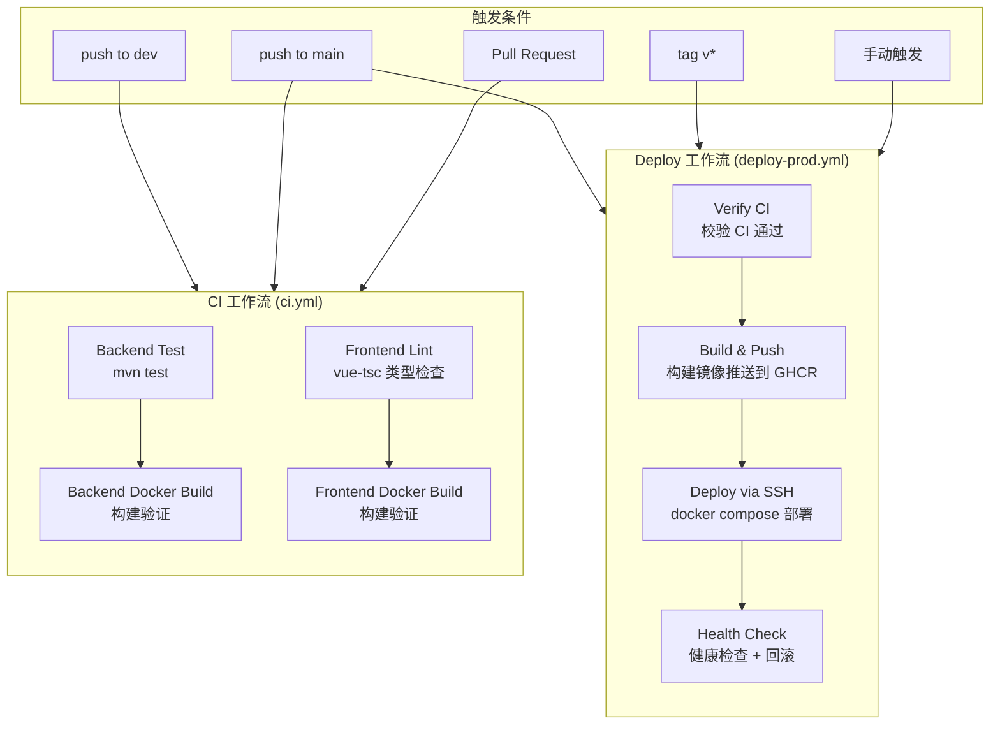
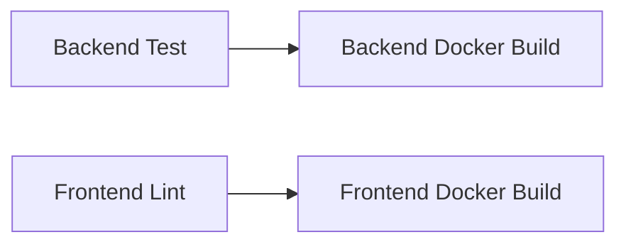
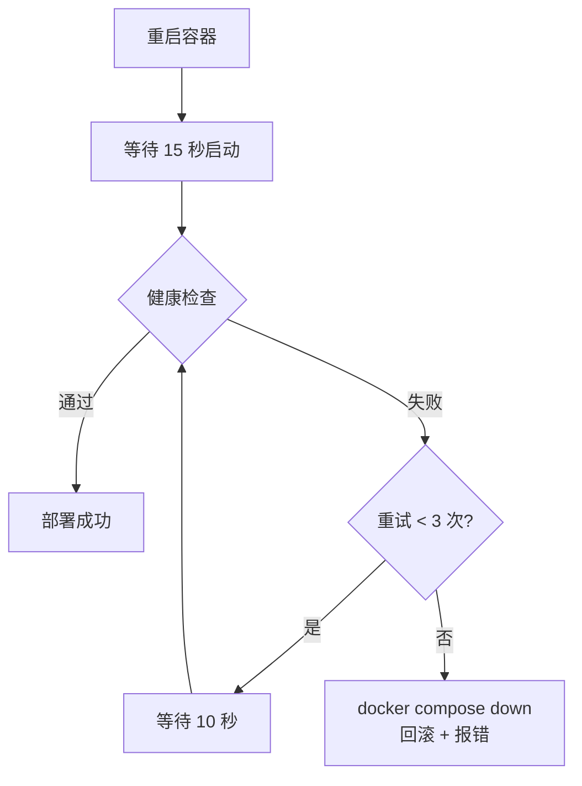
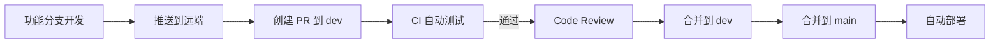

# AiSale CI/CD 持续集成与持续部署

> 项目版本：v1.3  
> 最后更新：2026-04-15  
> 文档目的：详细阐述项目 CI/CD 流水线的架构设计、配置细节及运维指南

---

## 一、CI/CD 架构总览

### 1.1 设计目标

| 目标 | 说明 |
|------|------|
| 自动化测试 | 每次提交自动运行后端单元测试与前端类型检查，确保代码质量 |
| Docker 容器化构建 | 前后端分别构建为 Docker 镜像，保证环境一致性 |
| 镜像仓库管理 | 推送到 GitHub Container Registry (GHCR)，版本可追溯 |
| 一键部署 | 通过 SSH 拉取镜像并启动服务，支持健康检查与回滚 |
| 安全管理 | 敏感信息通过 GitHub Secrets 管理，不暴露在代码中 |

### 1.2 流水线架构图



### 1.3 文件结构

```
LEARN_AISALE/
├── .github/workflows/
│   ├── ci.yml                    # CI 持续集成工作流
│   └── deploy-prod.yml           # 生产部署工作流
├── backend/
│   ├── Dockerfile                # 后端多阶段构建
│   └── .dockerignore             # 后端构建排除文件
├── frontend/
│   ├── Dockerfile                # 前端多阶段构建
│   ├── nginx.conf                # Nginx 配置（SPA + 反代）
│   └── .dockerignore             # 前端构建排除文件
├── docker-compose.yml            # 本地开发 Docker Compose
└── docker-compose.prod.yml       # 生产环境 Docker Compose
```

---

## 二、CI 持续集成工作流

### 2.1 触发条件

```yaml
on:
  push:
    branches: [dev, main]
  pull_request:
    branches: [dev, main]
```

- 任何向 `dev` 或 `main` 分支的 push 都会触发
- 针对 `dev` 或 `main` 的 Pull Request 也会触发
- 使用 `concurrency` 配置确保同一分支的重复运行会被取消，避免资源浪费

### 2.2 后端流水线

#### 2.2.1 Backend Test

| 步骤 | 说明 |
|------|------|
| Checkout code | 拉取代码 |
| Set up JDK 17 | 安装 Temurin JDK 17，启用 Maven 缓存加速 |
| Run tests | 执行 `mvn test -B`，使用 dev profile（H2 内存数据库） |
| Upload test results | 无论成功失败都上传 surefire 测试报告，保留 7 天 |

**测试环境变量：**
```yaml
env:
  OPENAI_API_KEY: test-key          # 测试用占位 key
  OPENAI_BASE_URL: https://api.openai.com
```

> 测试使用 H2 内存数据库，无需外部数据库依赖。Spring AI 相关测试通过 mock 或占位 key 绕过真实 API 调用。

#### 2.2.2 Backend Docker Build

| 步骤 | 说明 |
|------|------|
| Set up Docker Buildx | 启用 Docker Buildx 支持多平台构建 |
| Build Docker image | 构建镜像但不推送（`push: false`），仅验证构建成功 |
| Verify image | 检查镜像元数据确认构建产物正确 |

**缓存策略：** 使用 GitHub Actions Cache (`type=gha`)，Maven 依赖层被缓存后，后续构建只需重新打包应用代码层，大幅缩短构建时间。

### 2.3 前端流水线

#### 2.3.1 Frontend Lint

| 步骤 | 说明 |
|------|------|
| Set up Node.js 20 | 安装 Node.js，启用 npm 缓存 |
| Install dependencies | `npm ci` 严格按 lock 文件安装 |
| Type check | `vue-tsc --noEmit` 仅做类型检查不生成文件 |

#### 2.3.2 Frontend Docker Build

与后端类似，构建镜像验证 + GHA 缓存。前端构建支持构建参数：

```yaml
build-args: VITE_API_BASE_URL=/api
```

### 2.4 Job 依赖关系



- 后端和前端流水线**并行执行**，互不等待
- 每条流水线内部有串行依赖：测试通过才做 Docker 构建
- 任何 Job 失败都会在 GitHub commit status 上标记为 ❌

---

## 三、Docker 镜像构建

### 3.1 后端 Dockerfile

采用**多阶段构建**，将编译环境与运行环境分离：

```dockerfile
# ---- Build Stage ----
FROM maven:3.9-eclipse-temurin-17 AS build
WORKDIR /app
COPY pom.xml .
RUN mvn dependency:go-offline -B        # 先下载依赖（可被缓存）
COPY src ./src
RUN mvn package -B -DskipTests

# ---- Runtime Stage ----
FROM eclipse-temurin:17-jre-alpine       # 仅 JRE，镜像更小
WORKDIR /app
RUN addgroup -S appgroup && adduser -S appuser -G appgroup
COPY --from=build /app/target/*.jar app.jar
RUN chown -R appuser:appgroup /app
USER appuser                             # 非 root 运行
EXPOSE 8090
ENTRYPOINT ["java", "-Djava.security.egd=file:/dev/./urandom", "-Dfile.encoding=UTF-8", "-jar", "app.jar"]
```

**关键设计决策：**

| 决策 | 原因 |
|------|------|
| 多阶段构建 | 编译阶段约 500MB，运行阶段仅约 200MB |
| `dependency:go-offline` 先执行 | pom.xml 不变时依赖层可被 Docker 缓存复用 |
| Alpine JRE 基础镜像 | 相比完整 JDK 减小约 300MB |
| 非 root 用户 | 安全最佳实践，避免容器内权限提升 |
| `-Djava.security.egd` | 使用非阻塞随机数生成器，加速 Spring Boot 启动 |

### 3.2 前端 Dockerfile

```dockerfile
# ---- Build Stage ----
FROM node:20-alpine AS build
WORKDIR /app
COPY package.json package-lock.json ./
RUN npm ci                              # 严格按 lock 安装
COPY . .
ARG VITE_API_BASE_URL=/api              # 构建时注入 API 地址
ENV VITE_API_BASE_URL=$VITE_API_BASE_URL
RUN npm run build

# ---- Runtime Stage ----
FROM nginx:alpine
COPY --from=build /app/dist /usr/share/nginx/html
COPY nginx.conf /etc/nginx/conf.d/default.conf
EXPOSE 80
CMD ["nginx", "-g", "daemon off;"]
```

**关键设计决策：**

| 决策 | 原因 |
|------|------|
| `npm ci` 而非 `npm install` | 严格按 lock 文件安装，确保可复现构建 |
| `ARG VITE_API_BASE_URL` | Vite 环境变量在构建时注入，不同环境可设置不同值 |
| Nginx 托管 | 生产级静态文件服务，支持 gzip、缓存、反代 |

### 3.3 Nginx 配置

```nginx
server {
    listen 80;
    root /usr/share/nginx/html;

    # Gzip 压缩
    gzip on;
    gzip_min_length 256;

    # SPA 路由 fallback
    location / {
        try_files $uri $uri/ /index.html;
    }

    # API 反向代理 → 后端容器
    location /api/ {
        proxy_pass http://backend:8090/;
    }

    # WebSocket 代理
    location /ws {
        proxy_pass http://backend:8090/ws;
        proxy_http_version 1.1;
        proxy_set_header Upgrade $http_upgrade;
        proxy_set_header Connection "upgrade";
    }

    # 静态资源长缓存
    location ~* \.(js|css|png|jpg|jpeg|gif|ico|svg|woff2?)$ {
        expires 30d;
        add_header Cache-Control "public, immutable";
    }
}
```

**要点：**
- `backend` 是 Docker Compose 网络中的服务名，自动 DNS 解析
- SPA 的所有路由都 fallback 到 `index.html`，交给 Vue Router 处理
- WebSocket 通过 `Upgrade` 头升级协议

### 3.4 .dockerignore

**后端：**
```
target/          # 排除本地构建产物
.idea/           # 排除 IDE 配置
.env             # 排除环境变量文件
```

**前端：**
```
node_modules/    # 排除依赖（容器内重新安装）
dist/            # 排除本地构建产物
```

> `.dockerignore` 能显著减小 Docker 构建上下文体积，加速 `docker build` 过程。

---

## 四、Deploy 持续部署工作流

### 4.1 触发条件

```yaml
on:
  push:
    branches: [main]           # 合并到 main 自动部署
    tags: ['v*']               # 发布版本标签触发部署
  workflow_dispatch:           # 手动触发（需输入 CONFIRM）
```

- **自动触发：** 代码合并到 `main` 或推送 `v*` 标签时
- **手动触发：** 在 GitHub Actions 页面手动运行，需输入 `CONFIRM` 确认

### 4.2 部署流程详解

#### 阶段一：Verify CI

部署前先校验 `main` 分支最新的 CI 运行是否成功：

```javascript
const runs = await github.rest.actions.listWorkflowRuns({
  workflow_id: 'ci.yml',
  branch: 'main',
  status: 'completed',
  per_page: 1
});
if (latest.conclusion !== 'success') {
  core.setFailed(`Latest CI run conclusion: ${latest.conclusion}`);
}
```

**目的：** 防止测试未通过的代码被部署到生产环境。

#### 阶段二：Build & Push Images

| 步骤 | 说明 |
|------|------|
| Login to GHCR | 使用 `GITHUB_TOKEN` 登录 GitHub Container Registry |
| Extract metadata | 自动生成镜像标签（SHA、版本号、latest） |
| Build and push backend | 构建后端镜像并推送到 GHCR |
| Build and push frontend | 构建前端镜像并推送到 GHCR |

**镜像标签策略：**

| 标签 | 触发条件 | 示例 |
|------|----------|------|
| `sha-xxxxxxx` | 每次部署 | `sha-a1b2c3d` |
| `v1.0.0` | 推送 tag | `v1.3.0` |
| `latest` | 每次部署 | `latest` |

**镜像命名规则：**
```
ghcr.io/{owner}/{repo}/backend:latest
ghcr.io/{owner}/{repo}/frontend:latest
```

#### 阶段三：Deploy via SSH

通过 SSH 连接生产服务器执行部署：

```bash
cd /opt/aisale

# 1. 登录 GHCR 拉取私有镜像
docker login ghcr.io

# 2. 拉取最新镜像
docker compose -f docker-compose.prod.yml pull

# 3. 滚动重启服务
docker compose -f docker-compose.prod.yml up -d --remove-orphans

# 4. 健康检查（3 次重试，每次间隔 10 秒）
for i in 1 2 3; do
  if curl -sf http://localhost:8090/actuator/health; then
    echo "Health check passed"
    break
  fi
done

# 5. 清理旧镜像
docker image prune -f
```

**健康检查与回滚：**



> 健康检查依赖 Spring Boot Actuator 的 `/actuator/health` 端点。如需启用，需在 `pom.xml` 中添加 `spring-boot-starter-actuator` 依赖。

### 4.3 并发控制

```yaml
concurrency:
  group: deploy
  cancel-in-progress: false
```

- 同一时间只允许一个部署流程运行
- 新的部署**不会取消**正在进行的部署（`cancel-in-progress: false`），防止中断正在进行的健康检查或回滚

---

## 五、Docker Compose 配置

### 5.1 本地开发 (`docker-compose.yml`)

```yaml
services:
  backend:
    build:
      context: ./backend          # 本地构建
    ports: ["8090:8090"]
    environment:
      - SPRING_PROFILES_ACTIVE=${SPRING_PROFILES_ACTIVE:-dev}

  frontend:
    build:
      context: ./frontend         # 本地构建
      args:
        VITE_API_BASE_URL: /api
    ports: ["80:80"]
    depends_on: [backend]
```

**本地启动：**
```bash
# 构建并启动
docker compose up -d --build

# 查看日志
docker compose logs -f

# 停止
docker compose down
```

### 5.2 生产环境 (`docker-compose.prod.yml`)

```yaml
services:
  backend:
    image: ghcr.io/{owner}/{repo}/backend:latest    # 从 GHCR 拉取
    environment:
      - SPRING_PROFILES_ACTIVE=prod

  frontend:
    image: ghcr.io/{owner}/{repo}/frontend:latest    # 从 GHCR 拉取
```

**服务器目录结构：**
```
/opt/aisale/
├── docker-compose.prod.yml
└── .env                    # 敏感环境变量（不纳入版本控制）
```

**`.env` 示例：**
```env
OPENAI_API_KEY=sk-xxx
OPENAI_BASE_URL=https://api.openai.com
OSS_ENDPOINT=oss-cn-hangzhou.aliyuncs.com
OSS_ACCESS_KEY_ID=LTAI5txxx
OSS_ACCESS_KEY_SECRET=xxxxxx
OSS_BUCKET_NAME=aisale-prod
OSS_BASE_URL=https://aisale-prod.oss-cn-hangzhou.aliyuncs.com
```

---

## 六、GitHub 配置指南

### 6.1 Secrets 配置

在 **仓库 Settings → Secrets and variables → Actions** 中配置：

| Secret | 说明 | 必需 |
|--------|------|------|
| `SERVER_HOST` | 生产服务器 IP 或域名 | ✅ |
| `SERVER_USER` | SSH 登录用户名 | ✅ |
| `SERVER_SSH_KEY` | SSH 私钥（OpenSSH 格式） | ✅ |

> `GITHUB_TOKEN` 由 GitHub 自动提供，无需手动配置。

### 6.2 Variables 配置

| Variable | 说明 | 默认值 |
|----------|------|--------|
| `API_BASE_URL` | 前端 Vite 构建的 API 基础路径 | `/api` |

### 6.3 Environment 配置

在 **仓库 Settings → Environments** 中创建 `production` 环境：

- 可配置 **Required reviewers**：部署前需指定人员审批
- 可配置 **Deployment branches**：限制只有 `main` 分支可部署
- 可配置 **Wait timer**：部署前等待时间（秒）

### 6.4 GHCR 包可见性

推送后镜像默认为 private，需在 **仓库 Settings → Packages** 中将包设为关联到仓库，以便 `GITHUB_TOKEN` 有权限拉取。

### 6.5 服务器 SSH 密钥准备

```bash
# 1. 生成密钥对
ssh-keygen -t ed25519 -C "github-actions" -f ~/.ssh/github_actions

# 2. 将公钥添加到服务器
cat ~/.ssh/github_actions.pub >> ~/.ssh/authorized_keys

# 3. 将私钥内容复制到 GitHub Secret (SERVER_SSH_KEY)
cat ~/.ssh/github_actions
```

---

## 七、日常操作指南

### 7.1 日常开发流程



### 7.2 版本发布流程

```bash
# 1. 确保 main 分支 CI 通过
# 2. 打版本标签
git tag v1.3.0
git push origin v1.3.0

# 3. 自动触发部署，镜像标签包含版本号
```

### 7.3 手动部署

1. 进入仓库 **Actions** 页面
2. 选择 **Deploy** 工作流
3. 点击 **Run workflow**
4. 输入 `CONFIRM` 确认
5. 等待部署完成

### 7.4 回滚操作

```bash
# SSH 登录服务器
ssh user@server

# 查看镜像历史
docker images | grep aisale

# 回滚到指定版本
cd /opt/aisale
# 编辑 .env 设置 TAG 变量
# TAG=sha-a1b2c3d  # 回滚到之前的 SHA
docker compose -f docker-compose.prod.yml up -d
```

### 7.5 查看运行状态

```bash
# 查看容器状态
docker compose -f docker-compose.prod.yml ps

# 查看后端日志
docker compose -f docker-compose.prod.yml logs -f backend

# 查看前端日志
docker compose -f docker-compose.prod.yml logs -f frontend

# 健康检查
curl http://localhost:8090/actuator/health
```

---

## 八、故障排查

### 8.1 常见问题

| 问题 | 可能原因 | 解决方案 |
|------|----------|----------|
| CI 测试失败 | 代码变更破坏了现有测试 | 查看测试报告 artifact，修复后重新提交 |
| Docker 构建失败 | Dockerfile 或依赖问题 | 本地 `docker build` 复现排查 |
| 镜像推送失败 | GHCR 权限不足 | 检查 `packages: write` 权限和包可见性 |
| SSH 部署失败 | 密钥或网络问题 | 验证 SSH 密钥格式、服务器可达性 |
| 健康检查失败 | 应用启动异常 | SSH 登录查看 `docker compose logs` |
| 镜像拉取失败 | GHCR 认证问题 | 确认服务器 `docker login` 成功 |

### 8.2 日志查看

```bash
# GitHub Actions 日志：仓库 Actions 页面
# 服务器容器日志：
docker compose -f docker-compose.prod.yml logs --tail=100 backend
```

---

## 九、安全注意事项

1. **绝不将密钥写入代码**：所有敏感信息通过 GitHub Secrets 或服务器 `.env` 管理
2. **容器非 root 运行**：后端镜像使用 `appuser` 用户
3. **SSH 密钥安全**：使用 Ed25519 算法，私钥仅存于 GitHub Secrets
4. **GHCR 镜像私有**：默认 private，需认证才能拉取
5. **环境保护规则**：生产环境可配置审批人和分支限制
6. **.dockerignore**：确保 `.env` 和敏感文件不会进入 Docker 构建上下文
