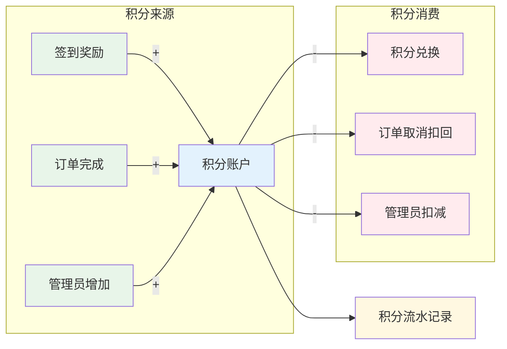
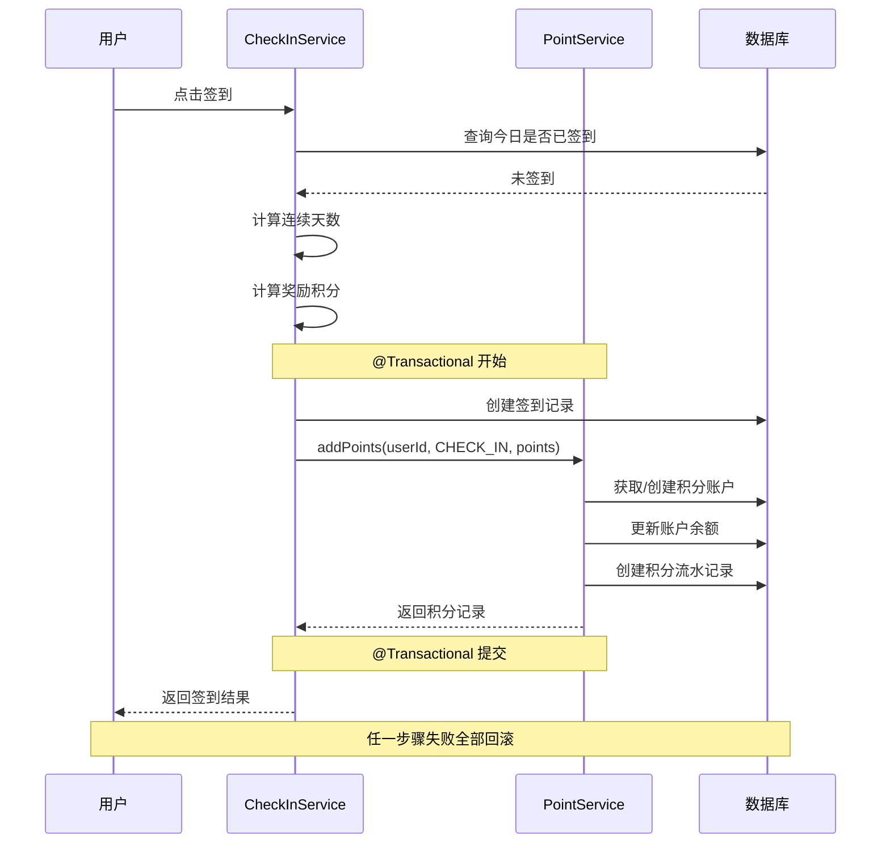
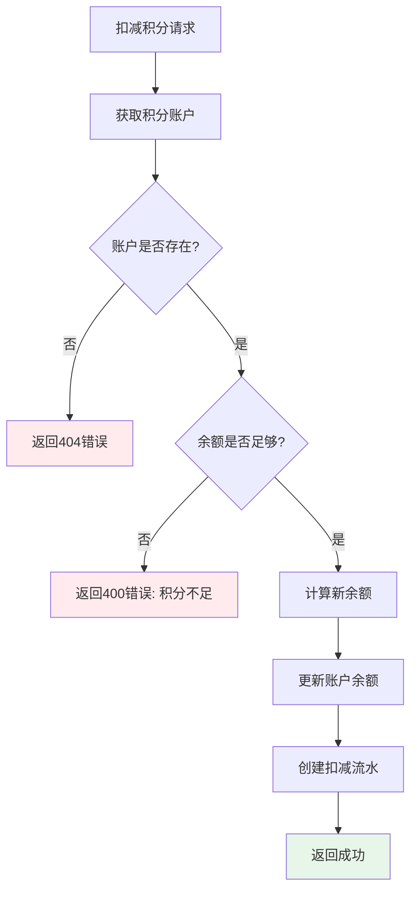

# 3.3 用户积分模块开发

## 一、需求分析

### 1.1 功能需求

| 功能       | 描述                                                   | 优先级 |
| ---------- | ------------------------------------------------------ | ------ |
| 积分账户   | 每个用户一个积分账户，记录总积分、可用积分、已消费积分 | P0     |
| 积分获取   | 签到奖励、订单完成奖励、管理员手动调整                 | P0     |
| 积分消费   | 积分兑换（预留接口）                                   | P1     |
| 积分流水   | 记录每笔积分变动，支持按类型筛选和分页查询             | P0     |
| 管理员调整 | 管理员可增减用户积分并填写原因                         | P0     |
| 前端展示   | 积分概览卡片、积分明细列表、Profile入口                | P0     |

### 1.2 非功能需求

- 积分变动必须事务性，账户余额与流水记录强一致
- 积分扣减需校验余额，防止透支
- 积分流水不可篡改，仅追加
- 接口响应时间 < 200ms

---

## 二、数据库设计

### 2.1 ER 图

```mermaid
erDiagram
    users ||--o| point_accounts : "积分账户"
    users ||--o{ point_records : "积分流水"
    check_ins ||--o{ point_records : "签到奖励"
    orders ||--o{ point_records : "订单奖励"

    users {
        bigint id PK
        varchar username
        varchar password
    }

    point_accounts {
        bigint id PK
        bigint user_id FK UK
        int total_points
        int available_points
        int used_points
        timestamp created_at
        timestamp updated_at
    }

    point_records {
        bigint id PK
        bigint user_id FK
        varchar type
        int points
        int balance_after
        bigint related_id
        varchar description
        timestamp created_at
    }
```

### 2.2 point_accounts（积分账户表）

| 字段             | 类型      | 约束                | 说明               |
| ---------------- | --------- | ------------------- | ------------------ |
| id               | BIGINT    | PK, AUTO_INCREMENT  | 主键               |
| user_id          | BIGINT    | NOT NULL, UNIQUE    | 用户ID，一户一账户 |
| total_points     | INT       | NOT NULL, DEFAULT 0 | 总累计积分         |
| available_points | INT       | NOT NULL, DEFAULT 0 | 可用积分           |
| used_points      | INT       | NOT NULL, DEFAULT 0 | 已消费积分         |
| created_at       | TIMESTAMP |                     | 创建时间           |
| updated_at       | TIMESTAMP |                     | 更新时间           |

**索引**：`idx_point_account_user` (user_id) UNIQUE

**约束**：`total_points = available_points + used_points`（业务层保障）

### 2.2 point_records（积分流水表）

| 字段          | 类型         | 约束               | 说明                 |
| ------------- | ------------ | ------------------ | -------------------- |
| id            | BIGINT       | PK, AUTO_INCREMENT | 主键                 |
| user_id       | BIGINT       | NOT NULL           | 用户ID               |
| type          | VARCHAR(30)  | NOT NULL           | 变动类型             |
| points        | INT          | NOT NULL           | 变动积分（正增负减） |
| balance_after | INT          | NOT NULL           | 变动后可用余额快照   |
| related_id    | BIGINT       | NULL               | 关联业务ID           |
| description   | VARCHAR(200) | NULL               | 描述                 |
| created_at    | TIMESTAMP    | NOT NULL           | 创建时间             |

**索引**：

- `idx_point_record_user` (user_id)
- `idx_point_record_user_type` (user_id, type)
- `idx_point_record_created` (created_at)

### 2.3 积分类型枚举

| 类型         | 值             | 方向 | 说明               |
| ------------ | -------------- | ---- | ------------------ |
| 签到奖励     | CHECK_IN       | +    | 连续签到阶梯奖励   |
| 订单完成奖励 | ORDER_COMPLETE | +    | 订单完成后奖励     |
| 订单取消扣回 | ORDER_CANCEL   | -    | 订单取消后扣回奖励 |
| 管理员增加   | ADMIN_ADD      | +    | 管理员手动增加     |
| 管理员扣减   | ADMIN_DEDUCT   | -    | 管理员手动扣减     |
| 积分兑换     | EXCHANGE       | -    | 积分兑换消费       |

### 2.4 积分类型流向图



---

## 三、后端实现

### 3.1 Entity 层

```
PointAccount.java  — 积分账户实体
PointRecord.java   — 积分流水实体（含 PointType 枚举）
```

关键设计：

- PointAccount 的 `user_id` 设置 UNIQUE 约束，确保一户一账户
- PointRecord 的 `points` 字段使用正负数表示增加/扣减
- `balance_after` 记录变动后余额快照，便于对账

### 3.2 Repository 层

```
PointAccountRepository.java  — 按用户ID查询账户
PointRecordRepository.java   — 分页查询流水、按类型筛选、统计次数
```

### 3.3 DTO 层

| DTO                     | 用途                                |
| ----------------------- | ----------------------------------- |
| PointAccountResponse    | 积分账户概览（含签到/订单统计次数） |
| PointRecordResponse     | 积分流水记录响应                    |
| AdminPointAdjustRequest | 管理员调整积分请求                  |

### 3.4 Service 层

**PointService** 核心方法：

```java
// 获取或创建积分账户（懒创建）
PointAccount getOrCreateAccount(Long userId)

// 获取账户概览
PointAccountResponse getAccountOverview(String username)

// 获取积分流水（分页 + 类型筛选）
Page<PointRecordResponse> getPointRecords(String username, PointType type, int page, int size)

// 增加积分（通用）
PointRecord addPoints(Long userId, PointType type, int points, Long relatedId, String description)

// 扣减积分（含余额校验）
PointRecord deductPoints(Long userId, PointType type, int points, Long relatedId, String description)

// 管理员调整积分
PointRecordResponse adminAdjustPoints(Long targetUserId, AdminPointAdjustRequest request)
```

**与签到模块集成**：CheckInService 签到成功后调用 `pointService.addPoints()` 自动增加积分。

### 3.5 Controller 层

**用户端** (`/api/user/points`)：

| 方法 | 路径                       | 说明             |
| ---- | -------------------------- | ---------------- |
| GET  | /account                   | 获取积分账户概览 |
| GET  | /records?type=&page=&size= | 获取积分流水     |

**管理端** (`/api/admin/points`)：

| 方法 | 路径             | 说明               |
| ---- | ---------------- | ------------------ |
| POST | /adjust/{userId} | 管理员调整用户积分 |

### 3.6 错误码

| 错误码   | 说明           | HTTP状态码 |
| -------- | -------------- | ---------- |
| 80010001 | 积分不足       | 400        |
| 80010002 | 积分账户不存在 | 404        |

---

## 四、积分获取规则

### 4.1 签到奖励（已实现）

| 连续天数  | 奖励积分 |
| --------- | -------- |
| 1天       | 5分      |
| 2-6天     | 10分/天  |
| 7天及以上 | 20分/天  |

### 4.2 订单奖励（预留）

订单完成后调用：

```java
pointService.addPoints(userId, PointType.ORDER_COMPLETE, points, orderId, "订单完成奖励");
```

---

## 五、事务一致性保障

### 5.1 签到+积分事务流程图



### 5.2 签到+积分事务

`CheckInService.checkIn()` 方法标注 `@Transactional`，签到记录创建和积分增加在同一事务中：

```
1. 检查今日是否已签到
2. 计算连续天数
3. 创建签到记录
4. 调用 pointService.addPoints() 增加积分
   - 创建/获取积分账户
   - 更新账户余额
   - 创建积分流水
5. 事务提交（任一步骤失败全部回滚）
```

### 5.3 积分扣减防护流程图



### 5.4 积分扣减防护

```java
// deductPoints 方法中的余额校验
if (account.getAvailablePoints() < points) {
    throw new BadRequestException(ErrorCode.POINT_INSUFFICIENT);
}
```

---

## 六、前端实现

### 6.1 API 层 (`api/points.ts`)

| 函数                            | 接口                               | 说明         |
| ------------------------------- | ---------------------------------- | ------------ |
| getPointAccount()               | GET /user/points/account           | 获取积分概览 |
| getPointRecords(params)         | GET /user/points/records           | 获取积分流水 |
| adminAdjustPoints(userId, data) | POST /admin/points/adjust/{userId} | 管理员调整   |

### 6.2 Store 层 (`stores/points.ts`)

```typescript
const pointsStore = usePointsStore();
pointsStore.availablePoints; // 可用积分
pointsStore.totalPoints; // 累计积分
pointsStore.usedPoints; // 已使用积分
pointsStore.fetchAccount(); // 刷新账户
pointsStore.fetchRecords(); // 刷新流水
```

### 6.3 页面 (`views/user/Points.vue`)

- **积分总览卡片**：渐变背景，展示可用积分、累计获得、已使用
- **来源统计**：签到次数、订单奖励次数
- **积分明细**：列表展示，支持类型筛选和分页加载
- **视觉区分**：收入绿色图标，支出红色图标

### 6.4 Profile 入口

Profile 快捷入口区域新增"积分"按钮（6列布局），渐变橙色图标区分。

---

## 七、API 接口文档

### 7.1 获取积分账户概览

```
GET /api/user/points/account
Authorization: Bearer <token>
```

**响应**：

```json
{
  "code": 200,
  "message": "success",
  "data": {
    "id": 1,
    "userId": 1,
    "totalPoints": 150,
    "availablePoints": 120,
    "usedPoints": 30,
    "checkInPoints": 12,
    "orderPoints": 3
  }
}
```

### 7.2 获取积分流水

```
GET /api/user/points/records?type=CHECK_IN&page=0&size=20
Authorization: Bearer <token>
```

**响应**：

```json
{
  "code": 200,
  "message": "success",
  "data": {
    "content": [
      {
        "id": 1,
        "type": "CHECK_IN",
        "points": 10,
        "balanceAfter": 120,
        "relatedId": 5,
        "description": "签到奖励：连续签到3天",
        "createdAt": "2026-04-15T08:30:00"
      }
    ],
    "totalElements": 25,
    "totalPages": 2,
    "number": 0,
    "size": 20
  }
}
```

### 7.3 管理员调整积分

```
POST /api/admin/points/adjust/1
Authorization: Bearer <admin-token>
Content-Type: application/json

{
  "points": 100,
  "reason": "活动奖励"
}
```

**响应**：

```json
{
  "code": 200,
  "message": "积分调整成功",
  "data": {
    "id": 26,
    "type": "ADMIN_ADD",
    "points": 100,
    "balanceAfter": 220,
    "relatedId": null,
    "description": "管理员调整：活动奖励",
    "createdAt": "2026-04-15T10:00:00"
  }
}
```

---

## 八、文件清单

### 8.1 后端新增文件

| 文件                                   | 说明                              |
| -------------------------------------- | --------------------------------- |
| entity/PointAccount.java               | 积分账户实体                      |
| entity/PointRecord.java                | 积分流水实体（含 PointType 枚举） |
| repository/PointAccountRepository.java | 积分账户仓储                      |
| repository/PointRecordRepository.java  | 积分流水仓储                      |
| dto/PointAccountResponse.java          | 积分账户响应 DTO                  |
| dto/PointRecordResponse.java           | 积分流水响应 DTO                  |
| dto/AdminPointAdjustRequest.java       | 管理员调整请求 DTO                |
| service/PointService.java              | 积分服务（核心业务逻辑）          |
| controller/UserPointsController.java   | 用户端积分接口                    |
| controller/AdminPointsController.java  | 管理端积分接口                    |

### 8.2 后端修改文件

| 文件                        | 变更                                  |
| --------------------------- | ------------------------------------- |
| exception/ErrorCode.java    | 新增积分模块错误码（80xxxxxx）        |
| service/CheckInService.java | 注入 PointService，签到后自动增加积分 |

### 8.3 前端新增文件

| 文件                  | 说明             |
| --------------------- | ---------------- |
| api/points.ts         | 积分 API 接口    |
| stores/points.ts      | 积分 Pinia Store |
| views/user/Points.vue | 积分页面         |

### 8.4 前端修改文件

| 文件                   | 变更                   |
| ---------------------- | ---------------------- |
| stores/index.ts        | 新增 points store 导出 |
| router/index.ts        | 新增 /user/points 路由 |
| views/user/Profile.vue | 新增积分快捷入口       |

---

## 九、测试要点

### 9.1 后端测试

- [ ] 新用户首次访问积分账户，自动创建账户（余额为0）
- [ ] 签到后积分正确增加（验证 CheckIn → PointService 调用链）
- [ ] 连续签到阶梯积分：1天5分、2-6天10分、7天+20分
- [ ] 积分扣减时余额不足返回 400 错误
- [ ] 积分流水记录的 balance_after 与账户实际余额一致
- [ ] 管理员调整积分为0时返回 400 错误
- [ ] 管理员调整原因为空时返回 400 错误
- [ ] 分页查询正常，类型筛选正常

### 9.2 前端测试

- [ ] 积分页面正确展示可用积分、累计获得、已使用
- [ ] 积分明细列表正确展示类型图标和正负号
- [ ] 类型筛选下拉切换后数据刷新
- [ ] 加载更多分页正常
- [ ] Profile 入口跳转积分页面正常
- [ ] 签到后积分页面数据同步刷新
