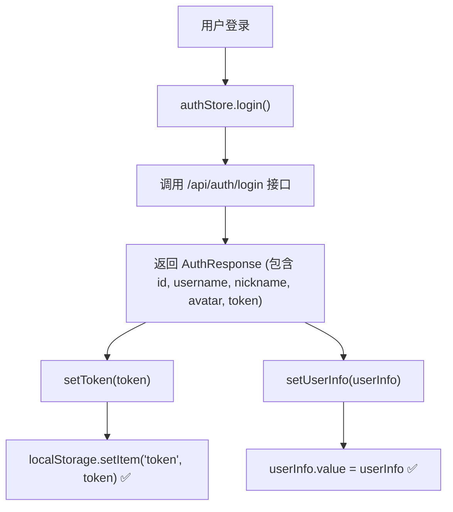
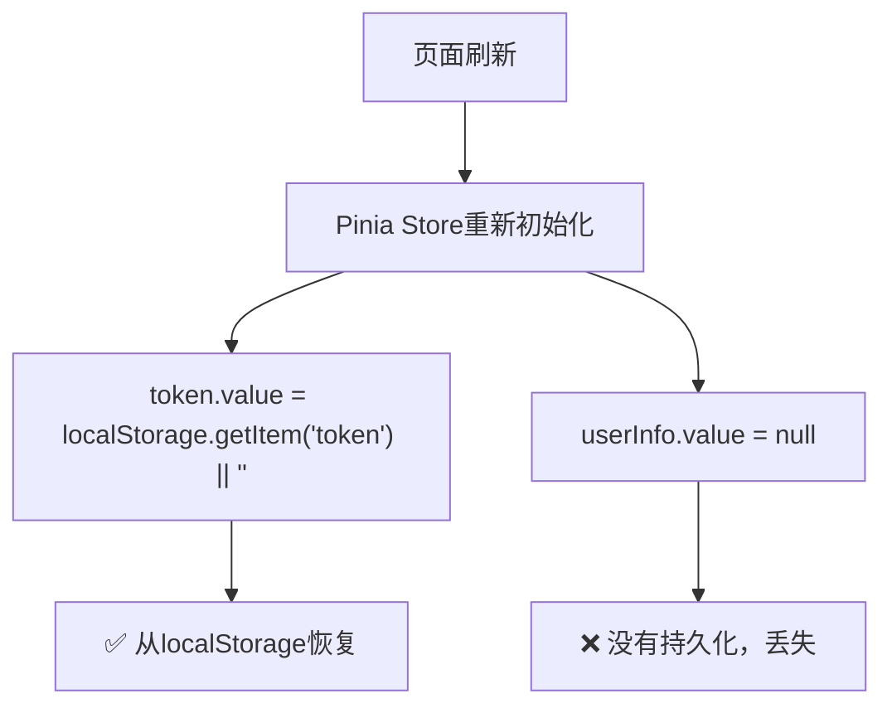
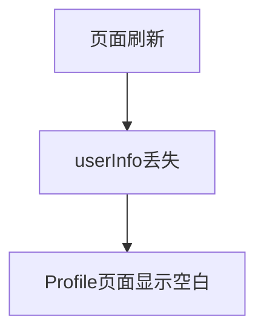
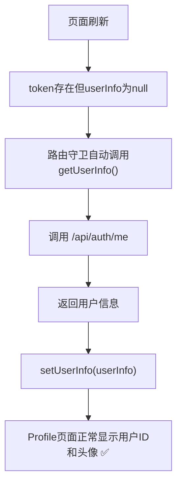

# 用户信息显示问题分析

## 问题现象

**页面**: `/user/profile`

**症状**: 
- 用户ID不显示
- 用户头像不显示
- 页面刷新后用户信息丢失

## 问题分析

### 1. 前端数据流分析

#### 登录流程



#### 页面刷新流程



### 2. 根本原因

在 [auth.ts](file:///e:/CODE/git/LEARN_AISALE/frontend/src/stores/auth.ts#L47-L48) 中：

```typescript
const token = ref<string>(localStorage.getItem('token') || '')  // ✅ 持久化到localStorage
const userInfo = ref<UserInfo | null>(null)  // ❌ 没有持久化，刷新后丢失
```

**问题**：
- `token` 存储在 localStorage，页面刷新后可以恢复
- `userInfo` 只存储在 Pinia Store 的内存中，页面刷新后丢失

### 3. 路由守卫问题

在 [router/index.ts](file:///e:/CODE/git/LEARN_AISALE/frontend/src/router/index.ts#L218-L247) 中：

```typescript
router.beforeEach((to, _from, next) => {
  const authStore = useAuthStore()
  
  // 需要认证的路由
  if (to.meta.requiresAuth) {
    if (!authStore.isLoggedIn) {  // 只检查token是否存在
      next({ name: 'UserLogin', query: { redirect: to.fullPath } })
    } else {
      next()  // ❌ 没有检查userInfo是否存在
    }
  }
})
```

**问题**：
- 路由守卫只检查 `isLoggedIn`（即token是否存在）
- 没有检查 `userInfo` 是否存在
- 没有自动调用 `getUserInfo()` 获取用户信息

### 4. Profile页面依赖

在 [Profile.vue](file:///e:/CODE/git/LEARN_AISALE/frontend/src/views/user/Profile.vue#L7-L13) 中：

```vue
<el-avatar :size="56" :src="authStore.userInfo?.avatar || undefined">
  {{ userInitial }}
</el-avatar>

<h2 class="user-name">{{ authStore.userInfo?.nickname || authStore.userInfo?.username }}</h2>
<p class="user-id">ID: {{ authStore.userInfo?.id }}</p>
```

**依赖**：
- 头像依赖 `userInfo.avatar`
- 用户名依赖 `userInfo.nickname` 或 `userInfo.username`
- ID依赖 `userInfo.id`

当 `userInfo` 为 `null` 时，所有显示都为空。

## 修复方案

### 方案1: 路由守卫自动获取用户信息（已采用）

**优点**：
- 不需要修改数据持久化逻辑
- 自动恢复用户信息
- 用户体验好

**实现**：

修改 [router/index.ts](file:///e:/CODE/git/LEARN_AISALE/frontend/src/router/index.ts#L218-L247)：

```typescript
router.beforeEach(async (to, _from, next) => {
  const authStore = useAuthStore()

  // 如果有token但没有userInfo，自动获取用户信息
  if (authStore.isLoggedIn && !authStore.userInfo) {
    try {
      await authStore.getUserInfo()  // 调用 /api/auth/me 获取用户信息
    } catch (error) {
      console.error('获取用户信息失败:', error)
      authStore.logout()  // token失效，清除登录状态
      next({ name: 'UserLogin', query: { redirect: to.fullPath } })
      return
    }
  }

  // 需要认证的路由
  if (to.meta.requiresAuth) {
    if (!authStore.isLoggedIn) {
      next({ name: 'UserLogin', query: { redirect: to.fullPath } })
    } else {
      next()
    }
  }
})
```

### 方案2: userInfo持久化到localStorage（备选）

**优点**：
- 不需要每次刷新都请求API
- 减少网络请求

**缺点**：
- 需要处理数据同步问题
- 用户信息更新时需要同步更新localStorage

**实现**：

修改 [auth.ts](file:///e:/CODE/git/LEARN_AISALE/frontend/src/stores/auth.ts#L47-L72)：

```typescript
const userInfo = ref<UserInfo | null>(
  JSON.parse(localStorage.getItem('userInfo') || 'null')
)

const setUserInfo = (info: UserInfo) => {
  userInfo.value = info
  localStorage.setItem('userInfo', JSON.stringify(info))
}

const logout = () => {
  token.value = ''
  userInfo.value = null
  localStorage.removeItem('token')
  localStorage.removeItem('userInfo')
}
```

## 后端API支持

### /api/auth/me 接口

在 [UserAuthController.java](file:///e:/CODE/git/LEARN_AISALE/backend/src/main/java/com/aisale/backend/controller/UserAuthController.java#L39-L44)：

```java
@Operation(summary = "获取当前用户信息")
@GetMapping("/me")
public ApiResponse<User> getCurrentUser(@AuthenticationPrincipal UserDetails userDetails) {
    User user = authService.getCurrentUser(userDetails.getUsername());
    return ApiResponse.success(user);
}
```

**权限配置**：
- 接口路径：`/api/auth/me`
- 需要认证：✅ (不在permitAll列表中)
- 返回数据：完整的User对象（包含id, username, nickname, avatar等）

## 修复效果

### 修复前



### 修复后



## 测试验证

### 测试步骤
1. 用户登录成功
2. 刷新页面（F5）
3. 访问 `/user/profile`
4. 检查用户ID和头像是否正常显示

### 预期结果
- ✅ 用户ID正常显示
- ✅ 用户头像正常显示
- ✅ 用户昵称正常显示
- ✅ 页面刷新后信息不丢失

## 相关文件

### 前端文件
- [frontend/src/stores/auth.ts](file:///e:/CODE/git/LEARN_AISALE/frontend/src/stores/auth.ts) - 用户状态管理
- [frontend/src/router/index.ts](file:///e:/CODE/git/LEARN_AISALE/frontend/src/router/index.ts) - 路由守卫
- [frontend/src/views/user/Profile.vue](file:///e:/CODE/git/LEARN_AISALE/frontend/src/views/user/Profile.vue) - Profile页面

### 后端文件
- [backend/src/main/java/com/aisale/backend/controller/UserAuthController.java](file:///e:/CODE/git/LEARN_AISALE/backend/src/main/java/com/aisale/backend/controller/UserAuthController.java) - 用户认证接口
- [backend/src/main/java/com/aisale/backend/service/AuthService.java](file:///e:/CODE/git/LEARN_AISALE/backend/src/main/java/com/aisale/backend/service/AuthService.java) - 认证服务
- [backend/src/main/java/com/aisale/backend/security/SecurityConfig.java](file:///e:/CODE/git/LEARN_AISALE/backend/src/main/java/com/aisale/backend/security/SecurityConfig.java) - 安全配置

## 修复日期

2026-04-13

## Git提交

Commit ID: bb1a8bc