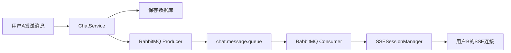

# WebSocket 迁移到 RabbitMQ + SSE 设计文档

## 一、需求背景

当前系统使用原生 Spring WebSocket 实现聊天消息推送，存在以下问题：
- 会话管理依赖内存，不支持分布式部署
- 代码耦合度较高，消息推送与 WebSocket 紧密绑定

**目标**：将 WebSocket 替换为 RabbitMQ + SSE 方案，实现消息推送解耦。

---

## 二、技术方案

### 2.1 架构选型

| 组件 | 替换方案 | 说明 |
|-----|---------|-----|
| WebSocket 连接 | SSE (Server-Sent Events) | 前端改用 HTTP SSE 接收消息 |
| 消息分发 | RabbitMQ | 后端通过队列解耦消息生产与消费 |
| 会话管理 | SSESessionManager | 内存管理 SSE 连接（单机部署） |

### 2.2 消息流程



---

## 三、后端实现

### 3.1 新增依赖

```xml
<!-- pom.xml -->
<dependency>
    <groupId>org.springframework.boot</groupId>
    <artifactId>spring-boot-starter-amqp</artifactId>
</dependency>
```

### 3.2 文件清单

| 文件 | 操作 | 说明 |
|-----|-----|-----|
| `config/RabbitMQConfig.java` | 新增 | RabbitMQ 队列/交换机配置 |
| `controller/SSEChatController.java` | 新增 | SSE 连接端点 |
| `service/SSESessionManager.java` | 新增 | SSE 会话管理 |
| `service/ChatMessageProducer.java` | 新增 | RabbitMQ 消息生产者 |
| `service/ChatMessageConsumer.java` | 新增 | RabbitMQ 消息消费者 |
| `service/ChatService.java` | 修改 | 移除 Event 发布，调用 Producer |
| `dto/SSEMessageDTO.java` | 新增 | SSE 消息格式 |
| `websocket/*` | 删除 | 废弃原 WebSocket 实现 |
| `config/WebSocketConfig.java` | 删除 | 废弃 WebSocket 配置 |

### 3.3 RabbitMQ 配置

```java
@Configuration
public class RabbitMQConfig {
    public static final String CHAT_QUEUE = "chat.message.queue";
    public static final String CHAT_EXCHANGE = "chat.exchange";
    public static final String CHAT_ROUTING_KEY = "chat.message";

    @Bean
    public Queue chatQueue() {
        return new Queue(CHAT_QUEUE, true);
    }

    @Bean
    public DirectExchange chatExchange() {
        return new DirectExchange(CHAT_EXCHANGE);
    }

    @Bean
    public Binding chatBinding() {
        return BindingBuilder.bind(chatQueue())
            .to(chatExchange())
            .with(CHAT_ROUTING_KEY);
    }
}
```

### 3.4 SSE 会话管理

```java
@Service
@Slf4j
public class SSESessionManager {
    private final ConcurrentHashMap<Long, SseEmitter> emitters = new ConcurrentHashMap<>();

    public SseEmitter register(Long userId) {
        SseEmitter emitter = new SseEmitter(30 * 60 * 1000L);
        emitters.put(userId, emitter);
        emitter.onCompletion(() -> emitters.remove(userId));
        emitter.onTimeout(() -> emitters.remove(userId));
        log.info("SSE registered for userId={}", userId);
        return emitter;
    }

    public void sendToUser(Long userId, Object message) {
        SseEmitter emitter = emitters.get(userId);
        if (emitter != null) {
            try {
                emitter.send(SseEmitter.event().data(message));
            } catch (Exception e) {
                log.error("SSE send failed for userId={}", userId);
                emitters.remove(userId);
            }
        }
    }

    public boolean isUserOnline(Long userId) {
        return emitters.containsKey(userId);
    }
}
```

### 3.5 SSE Controller

```java
@RestController
@RequestMapping("/api/sse")
@Slf4j
public class SSEChatController {
    private final SSESessionManager sseSessionManager;

    @GetMapping("/chat")
    public SseEmitter connect(@AuthenticationPrincipal Long userId) {
        return sseSessionManager.register(userId);
    }
}
```

### 3.6 ChatService 修改

移除 `ApplicationEventPublisher` 和 `ChatMessageEvent`，改为：

```java
@Service
@RequiredArgsConstructor
public class ChatService {
    private final ChatMessageRepository chatMessageRepository;
    private final ChatMessageProducer messageProducer;

    @Transactional
    public ChatMessageResponse sendMessage(Long senderId, Long receiverId, String content) {
        // 保存消息...
        ChatMessageResponse response = ...;
        
        // 发送到 RabbitMQ（替代 Event 发布）
        messageProducer.sendChatMessage(receiverId, response);
        messageProducer.sendChatMessage(senderId, response); // 发送方也需要
        
        return response;
    }
}
```

---

## 四、前端实现

### 4.1 SSE API

```typescript
// api/chat.ts
export function connectSSE(onMessage: (msg: ChatMessageResponse) => void) {
  const token = localStorage.getItem('token');
  const eventSource = new EventSource(
    `/api/sse/chat?token=${encodeURIComponent(token)}`,
    { withCredentials: true }
  );

  eventSource.onmessage = (event) => {
    const msg = JSON.parse(event.data);
    onMessage(msg);
  };

  eventSource.onerror = () => {
    console.error('SSE connection error');
    eventSource.close();
  };

  return eventSource;
}
```

### 4.2 路由调整

移除 WebSocket 相关页面，改用 SSE 连接。

---

## 五、废弃组件

| 组件 | 处理方式 |
|-----|---------|
| `ChatWebSocketHandler.java` | 删除 |
| `ChatMessageEventListener.java` | 删除 |
| `JwtHandshakeInterceptor.java` | 删除 |
| `WebSocketConfig.java` | 删除 |
| `WebSocketAuthChannelInterceptor.java` | 删除 |
| `WebSocketPrincipal.java` | 删除 |
| `ChatMessageEvent.java` | 删除 |

---

## 六、测试要点

- [ ] SSE 连接成功建立
- [ ] SSE 超时自动断开重连
- [ ] 消息通过 RabbitMQ 正确投递
- [ ] 用户离线时消息不丢失（队列持久化）
- [ ] 多用户同时在线消息正确分发
- [ ] 异常场景：RabbitMQ 连接失败时的降级处理